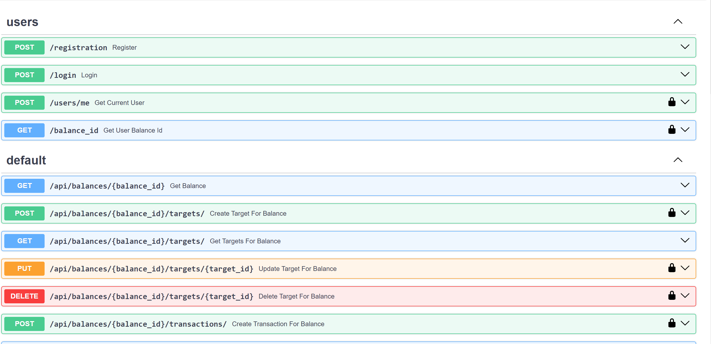
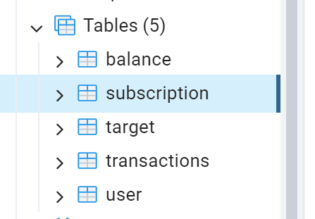
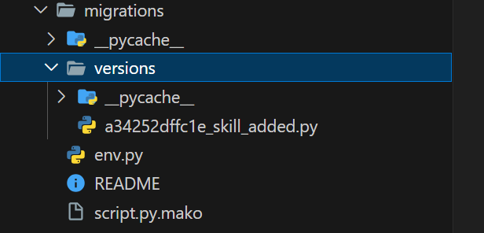

# Отчет по лабораторной работе №1

#### Цель работы:

Научится реализовывать полноценное серверное приложение с помощью фреймворка FastAPI с применением дополнительных средств и библиотек.

## Задание

#### Текст задания:

1. Выполнить практики 2.1-2.3 Их можно реализовать на примере, приведенном в текстах практик или используя выбранную тему. Практики можно предоставить в любом из ниже приведенных вариантов:
   a. Каждая практика - отдельная папка в репозитории.
   b. Каждая практика - отдельная ветка в репозитории.
   c. Каждая практика - отдельный коммит в репозитории.
2. Задание на 9 Баллов: Реализовать на основании выбранной модели с помощью инструкций из практик серверное приложение на FastAPI. Оно должно включать в себя:
   a. Таблицы, реализованные с помощью ORM SQLAlchemy или SQLModel с использованием БД PostgreSQL.
   b. API, содержащее CRUD-ы. Там где это необходимо, реализовать GET-запросы возвращающие модели с вложенными объектами (связи many-to-many и one-to-many).
   c. Настроенную систему миграций с помощью библиотеки Alembic.
   d. Аннотацию типов в передаваемых и возвращаемых значениях в API-методах.
   e. Оформленную файловую структуру проекта с разделением кода, отвечающего за разную бизнес-логику и предметную область, на отдельные файлы и папки.
   f. (опционально) Комментарии к сложным частям кода.
3. Задание на 15 Баллов (можно реализовывать сразу): Необходимо реализовать функционал пользователя в разрабатываемом приложении. Функционал включает в себя:
   a. Авторизацию и регистрацию
   b. Генерацию JWT-токенов
   c. Аутентификацию по JWT-токену
   d. Хэширование паролей
   e. Дополнительные АПИ-методы для получения информации о пользователе, списка пользователей и смене пароля

#### Ссылка на практики

[https://github.com/pavel-nikitin-2022/ITMO_ICT_WebDevelopment_tools_2023-2024/tree/main/K33402/Nikitin_Pavel/practical_works](https://github.com/pavel-nikitin-2022/ITMO_ICT_WebDevelopment_tools_2023-2024/tree/main/K33402/Nikitin_Pavel/practical_works)

#### Ход Работы:

Для начала определим структуру проекта, были выделены несколько сущностей:
1) endpoints - для обработки запросов
2) models - для хранения проекта
3) repositories - для реализации паттерна репозитория и инкапсулирования логики работы с бд внутри
4) отдельный файлы такие как, main, auth, database


На первом шаге инициализируем приложение и подключаем базу данных:

```
import uvicorn
from fastapi import FastAPI
from sqlmodel import SQLModel

from database import engine
from endpoints.user import user_router
from endpoints.finance import main_router

app = FastAPI()

app.include_router(user_router)
app.include_router(main_router, prefix="/api")


def create_db():
    SQLModel.metadata.create_all(engine)


@app.on_event("startup")
def on_startup():
    create_db()


if __name__ == '__main__':
    uvicorn.run(app, host='localhost', port=8001, reload=True)
```

Для авторизации мы использовали boilerplate код модуля для создания и дальнейшей работы с jwt токенами
Все секреты хранятся в .env файле

```
secret_key = os.getenv("SECRET_KEY")

class AuthHandler:
    security = HTTPBearer()
    pwd_context = CryptContext(schemes=['bcrypt'])
    secret = secret_key

    def get_password_hash(self, password):
        return self.pwd_context.hash(password)

    def verify_password(self, pwd, hashed_pwd):
        return self.pwd_context.verify(pwd, hashed_pwd)

    def encode_token(self, user_id):
        payload = {
            'exp': datetime.datetime.utcnow() + datetime.timedelta(hours=8),
            'iat': datetime.datetime.utcnow(),
            'sub': user_id
        }
        return jwt.encode(payload, self.secret, algorithm='HS256')

    def decode_token(self, token):
        try:
            payload = jwt.decode(token, self.secret, algorithms=['HS256'])
            return payload['sub']
        except jwt.ExpiredSignatureError:
            raise HTTPException(status_code=401, detail='Expired signature')
        except jwt.InvalidTokenError:
            raise HTTPException(status_code=401, detail='Invalid token')

    def auth_wrapper(self, auth: HTTPAuthorizationCredentials = Security(security)):
        return self.decode_token(auth.credentials)

    def get_current_user(self, auth: HTTPAuthorizationCredentials = Security(security)):
        credentials_exception = HTTPException(
            status_code=status.HTTP_401_UNAUTHORIZED,
            detail='Could not validate credentials'
        )
        username = self.decode_token(auth.credentials)
        if username is None:
            raise credentials_exception
        user = find_user(username)
        if username is None:
            raise credentials_exception
        return user
```

Также создаем модель пользователя:

```
class User(SQLModel, table=True):
    id: int = Field(primary_key=True)
    username: str = Field(index=True)
    password: str
    email: str
    balance: Optional["Balance"] = Relationship(back_populates="user")
    created_at: datetime.datetime = Field(default=datetime.datetime.now())
```

Вот пример работы обработки запросов

```
@main_router.get("/balances/{balance_id}", response_model=Balance)
def get_balance(balance_id: int):
    balance = find_balance(balance_id)
    print(balance)
    if not balance:
        raise HTTPException(status_code=404, detail="Balance not found")
    return balance
```

Также пример работы с данными в бд, на каждый запрос создается отдельная сессия
Это гарантирует сохранность данных при большом количестве паралельных соединений

```
def select_all_balances():
    with Session(engine) as session:
        statement = select(Balance)
        res = session.exec(statement).all()
        return res

def find_balance(balance_id):
    with Session(bind=engine) as session:
      statement = select(Balance).where(Balance.id == balance_id)
      return session.exec(statement).first()
```

Визуализация операций при помощи библиотеки swagger


Визуализация базы данных при помощи PGAdmin   


Также контролируем все изменения в базе данных при помощи библиотеки alembic


## Вывод

В ходе работы было написано API с авторизацией и CRUD-операциями на фреймворке FastAPI