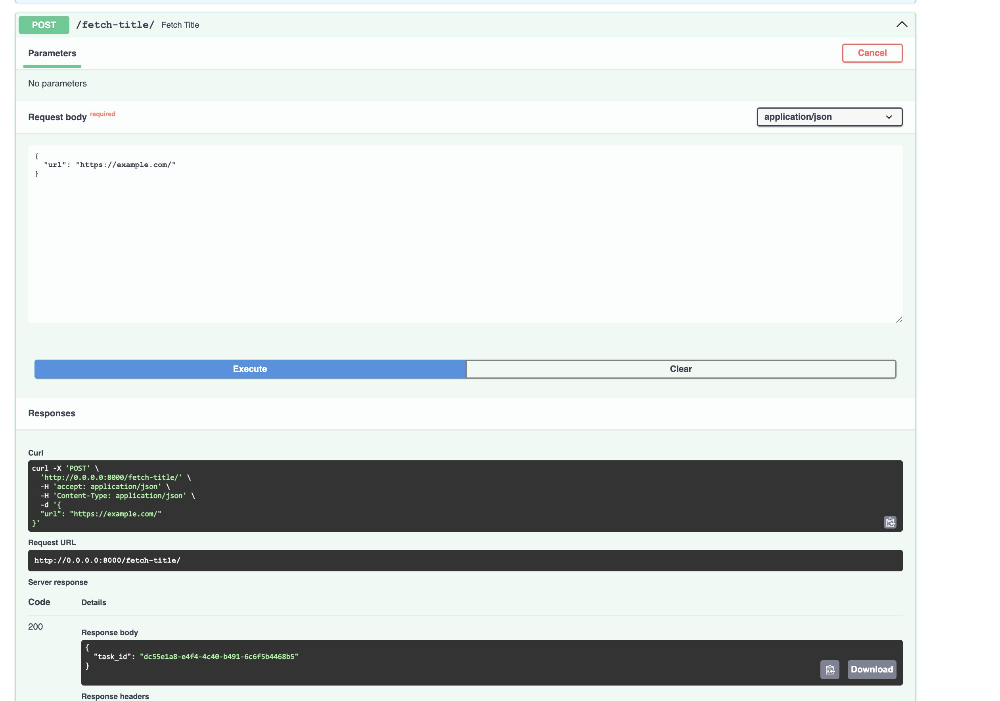
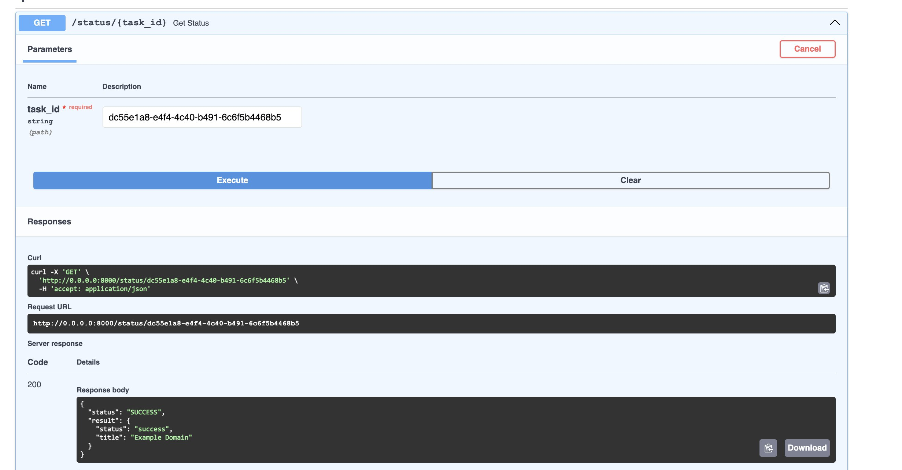

# Отчет по лабораторной работе №3

#### Цель работы:

Научиться упаковывать FastAPI приложение в Docker, интегрировать парсер данных с базой данных и вызывать парсер через API и очередь.

## Задание

#### Текст задания:

1. Упаковка FastAPI приложения, базы данных и парсера данных в Docker
2. Вызов парсера из FastAPI
3. Вызов парсера из FastAPI через очередь

#### Ход Работы:

Для начала я решил объединить вторую и третью лабораторные в 1 проекте добавил fastapi в parser

```
   from fastapi import FastAPI, HTTPException
   from pydantic import BaseModel, HttpUrl
   from tasks import fetch_and_store_title

   app = FastAPI()

   class URLItem(BaseModel):
      url: HttpUrl

  @app.post("/get-title/")
  async def get_title(url_item: URLItem):
      result = fetch_and_store_title.delay(str(url_item.url))
      print(result, "RESULT")
      return {"task_id": str(result)}

  @app.get("/status/{task_id}")
  async def get_status(task_id: str):
      task_result = fetch_and_store_title.AsyncResult(task_id)
      if task_result.state == 'PENDING':
          return {"status": "PENDING"}
      elif task_result.state == 'SUCCESS':
          return {"status": "SUCCESS", "result": task_result.result}
      else:
          return {"status": "FAILURE"}
```

А это главное приложение - main-app, то есть приложение главное выступает в качестве

```
from fastapi import APIRouter, HTTPException, Depends
from typing import List
from pydantic import BaseModel, HttpUrl
import aiohttp
import ssl
from auth import AuthHandler

parser_router = APIRouter()
auth_handler = AuthHandler()

class URLItem(BaseModel):
    url: HttpUrl

async def fetch_title_from_parser(url):
    parser_url = "http://parser:9000/get-title/"
    ssl_context = ssl.create_default_context()
    ssl_context.check_hostname = False
    ssl_context.verify_mode = ssl.CERT_NONE

    async with aiohttp.ClientSession(connector=aiohttp.TCPConnector(ssl=ssl_context)) as session:
        async with session.post(parser_url, json={"url": url}) as response:
            if response.status != 200:
                raise HTTPException(status_code=response.status, detail="Error fetching the title from parser")
            data = await response.json()
            return data.get("task_id")

async def get_task_status(task_id):
      parser_url = f"http://parser:9000/status/{task_id}"

      async with aiohttp.ClientSession() as session:
          async with session.get(parser_url) as response:
              if response.status != 200:
                  raise HTTPException(status_code=response.status, detail="Error fetching task status")
              data = await response.json()
              return data

    @parser_router.get("/status/{task_id}", tags=['parser'])
    async def get_status(task_id: str):
        status = await get_task_status(task_id)
        return status

    @parser_router.post("/fetch-title/", tags=['parser'])
    async def fetch_title(url_item: URLItem):
        task_id = await fetch_title_from_parser(str(url_item.url))
        return {"task_id": task_id}
```

Следущим шагом я настроил dockerfile для каждого

Dockerfile для main-app

```
FROM python:3.10-slim

WORKDIR /app

COPY requirements.txt .

RUN pip install --no-cache-dir -r requirements.txt

COPY . .

EXPOSE 8000

CMD ["uvicorn", "main:app", "--host", "0.0.0.0", "--port", "8000"]
```

Dockerfile для parser

```
FROM python:3.10-slim

WORKDIR /app

COPY requirements.txt .

RUN pip install --no-cache-dir -r requirements.txt

COPY . .

EXPOSE 9000

CMD ["sh", "-c", "uvicorn main:app --host 0.0.0.0 --port 9000 & celery -A tasks worker --loglevel=info"]
```

А также docker-compose.yml

```
version: '3.8'

services:
  main-app:
    build:
      context: ./main-app
      dockerfile: Dockerfile
    container_name: main-app
    restart: always
    depends_on:
      - db
      - parser
    ports:
      - "8000:8000"
    networks:
      - app-network

  parser:
    build:
      context: ./parser
      dockerfile: Dockerfile
    container_name: parser
    restart: always
    networks:
      - app-network
    depends_on:
      - redis
      - db

  db:
    image: postgres:14
    container_name: db
    restart: always
    environment:
      POSTGRES_USER: user
      POSTGRES_PASSWORD: password
      POSTGRES_DB: database
    volumes:
      - postgres_data:/var/lib/postgresql/data
    ports:
      - "10000:5432"
    networks:
      - app-network

  redis:
    image: redis:latest
    container_name: redis
    restart: always
    networks:
      - app-network

networks:
  app-network:
    driver: bridge

volumes:
  postgres_data:
```

Дальше в parser я настроил очередь событий при помощи celery и redis

```
from celery import Celery
import os
from dotenv import load_dotenv

load_dotenv()

redis_url = os.getenv('REDIS_URL', 'redis://redis:6379/0')

app = Celery('tasks', broker=redis_url, backend=redis_url)

app.conf.update(
    result_expires=3600,
)

if __name__ == '__main__':
    app.start()
```

И создали саму задачу

```
from celery import Celery
import aiohttp
from bs4 import BeautifulSoup
import ssl
from database import commit_article
import asyncio
from celery_config import app

@app.task
def fetch_and_store_title(url: str):
    ssl_context = ssl.create_default_context()
    ssl_context.check_hostname = False
    ssl_context.verify_mode = ssl.CERT_NONE

    async def fetch_title():
        async with aiohttp.ClientSession(connector=aiohttp.TCPConnector(ssl=ssl_context)) as session:
            async with session.get(url) as response:
                if response.status != 200:
                    return {'status': 'error', 'message': 'Error fetching the URL'}
                html = await response.text()
                parsed_html = BeautifulSoup(html, 'html.parser')
                title = parsed_html.title.string if parsed_html.title else 'No title found'
                commit_article(title)
                return {'status': 'success', 'title': title}

    return asyncio.get_event_loop().run_until_complete(fetch_title())
```

Результат работы программы:

