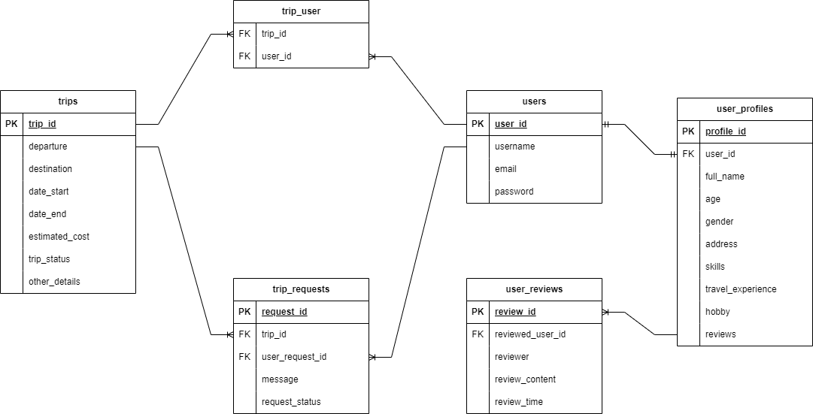

# API Documentation

Welcome to the documentation for our API. This documentation provides details about the endpoints, request/response formats, and usage instructions for interacting with our API.

The goal is to create a web application that helps people find travel partners. The app will allow users to find travel companions for specific trips, exchange information about planned trips, and discuss route details.

## Table of Contents

- [Users Endpoints](users.md)
- [Profiles Endpoints](profiles.md)
- [Reviews Endpoints](reviews.md)
- [Trips Endpoints](trips.md)

