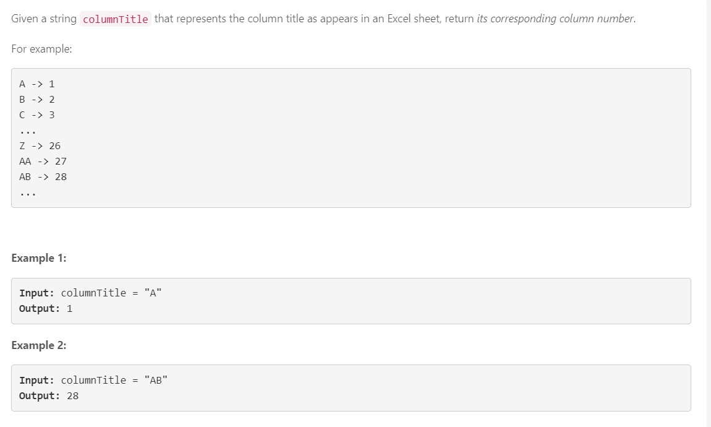
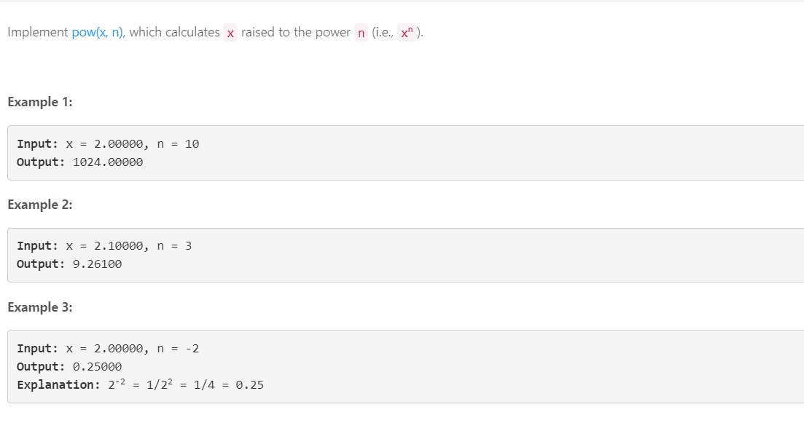
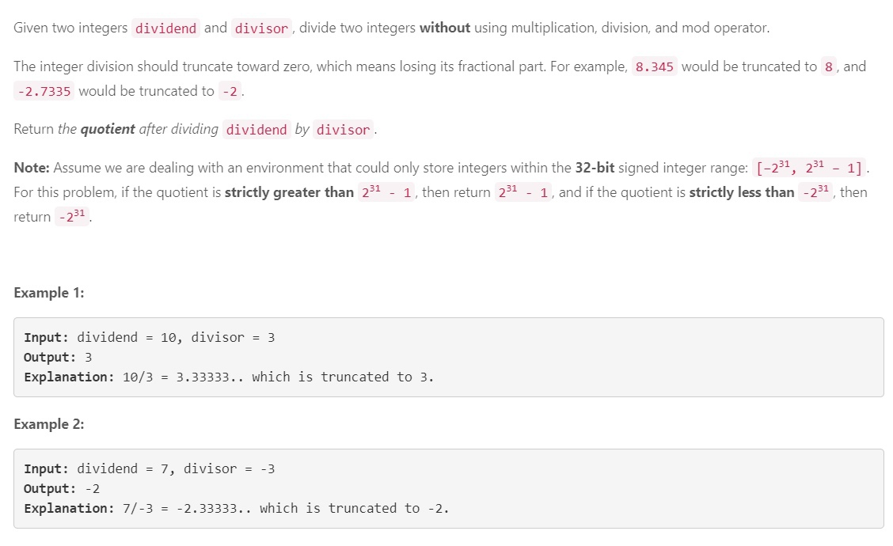
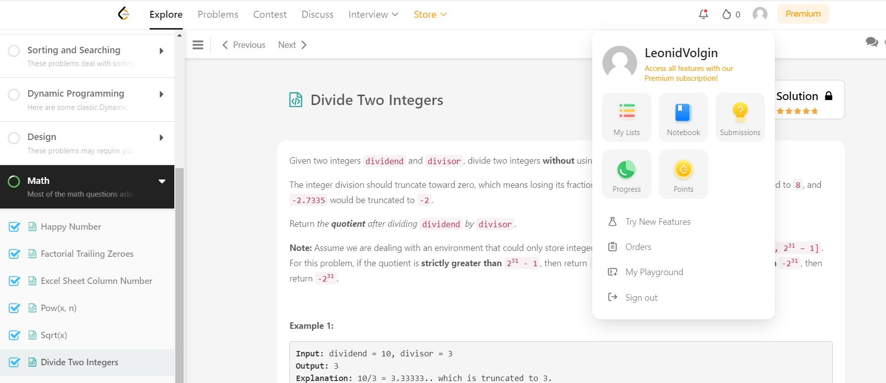

## Задача №1

### Решение
    class Solution:
        def titleToNumber(self, columnTitle: str) -> int:
            dict = {'A':1,
            'B':2,
            'C':3,
            'D':4,
            'E':5,
            'F':6,
            'G':7,
            'H':8,
            'I':9,
            'J':10,
            'K':11,
            'L':12,
            'M':13,
            'N':14,
            'O':15,
            'P':16,
            'Q':17,
            'R':18,
            'S':19,
            'T':20,
            'U':21,
            'V':22,
            'W':23,
            'X':24,
            'Y':25,
            'Z':26
            }
    
            #str = columnTitle
            number = columnTitle
            l = len(number) - 1
            ans = 0
            for char in number:
                    ans = ans + dict[char]*(26**l)
                    l = l - 1
            return ans

## Задача №2

### Решение
    
    class Solution:
        def myPow(self, x: float, n: int) -> float:
            def powpow(x, n):
                if n < 0:
                    n = -n
                    x = 1 / x
                if n == 2:
                    return x * x
                if n == 1:
                    return x
                if n == 0:
                    return 1
    
                half = n // 2
                ost = n % 2
                if ost == 1:
                    xx = x
                else:
                    xx = 1
    
                ans = powpow(x, half)
                return ans * ans * xx
    
            return powpow(x, n)

## Задача №3

### Решение
     class Solution:
        def mySqrt(self, x: int) -> int:
            if x == 0 or x == 1:
                return x
            mid = x // 2
            right = x
            while mid>0 and mid<right:
                #print(mid, right)
                if mid*mid>x:
                    right = mid
                    mid = mid//2
    
                if mid*mid < x:
                    if (mid+1)*(mid+1) != x:
                        mid = (mid + right)//2
                    else:
                        return mid + 1
                if mid*mid == x:
                    return mid
                
                if mid + 1 == right:
                    if mid*mid > x:
                        return mid-1
                    return mid

## Задача №4

### Решение

class Solution:
        def divide(self, dividend: int, divisor: int) -> int:
            # один из примеров внутри самой задачи неверный (-2147483648,-1 ответ должен быть 2147483648, а не 2147483647)
            if dividend == -2147483648 and divisor == -1:
                return 2147483647
            def div(a, b, counter):
    
                if a < 0 and b > 0:
                    a = -a
                    counter  = -1
                else:
                    if a > 0 and b < 0:
                        b = -b
                        counter = -1
                    else:
                        if a < 0 and b <0:
                            a = -a
                            b = -b
    
    
                if b > a:
                    return 0
                if b == a:
                    return counter
    
                bb = b
                cc = counter
                while True:
                    step_b = b + b
                    if step_b > a:
                        return counter + div(a-b,bb,cc)
                    if step_b == a:
                        return counter+counter
                    else:
                        b = step_b
                        counter = counter + counter
            return div(dividend,divisor,1)

# Чтоб не быть голословным

