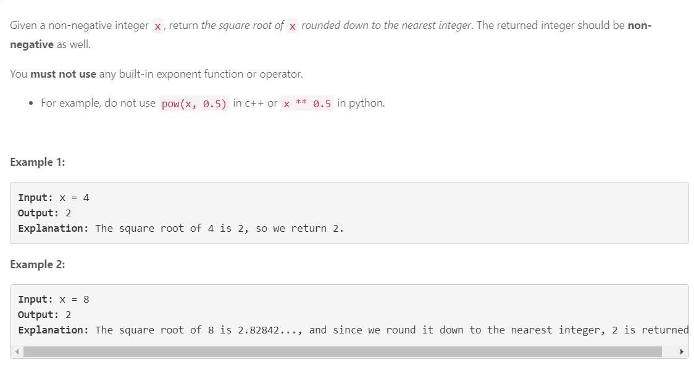

## Задача №1

### Решение
    class Solution:
        def titleToNumber(self, columnTitle: str) -> int:
            dict = {'A':1,
            'B':2,
            'C':3,
            'D':4,
            'E':5,
            'F':6,
            'G':7,
            'H':8,
            'I':9,
            'J':10,
            'K':11,
            'L':12,
            'M':13,
            'N':14,
            'O':15,
            'P':16,
            'Q':17,
            'R':18,
            'S':19,
            'T':20,
            'U':21,
            'V':22,
            'W':23,
            'X':24,
            'Y':25,
            'Z':26
            }
    
            #str = columnTitle
            number = columnTitle
            l = len(number) - 1
            ans = 0
            for char in number:
                    ans = ans + dict[char]*(26**l)
                    l = l - 1
            return ans

## Задача №2

### Решение
    
    class Solution:
        def myPow(self, x: float, n: int) -> float:
            def powpow(x, n):
                if n < 0:
                    n = -n
                    x = 1 / x
                if n == 2:
                    return x * x
                if n == 1:
                    return x
                if n == 0:
                    return 1
    
                half = n // 2
                ost = n % 2
                if ost == 1:
                    xx = x
                else:
                    xx = 1
    
                ans = powpow(x, half)
                return ans * ans * xx
    
            return powpow(x, n)

## Задача №3

### Решение
     class Solution:
        def mySqrt(self, x: int) -> int:
            if x == 0 or x == 1:
                return x
            mid = x // 2
            right = x
            while mid>0 and mid<right:
                #print(mid, right)
                if mid*mid>x:
                    right = mid
                    mid = mid//2
    
                if mid*mid < x:
                    if (mid+1)*(mid+1) != x:
                        mid = (mid + right)//2
                    else:
                        return mid + 1
                if mid*mid == x:
                    return mid
                
                if mid + 1 == right:
                    if mid*mid > x:
                        return mid-1
                    return mid

## Задача №4

### Решение

class Solution:
        def divide(self, dividend: int, divisor: int) -> int:
            # один из примеров внутри самой задачи неверный (-2147483648,-1 ответ должен быть 2147483648, а не 2147483647)
            if dividend == -2147483648 and divisor == -1:
                return 2147483647
            def div(a, b, counter):
    
                if a < 0 and b > 0:
                    a = -a
                    counter  = -1
                else:
                    if a > 0 and b < 0:
                        b = -b
                        counter = -1
                    else:
                        if a < 0 and b <0:
                            a = -a
                            b = -b
    
    
                if b > a:
                    return 0
                if b == a:
                    return counter
    
                bb = b
                cc = counter
                while True:
                    step_b = b + b
                    if step_b > a:
                        return counter + div(a-b,bb,cc)
                    if step_b == a:
                        return counter+counter
                    else:
                        b = step_b
                        counter = counter + counter
            return div(dividend,divisor,1)

## Задача №5

### Код
    # Definition for singly-linked list.
    # class ListNode:
    #     def __init__(self, val=0, next=None):
    #         self.val = val
    #         self.next = next
    class Solution:
        def addTwoNumbers(self, l1: Optional[ListNode], l2: Optional[ListNode]) -> Optional[ListNode]:
            sum1 = 0
            i = 0
            while not(l1 is None):
                sum1 = sum1 + l1.val * (10 ** i)
                i = i + 1
                l1 = l1.next
            
            sum2 = 0
            i = 0
            while not(l2 is None):
                sum2 = sum2 + l2.val * (10 ** i)
                i = i + 1
                l2 = l2.next
                
            ans = sum1 + sum2
            
            answer = ListNode()
            
            if ans == 0:
                return answer
            
            answer.val = ans%10
            ans = ans // 10
            
            if ans > 0:
                step = ListNode()
                answer.next = step
                
                
            while ans > 0:
                
                step.val = ans%10
                ans = ans // 10
                if ans > 0:
                    next_step = ListNode()
                    step.next = next_step
                    step = next_step
                
            return answer
            

## Задача №6

### Код
    # Definition for singly-linked list.
    # class ListNode:
    #     def __init__(self, val=0, next=None):
    #         self.val = val
    #         self.next = next
    class Solution:
        def oddEvenList(self, head: Optional[ListNode]) -> Optional[ListNode]:
            
            if head is None:
                return None
            
            if head.next is None:
                return head
            
            list1 = ListNode()
            list2 = ListNode()
            
            start1 = list1
            start2 = list2
            i = 0
            while not(head is None):
                if i%2 == 0:
                    list1.val = head.val
                    head = head.next
                    if not(head is None):
                        if not(head.next is None):
                            l1 = ListNode()
                            list1.next = l1
                            list1 = l1
                else:
                    list2.val = head.val
                    head = head.next
                    if not(head is None):
                        if not(head.next is None):
                            l2 = ListNode()
                            list2.next = l2
                            list2 = l2                
                i = i + 1
            list1.next = start2
            return start1

## Задача №7

### Код
    
    # Definition for singly-linked list.
    # class ListNode:
    #     def __init__(self, x):
    #         self.val = x
    #         self.next = None
    
    class Solution:
        def getIntersectionNode(self, headA: ListNode, headB: ListNode) -> Optional[ListNode]:
            
            len_a = 0
            len_b = 0
            
            A_start = headA
            B_start = headB
            
            while not (A_start is None):
                len_a = len_a + 1
                A_start = A_start.next
                
            while not (B_start is None):
                len_b = len_b + 1
                B_start = B_start.next
                
            if len_b < len_a:
                swap = headB
                headB = headA
                headA = swap
                
                swap = len_b
                len_b = len_a
                len_a = swap
                
            for i in range(len_b - len_a):
                headB = headB.next
               
            
            intersect = None
            
            while not (headA is None):
                if headA is headB:
                    if intersect is None:
                        intersect = ListNode(headA.val)
                       
                else:
                    intersect = None
                headA = headA.next
                headB = headB.next
            return intersect

## Задача №8

### Код
    class Solution:
        def letterCombinations(self, digits: str) -> List[str]:
            dict = {'2':['a','b','c'], '3':['d','e','f'], '4':['g','h','i'], '5':['j','k','l'],'6':['m','n','o'],'7':['p','q','r','s'], "8":['t','u','v'], '9':['w','x','y','z']}
            if digits == '':
                return []
            
            answ = ['']
            
            for digit in digits:
                new = []
                for elem in dict[digit]:
                    for i in answ:
                        new.append(i+elem)
                answ = new
            return answ

## Задача №9

### Код
    class Solution:
        def isHappy(self, n: int) -> bool:
          seen = set()
          while n != 1 and n not in seen:
            seen.add(n)
            n = sum(int(digit)**2 for digit in str(n))
          return n == 1

## Задача №10

### Код
    class Solution:
        def trailingZeroes(self, n: int) -> int:
            counter = 0
            for i in range(1,n+1):
                if i%5 == 0:
                    j = i
                    while True:
                        if j % 10 == 0 and j!=0:
                            j = j//10
                            counter = counter + 1
                        else:
                            break
                    while True:
                        if j % 5 == 0 and j != 0:
                            j = j // 5
                            counter = counter + 1
                        else:
                            break
            return counter

## Задача №11

### Код
    class Solution:
        def groupAnagrams(self, strs: List[str]) -> List[List[str]]:
            alphabet = 'abcdefghijklmnopqrstuvwxyz'
            signs = {}
            for sign in alphabet:
                signs[sign] = 0
            combinations = {}
            for word in strs:
                for sign in word:
                    signs[sign] = signs.get(sign) + 1
                slovo = []
                for sign in signs.keys():
                    slovo.append(sign)
                    slovo.append(str(signs[sign]))
                slovo = ''.join(slovo)
                arr = combinations.get(slovo, [])
                arr.append(word)
                combinations[slovo] = arr
                for sign in alphabet:
                    signs[sign] = 0
            listok = []
            for combination in combinations.keys():
                listok.append(combinations[combination])
            return(listok)

## Задача №12

### Код
    class Solution:
        def lengthOfLongestSubstring(self, s: str) -> int:
            if len(s) == 1:
                return 1
            left = 1
            maxlen = 0
            for i in range(1,len(s)):
                sub = s[left-1:i]
                #print(s[i], sub)
                if s[i] in sub:
                    if maxlen < len(sub):
                        maxlen = len(sub)
                    left = left + sub.index(s[i])+1
                    #print(left)
                else:
                    if maxlen < len(sub)+1:
                        maxlen = len(sub)+1
                #print(sub)
            return maxlen

## Задача №13

### Код
    class Solution:
            
        def expand(self, s, left, right):
          while left >= 0 and right < len(s) and s[left] == s[right]:
            left -= 1
            right += 1
          return right - left - 1
    
        def longestPalindrome(self,s: str) -> str:
          start = 0
          end = 0
    
          for i in range(len(s)):
            len1 = self.expand(s, i, i)
            len2 = self.expand(s, i, i + 1)
            length = max(len1, len2)
    
            if length > (end - start):
              start = i - (length - 1) // 2
              end = i + length // 2
    
          return s[start:end + 1]

## Задача №14

### Код
    class Solution:
        def increasingTriplet(self, nums: List[int]) -> bool:
            
            a1  = nums[0]
            b1 = None
            c1 = None
            flag = False
            for i in range(1,len(nums)):
                if b1 is None:
                    if nums[i]<= a1:
                        a1 = nums[i]
                    else:
                        b1 = nums[i]
                else:
                    if nums[i] > b1:
                        flag = True
                        break
                    else:
                        if nums[i] > a1:
                            b1 = nums[i]
                        else:
                            a1 = nums[i]
                            
            if flag:
                return flag
            
            c2 = nums[len(nums)-1]
            b2 = None
            a2 = None
            for i in range(len(nums)-2,-1,-1):
                if b2 is None:
                    if nums[i] >= c2:
                        c2 = nums[i]
                    else:
                        b2 = nums[i]
                else:
                    if nums[i] < b2:
                        flag = True
                        break
                    else:
                        if nums[i]<c2:
                            b2 = nums[i]
                        else:
                            c2 = nums[i]
            return flag
        

## Задача №15

### Код
    class Solution:
    
        def helper1(self, n):
            n_str = str(n)
            pairs = []
            prev = n_str[0]
            count = 1
            for i in range(1, len(n_str)):
                if n_str[i] == prev:
                    count += 1
                else:
                    pairs.append([prev, count])
                    prev = n_str[i]
                    count = 1
            pairs.append([prev, count])
        
            return pairs
    
        def helper2(self, pairs):
            arr = []
            for pair in pairs:
                arr.append(str(pair[1]))
                arr.append(pair[0])
    
            return ''.join(arr)
    
        def countAndSay(self, n: int) -> str:
            num = "1"
            for i in range(n - 1):
                pairs = self.helper1(num)
                num = self.helper2(pairs)
            return num

## Задача №16

### Код
    class Solution:
        def generateParenthesis(self, n: int) -> List[str]:
            variants= []
            scobs = n
            def recurs(string, opened, closed):
                nonlocal variants
                nonlocal scobs
                
                if opened + closed == scobs * 2:
                    variants.append(string)
                    return
                
                if closed < opened:
                    recurs(string+')',opened, closed + 1)
                
                if opened < scobs:
                    recurs(string+'(',opened+1, closed)
                
            recurs('(',1,0)
            return variants
## Задача №17

### Код
    class Solution:
        def permute(self, nums: List[int]) -> List[List[int]]:
            answer = []
            def recurs(pridatok, ostatok):
                nonlocal answer
                if len(ostatok)==0:
                    answer  = answer + pridatok
                    return
                for elem in pridatok:
                    for i in range(len(ostatok)):
                        recurs([elem + [ostatok[i]]], ostatok[:i]+ostatok[i+1:])
    
            recurs([[]], nums)
            return answer
            
 ## Задача №18

### Код
    class Solution:
        def subsets(self, nums: List[int]) -> List[List[int]]:
            answer = []
            def recurs(pridatok, ostatok):
                nonlocal answer
                if len(ostatok)==0:
                    answer  = answer + pridatok
                    return
                for elem in pridatok:
                    for i in range(len(ostatok)):
                        recurs([elem + [ostatok[i]]], ostatok[i+1:])
                    answer  = answer + [elem]
    
            recurs([[]], nums)
            return answer
        
            
        
            
            
        
            
            

# Чтобы не быть голословным

# Чтобы не быть голословным 2

# Чтобы не быть голословным 3

# Чтобы не быть голословным 4
