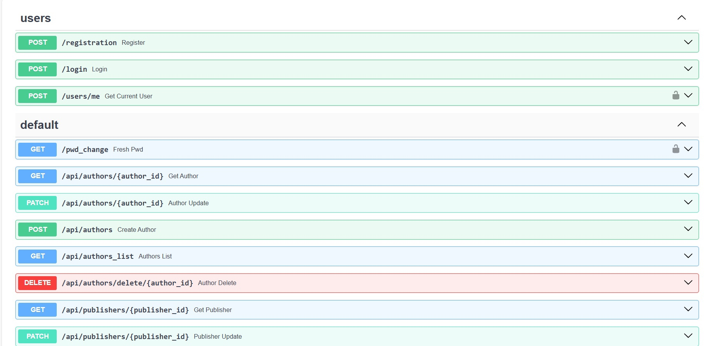

# Лабораторная работа №1

Научится реализовывать полноценное серверное приложение с помощью фреймворка FastAPI с применением дополнительных средств и библиотек.
Задача - создать веб-приложение, которое позволит пользователям обмениваться книгами между собой. Это приложение должно облегчать процесс обмена книгами, позволяя пользователям находить книги, которые им интересны, и находить новых пользователей для обмена книгами. Функционал веб-приложения должен включать следующее:
Создание профилей: Возможность пользователям создавать профили, указывать информацию о себе, своих навыках, опыте работы и предпочтениях по проектам.
Добавление книг в библиотеку: Пользователи могут добавлять книги, которыми они готовы поделиться, в свою виртуальную библиотеку на платформе.
Поиск и запросы на обмен: Функционал поиска книг в библиотеке других пользователей. Возможность отправлять запросы на обмен книгами другим пользователям.
Управление запросами и обменами: Возможность просмотра и управления запросами на обмен. Возможность подтверждения или отклонения запросов на обмен.

## Ход выполнения работы

### main.py:

    import uvicorn
    from fastapi import FastAPI
    #from models.main_models import *
    from db import init_db, engine
    from endpoints.user_endpoints import user_router
    from students.K33391.Volgin_Leonid.Lab_1.lab.endpoints.main_endpoints import main_router
    
    app = FastAPI()
    
    app.include_router(user_router)
    app.include_router(main_router, prefix="/api")
    
    
    # def create_db_and_tables():
    #     SQLModel.metadata.create_all(engine)
    
    @app.get('/')
    def hello():
        return 'hello'
    
    
    
    @app.on_event("startup")
    def on_startup():
        init_db()
    
    if __name__ == '__main__':
        uvicorn.run('main:app', host="localhost", port=8000, reload=True)
        #create_db_and_tables()

### auth.py:
    import datetime
    
    from fastapi import Security, HTTPException
    from fastapi.security import HTTPBearer, HTTPAuthorizationCredentials
    from passlib.context import CryptContext
    import jwt
    from starlette import status
    from dotenv import load_dotenv
    
    from repos.user_repos import find_user
    
    import os
    
    load_dotenv()
    
    secret_key = os.getenv("SECRET_KEY")
    #secret_key = 'secret_key'
    
    class AuthHandler:
        security = HTTPBearer()
        pwd_context = CryptContext(schemes=['bcrypt'])
        secret = secret_key
    
        def get_password_hash(self, password):
            return self.pwd_context.hash(password)
    
        def verify_password(self, pwd, hashed_pwd):
            return self.pwd_context.verify(pwd, hashed_pwd)
    
        def encode_token(self, user_id):
            payload = {
                'exp': datetime.datetime.utcnow() + datetime.timedelta(hours=8),
                'iat': datetime.datetime.utcnow(),
                'sub': user_id
            }
            return jwt.encode(payload, self.secret, algorithm='HS256')
    
        def decode_token(self, token):
            try:
                payload = jwt.decode(token, self.secret, algorithms=['HS256'])
                return payload['sub']
            except jwt.ExpiredSignatureError:
                raise HTTPException(status_code=401, detail='Expired signature')
            except jwt.InvalidTokenError:
                raise HTTPException(status_code=401, detail='Invalid token')
    
        def auth_wrapper(self, auth: HTTPAuthorizationCredentials = Security(security)):
            return self.decode_token(auth.credentials)
    
        def get_current_user(self, auth: HTTPAuthorizationCredentials = Security(security)):
            credentials_exception = HTTPException(
                status_code=status.HTTP_401_UNAUTHORIZED,
                detail='Could not validate credentials'
            )
            username = self.decode_token(auth.credentials)
            if username is None:
                raise credentials_exception
            user = find_user(username)
            if username is None:
                raise credentials_exception
            return user
### main_endpoints.py
    
    from fastapi import APIRouter, HTTPException, Depends
    from typing import List
    from sqlmodel import Session, select
    from endpoints.user_endpoints import auth_handler
    from students.K33391.Volgin_Leonid.Lab_1.lab.db import session, get_session
    from students.K33391.Volgin_Leonid.Lab_1.lab.models.main_models import Author, Author_Default, Publisher_Default, \
        Publisher, Book, Book_Default, WishList, WishList_Default, Acception, Publisher_Submodel
    
    main_router = APIRouter()

    @main_router.get("/authors/{author_id}")
    def get_author(author_id: int):
        author = session.get(Author, author_id)
        if not author:
            raise HTTPException(status_code=404, detail="Author not found")
        return author
    
    @main_router.post("/authors")
    def create_author(def_author: Author_Default,):
        author = Author.model_validate(def_author)
        session.add(author)
        session.commit()
        session.refresh(author)
        return {"status": 200, "data": author}
    
    @main_router.get("/authors_list")
    def authors_list(session=Depends(get_session)) -> List[Author]:
        return session.exec(select(Author)).all()
    
    @main_router.delete("/authors/delete/{author_id}")
    def author_delete(author_id: int, session=Depends(get_session)):
        author = session.get(Author, author_id)
        if not author:
            raise HTTPException(status_code=404, detail="Author not found")
        session.delete(author)
        session.commit()
        return {"ok": True}
    
    @main_router.patch("/authors/{author_id}")
    def author_update(author_id: int, author: Author_Default, session=Depends(get_session)) -> Author_Default:
        db_author = session.get(Author, author_id)
        if not db_author:
            raise HTTPException(status_code=404, detail="Author not found")
        author_data = author.model_dump(exclude_unset=True)
        for key, value in author_data.items():
            setattr(db_author, key, value)
        session.add(db_author)
        session.commit()
        session.refresh(db_author)
        return db_author

    @main_router.get("/publishers/{publisher_id}",response_model=Publisher_Submodel)
    def get_publisher(publisher_id: int):
        publisher = session.get(Publisher, publisher_id)
        if not publisher:
            raise HTTPException(status_code=404, detail="Publisher not found")
        return publisher
    
    @main_router.post("/publishers")
    def create_publisher(def_publisher: Publisher_Default,):
        publisher = Publisher.model_validate(def_publisher)
        session.add(publisher)
        session.commit()
        session.refresh(publisher)
        return {"status": 200, "data": publisher}
    
    @main_router.get("/publishers_list")
    def publishers_list(session=Depends(get_session)) -> List[Publisher]:
        return session.exec(select(Publisher)).all()
    
    @main_router.delete("/publishers/delete/{publisher_id}")
    def publisher_delete(publisher_id: int, session=Depends(get_session)):
        publisher = session.get(Publisher, publisher_id)
        if not publisher:
            raise HTTPException(status_code=404, detail="Publisher not found")
        session.delete(publisher)
        session.commit()
        return {"ok": True}
    
    @main_router.patch("/publishers/{publisher_id}")
    def publisher_update(publisher_id: int, publisher: Publisher_Default, session=Depends(get_session)) -> Publisher_Default:
        db_publisher = session.get(Publisher, publisher_id)
        if not db_publisher:
            raise HTTPException(status_code=404, detail="Publisher not found")
        publisher_data = publisher.model_dump(exclude_unset=True)
        for key, value in publisher_data.items():
            setattr(db_publisher, key, value)
        session.add(db_publisher)
        session.commit()
        session.refresh(db_publisher)
        return db_publisher
     
    @main_router.get("/books/{book_id}")
        def get_book(book_id: int):
            book = session.get(Book, book_id)
            if not book:
                raise HTTPException(status_code=404, detail="Book not found")
            return book
        
        @main_router.post("/books")
        def create_book(def_book: Book_Default,user=Depends(auth_handler.get_current_user)):
            book = Book(name=def_book.name, description=def_book.description, user_id=user.id)
            session.add(book)
            session.commit()
            session.refresh(book)
            return {"status": 200, "data": book}
        
        @main_router.get("/books_list")
        def books_list(session=Depends(get_session), user=Depends(auth_handler.get_current_user)) -> List[Book]:
            return session.query(Book).filter(Book.user_id == user.id).all()

        @main_router.delete("/books/delete/{book_id}")
        def book_delete(book_id: int, session=Depends(get_session),user=Depends(auth_handler.get_current_user)):
            book = session.get(Book, book_id)
            if not book:
                raise HTTPException(status_code=404, detail="Book not found")
            if book.user_id == user.id:
                session.delete(book)
                session.commit()
            else:
                raise HTTPException(status_code=404, detail="You have no permission for doing this")
            return {"ok": True}
        
        @main_router.post("/wishlists")
        def make_a_wish(wishlist: WishList_Default, user=Depends(auth_handler.get_current_user)):
            book = session.get(Book, wishlist.book_id)
            if not book:
                raise HTTPException(status_code=404, detail="Book not found")
            wish = WishList(book_id=wishlist.book_id, user_id=user.id)
            session.add(wish)
            session.commit()
            session.refresh(wish)
            return {"status": 200, "data": wish}
        
        @main_router.delete("/wishlists/delete/{book_id}")
        def wish_delete(book_id: int, session=Depends(get_session),user=Depends(auth_handler.get_current_user)):
            book = session.get(Book, book_id)
            if not book:
                raise HTTPException(status_code=404, detail="Book not found")
            wish = session.query(WishList).filter(WishList.book_id == book_id, WishList.user_id == user.id).first()
            if not wish:
                raise HTTPException(status_code=404, detail="Wish not found")
            session.delete(wish)
            session.commit()
            return {"ok": True}
        
        @main_router.put("/wishlists/accept/{book_id}")
        def wish_accept(book_id: int, acception: Acception, session=Depends(get_session),user=Depends(auth_handler.get_current_user)):
            book = session.get(Book, book_id)
            if not book:
                raise HTTPException(status_code=404, detail="Book not found")
            wish = session.query(WishList).filter(WishList.book_id == book_id, WishList.user_id == user.id).first()
            if not wish:
                raise HTTPException(status_code=404, detail="Wish not found")
        
            for key, value in acception.dict(exclude_unset=True).items():
                setattr(wish, key, value)
            session.add(wish)
            session.commit()
            session.refresh(wish)
            return {"ok": True}
        
        @main_router.get("/books_list")
        def wishs_list(session=Depends(get_session), user=Depends(auth_handler.get_current_user)) -> List[WishList]:
            return session.query(WishList).filter(WishList.user_id == user.id).all()

### user_endpoints.py

    from fastapi import APIRouter, HTTPException, Depends
    from starlette.responses import JSONResponse
    from starlette.status import HTTP_201_CREATED
    from auth.auth import AuthHandler
    from students.K33391.Volgin_Leonid.Lab_1.lab.models.main_models import User
    from models.user_models import UserInput, UserLogin
    from repos.user_repos import select_all_users, find_user
    from db import session
    
    user_router = APIRouter()
    auth_handler = AuthHandler()

    @user_router.post('/registration', status_code=201, tags=['users'], description='Register new user')
    def register(user: UserInput):
        users = select_all_users()
        if any(x.username == user.username for x in users):
            raise HTTPException(status_code=400, detail='Username is taken')
        hashed_pwd = auth_handler.get_password_hash(user.password)
        description = "New user"
        u = User(username=user.username, password=hashed_pwd, email=user.email, description=description)
        session.add(u)
        session.commit()
        return JSONResponse(status_code=201, content={"message": "User registered successfully"})

    @user_router.post('/login', tags=['users'])
    def login(user: UserLogin):
        user_found = find_user(user.username)
        if not user_found:
            raise HTTPException(status_code=401, detail='Invalid username and/or password')
        verified = auth_handler.verify_password(user.password, user_found.password)
        if not verified:
            raise HTTPException(status_code=401, detail='Invalid username and/or password')
        token = auth_handler.encode_token(user_found.username)
        return {'token': token}
    
    @user_router.get("/pwd_change")
    def fresh_pwd(pwd, new_pwd, user=Depends(auth_handler.get_current_user)):
        hashed_pwd = auth_handler.get_password_hash(pwd)
        #print(hashed_pwd)
        #print(user.password)
        #if hashed_pwd == user.password:
        new_hashed_pwd = auth_handler.get_password_hash(new_pwd)
        session.query(User).filter(User.id == user.id).update({'password': new_hashed_pwd})
        session.commit()
        #else:
            #raise HTTPException(status_code=401, detail=f'{hashed_pwd} {user.password}')

    @user_router.post('/users/me', tags=['users'])
    def get_current_user(user: User = Depends(auth_handler.get_current_user)):
        return user.username

### main_models.py:
    from typing import Optional
    from sqlmodel import SQLModel, Field, Relationship

    class Author_Default(SQLModel):
        name: str
        info: str
    
    class Author(Author_Default, table=True):
        #__table_args__ = {'extend_existing': True}
        id: Optional[int] = Field(default=None,primary_key=True)
        books: list['Book'] = Relationship(back_populates='author')

    class WishList_Default(SQLModel):
        book_id: Optional[int] = Field(default=None, foreign_key="book.id", primary_key=True)
    
    class Acception(SQLModel):
        is_accepted: Optional[bool] = Field(default=None, nullable=True)
    
    class WishList(WishList_Default, table=True):
        #__table_args__ = {'extend_existing': True}
        #id: Optional[int] = Field(primary_key=True)
        is_accepted: Optional[bool] = Field(default=None, nullable=True)
        aboba: Optional[bool] = Field(default=None, nullable=True)
        user_id: Optional[int] = Field(default=None, foreign_key="user.id", primary_key=True)

    class User_Default(SQLModel):
        username: str = Field(index=True)
        password: str
        email: str
        description: str
    
    class User(User_Default, table=True):
        #__table_args__ = {'extend_existing': True}
        id: int = Field(default=None,primary_key=True)
        user_books: list['Book'] = Relationship(back_populates='user')
        books: list['Book'] = Relationship(back_populates="users", link_model=WishList)

    class Publisher_Default(SQLModel):
        name: str
        info: str
    
    class Publisher_Submodel(Publisher_Default):
        books: Optional[list['Book']] = None
    
    class Publisher(Publisher_Default, table=True):
        #__table_args__ = {'extend_existing': True}
        id: Optional[int] = Field(default=None,primary_key=True)
        books: list['Book'] = Relationship(back_populates='publisher')

    class Book_Default(SQLModel):
        name: str
        description: str
    
    class Book(Book_Default, table=True):
        #__table_args__ = {'extend_existing': True}
        id: Optional[int] = Field(primary_key=True)
        user_id: int = Field(default=None, foreign_key="user.id")
        user: Optional[User] = Relationship(back_populates="user_books")
        author_id: int = Field(default=None, nullable=True, foreign_key="author.id")
        author: Optional[Author] = Relationship(back_populates="books")
        publisher_id: int = Field(default=None, nullable=True, foreign_key="publisher.id")
        publisher: Optional[Publisher] = Relationship(back_populates="books")
        users: list[User] = Relationship(back_populates="books", link_model=WishList)

### user_models.py:
    from pydantic import validator
    from sqlmodel import SQLModel

    class UserInput(SQLModel):
        username: str
        password: str
        password2: str
        email: str
        @validator('password2')
        def password_match(cls, v, values, **kwargs):
            if 'password' in values and v != values['password']:
                raise ValueError('passwords don\'t match')
            return v
    
    class UserLogin(SQLModel):
        username: str
        password: str

### db.py
    from sqlmodel import SQLModel, Session, create_engine
    import os
    from dotenv import load_dotenv
    load_dotenv()
    db_url = os.getenv('DB_URL')
    engine = create_engine(db_url, echo=True)
    session = Session(bind=engine)
    def init_db():
        SQLModel.metadata.create_all(engine)

    def get_session():
        with Session(engine) as session:
            yield session

## Результат

