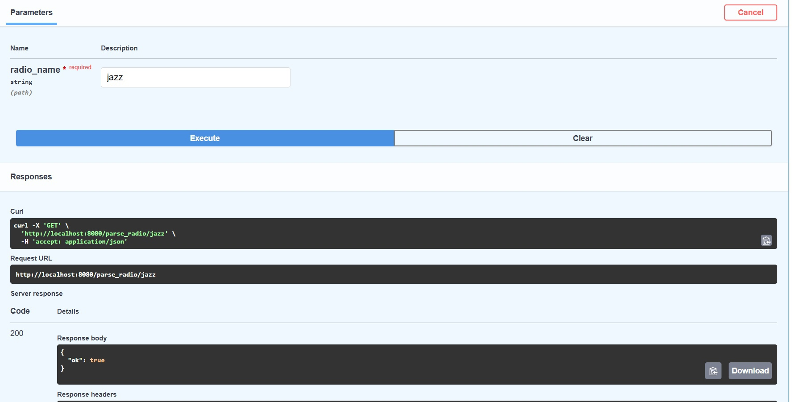
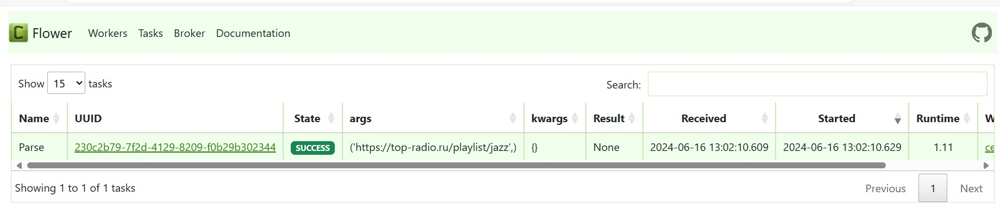

# Лабораторная работа №3

В результате выполнения этой работы был создан асинхронный парсер, который вызывался по определенному запросу через Fast-Api приложение.
После чего с помощью Celery и Redis был настроен вызов данного парсера через очередь.

## Код docker-compose.yml
    version: "3.7"
    
    services:
      db:
        image: postgres:15
        container_name: db
        command: -p 1221
        expose:
          - 1221
        env_file:
          - .env
      redis:
        image: redis:7
        container_name: redis
        command: --port 5370
        expose:
          - 5370
      app:
        build:
          context: .
        env_file:
          - .env
        container_name: api
        depends_on:
          - db
          - redis
        ports:
          - 8080:8080
      celery:
        build:
          context: .
        container_name: celery
        env_file:
          - .env
        command: ["/lab3/docker/celery.sh"]
        depends_on:
          - app
          - redis
          - db
      flower:
        build:
          context: .
        container_name: flower
        env_file:
          - .env
        command: ["/lab3/docker/flower.sh"]
        depends_on:
          - app
          - celery
          - redis
          - db
        ports:
          - 5555:5555

## Код Dockerfile
    FROM python:3.11
    
    WORKDIR /lab3
    
    COPY requirements.txt .
    
    RUN pip3 install -r requirements.txt
    
    COPY . .
    
    RUN chmod a+x docker/*.sh
    
    CMD gunicorn main:app --worker-class uvicorn.workers.UvicornWorker --bind 0.0.0.0:8080

## Код эедпоинта
    @app.get("/parse_radio/{radio_name}")
    async def parse_radio(radio_name: str):
        if radio_name not in radio_names:
            raise HTTPException(status_code=404, detail="Radio not found")
        else:
            radio_parse.delay(f'https://top-radio.ru/playlist/{radio_name}')
            return {"ok": True}

## Код worker.py

    import asyncio
    from config import *
    from celery import Celery
    from sqlalchemy import create_engine
    from sqlalchemy.orm import sessionmaker
    from radioparser import parse_and_save
    
    broker = f'redis://{REDIS_HOST}:{REDIS_PORT}'
    worker = Celery('tasks', broker=broker)
    
    DATABASE_URL = f"postgresql://{DB_USER}:{DB_PASS}@{DB_HOST}:{DB_PORT}/{DB_NAME}"
    engine = create_engine(DATABASE_URL)
    Session = sessionmaker(bind=engine)
    db_session = Session()
    
    
    @worker.task(name='Parse')
    def radio_parse(url: str):
        asyncio.run(parse_and_save(url, db_session))

### Результат

