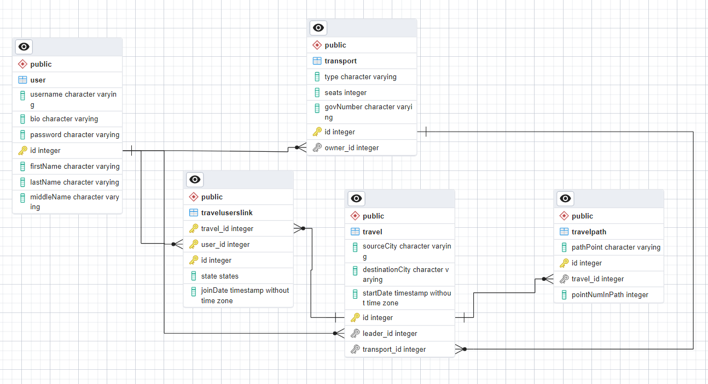

#Laboratory work 1
##Models
Задача - создать веб-приложение, которое поможет людям находить партнеров для совместных путешествий. Приложение должно предоставлять возможность пользователям находить попутчиков для конкретных путешествий, обмениваться информацией о планируемых поездках и обсуждать детали маршрута. 
Функционал веб-приложения должен включать следующее:

- Создание профилей: Возможность пользователям создавать профили, указывать информацию о себе, своих навыках, опыте работы и предпочтениях по проектам.
- Создание поездок: Возможность пользователям создавать объявления о планируемых поездках с указанием дат, маршрута, предполагаемой длительности и других деталей.
- Поиск попутчиков: Функционал поиска попутчиков для конкретных поездок на основе заданных критериев, таких как место отправления, место назначения, даты и т.д.
- Управление поездками: Возможность управления созданными поездками, включая добавление/изменение деталей, отмену поездки и т.д.



User
```py
class UserDefault(SQLModel):
    username: str
    firstName: str
    lastName: Optional[str] = None
    middleName: Optional[str] = None
    bio: Optional[str] = None
    age: Optional[int] = None


class UserCreate(UserDefault):
    password: str


class UserPasswordDefault(UserDefault):
    hashedPassword: str


class UserPasswordUpdate(SQLModel):
    oldPassword: str
    newPassword: str


class User(UserPasswordDefault, table=True):
    id: int = Field(default=None, primary_key=True)
    _travelsAsLeader: Optional[List["Travel"]] = Relationship(back_populates="_leader")
    _travelAsPassenger: Optional[List["Travel"]] = Relationship(back_populates="_companions", link_model=TravelUsersLink)
    _transports: Optional[List["Transport"]] = Relationship(back_populates="_owner")

```

Travel
```py
class TravelDefault(SQLModel):
    sourceCity: str
    destinationCity: str
    startDate: datetime
    leader_id: int = Field(default=None, foreign_key="user.id")
    transport_id: int = Field(default=None, foreign_key="transport.id")


class Travel(TravelDefault, table=True):
    id: int = Field(default=None, primary_key=True)
    _companions: Optional[List["User"]] = Relationship(back_populates="_travelAsPassenger", link_model=TravelUsersLink)
    _leader: Optional["User"] = Relationship(back_populates="_travelsAsLeader")
    _transport: Optional["Transport"] = Relationship(back_populates="_travels")
    _path: Optional[List["TravelPath"]] = Relationship(back_populates="_travel")
```

Transport
```py
class TransportBasic(SQLModel):
    seats: int = Field()
    govNumber: str


class TransportDefault(TransportBasic):
    type: str = Field(default=TransportType.other)
    owner_id: int = Field(default=None, foreign_key="user.id")


class Transport(TransportDefault, table=True):
    id: int = Field(default=None, primary_key=True)
    _owner: Optional["User"] = Relationship(back_populates="_transports")
    _travels: Optional[List["Travel"]] = Relationship(back_populates="_transport")
```

TravelPath
```py
class TravelPathDefault(SQLModel):
    travel_id: int = Field(default=None, foreign_key="travel.id")
    pathPoint: str
    pointNumInPath: int = Field(default=0)


class TravelPath(TravelPathDefault, table=True):
    id: int = Field(default=None, primary_key=True)
    _travel: Optional["Travel"] = Relationship(back_populates="_path")
```

TravelUserLink
```py
class TravelUsersLinkDefault(SQLModel):
    travel_id: Optional[int] = Field(
        default=None, foreign_key="travel.id", primary_key=True
    )
    user_id: Optional[int] = Field(
        default=None, foreign_key="user.id", primary_key=True
    )


class TravelUsersLinkState(TravelUsersLinkDefault):
    state: States = Field(default=States.awaiting)


class TravelUsersLink(TravelUsersLinkState, table=True):
    joinDate: datetime = Field(default=datetime.now())
```

Enums
```py
class States(Enum):
    awaiting = "awaiting"
    approve = "approve"
    reject = "reject"


class TransportType(Enum):
    plane = "plane"
    car = "car"
    truck = "truck"
    bus = "bus"
    other = "other"
```

##Exceptions
httpExeptions
```py
from fastapi import HTTPException
from starlette import status

unauthorizedException = HTTPException(
    status_code=status.HTTP_401_UNAUTHORIZED,
    detail="Could not validate credentials",
    headers={"WWW-Authenticate": "Bearer"},
)

usernameAlreadyExistedException = HTTPException(
    status_code=status.HTTP_400_BAD_REQUEST,
    detail="Username already existed",
)

incorrectPasswordException = HTTPException(
    status_code=status.HTTP_400_BAD_REQUEST,
    detail="Incorrect old password",
)

alreadyRegisteredOnTravelException = HTTPException(
    status_code=status.HTTP_400_BAD_REQUEST,
    detail="You already registered on this travel",
)

transportNotFoundException = HTTPException(
    status_code=status.HTTP_404_NOT_FOUND,
    detail="Transport not found",
)

travelNotFoundException = HTTPException(
    status_code=status.HTTP_404_NOT_FOUND,
    detail="Travel not found",
)

applicationNotFoundException = HTTPException(
    status_code=status.HTTP_404_NOT_FOUND,
    detail="Application not found",
)

userNotFoundException = HTTPException(
    status_code=status.HTTP_404_NOT_FOUND,
    detail="User not found",
)

travelPathNotFoundException = HTTPException(
    status_code=status.HTTP_404_NOT_FOUND,
    detail="TravelPath not found",
)

goOutOfThereException = HTTPException(
    status_code=status.HTTP_400_BAD_REQUEST,
    detail="GO OUT OF THERE",
)

travelLeaderApplicationException = HTTPException(
    status_code=status.HTTP_400_BAD_REQUEST,
    detail="You are lead this travel",
)
```

##main.py
```py
app = FastAPI()
oauth2_scheme = OAuth2PasswordBearer(tokenUrl="token")
load_dotenv()

#region Auth


def getPasswordHash(password: str) -> str:
    return bcrypt.hashpw(password.encode(), salt=(os.getenv("SALT")).encode()).decode()


def checkPassword(password: str, hashedPassword: str) -> bool:
    return bcrypt.checkpw(password.encode(), hashedPassword.encode())


def getUser(session: Session, username: str, hashedPassword: str) -> User:
    user = session.exec(select(User).where(User.username == username, User.hashedPassword == hashedPassword)).first()
    return user


def authenticate(session: Session, username: str, password: str) -> User:
    user = getUser(session, username, getPasswordHash(password))
    return user


def createaccess_token(data: dict) -> Token:
    data = data.copy()
    expire = str(datetime.utcnow() + timedelta(minutes=float(os.getenv("ACCESS_TOKEN_EXPIRE_TIME"))))
    data.update({'expire': expire})
    encodedJwt = jwt.encode(data, os.getenv("SECRET_KEY"), algorithm=os.getenv("ALGORITHM"))
    token = Token(access_token=encodedJwt, token_type="")
    return token


def currentUser(session: Session = Depends(get_session), token: str = Depends(oauth2_scheme)) -> User:
    try:
        #print("!!!", token)
        payload = jwt.decode(token, os.getenv("SECRET_KEY"), algorithms=[os.getenv("ALGORITHM")])
        username: str = payload.get("sub")
        password: str = payload.get("pass")
        if username is None or password is None:
            raise unauthorizedException
        user = getUser(session, username, password)
        if user is None:
            raise unauthorizedException
        return user
    except jwt.PyJWTError:
        raise unauthorizedException

#endregion

#region User


@app.post("/token", response_model=Token)
def login(data: OAuth2PasswordRequestForm = Depends(), session: Session = Depends(get_session)):
    user = authenticate(session, data.username, data.password)
    if not user:
        raise unauthorizedException
    access_token = createaccess_token(data={"sub": user.username, "pass": user.hashedPassword})
    return {"access_token": access_token.access_token, "token_type": "bearer"}


@app.post("/register", response_model=UserDefault)
def registration(user: UserCreate, session: Session = Depends(get_session)) -> UserDefault:
    if authenticate(session, user.username, user.password):
        raise usernameAlreadyExistedException
    data = user.__dict__
    data.update({"hashedPassword": getPasswordHash(user.password)})
    newUser = User(**data)
    session.add(newUser)
    session.commit()
    session.refresh(newUser)
    return newUser


@app.get("/users/me", response_model=UserDeatails)
def getMyUser(session=Depends(get_session), currentUser: User = Depends(currentUser)) -> dict[str, ]:
    user = currentUser.__dict__
    transports = session.exec(select(Transport).where(Transport.owner_id == user['id'])).all()
    travelAsPassenger = session.exec(select(Travel, TravelUsersLink).where(TravelUsersLink.travel_id == Travel.id, TravelUsersLink.user_id == user['id'])).all()
    travelsAsLeader = session.exec(select(Travel).where(Travel.leader_id == user['id'])).all()
    user.update({"transports": transports})
    user.update({"travelAsPassenger": travelAsPassenger})
    user.update({"travelsAsLeader": travelsAsLeader})
    return user


@app.get("/users/{user_id}", response_model=UserDefault)
def getUserByID(user_id: int, session=Depends(get_session)) -> User:
    user = session.get(User, user_id)
    return user


@app.put("/users/me/password")
def changePassword(data: UserPasswordUpdate, currentUser: User = Depends(currentUser), session=Depends(get_session)) -> dict[str, str]:
    user = session.exec(select(User).where(User.id == currentUser.id)).first()
    if not checkPassword(data.oldPassword, user.hashedPassword):
        raise incorrectPasswordException
    user.hashedPassword = getPasswordHash(data.newPassword)
    session.commit()
    return {"msg": "Password changed successfully"}

#endregion

#region Transport


@app.post("/me/Transport/add")
def addTransport(transport: TransportDefault, session=Depends(get_session), currentUser: User = Depends(currentUser)) -> TypedDict('Response', {"status": int, "data": Transport}):
    transport.owner_id = currentUser.id
    transport = Transport.model_validate(transport)
    session.add(transport)
    session.commit()
    session.refresh(transport)
    return {"status": 200, "data": transport}


@app.get("/me/transport")
def getUserTransport(session=Depends(get_session), currentUser: User = Depends(currentUser)) -> List[Transport]:
    transport = session.exec(select(Transport).where(Transport.owner_id == currentUser.id)).all()
    return transport


@app.put("/me/transport/change/{transport_id}")
def changeTransport(transport_id: int, data: TransportBasic, currentUser: User = Depends(currentUser), session=Depends(get_session)) -> Transport:
    transport = session.get(Transport, transport_id)
    if not transport:
        raise transportNotFoundException
    if(currentUser.id != transport.owner_id):
        raise goOutOfThereException
    transport.govNumber = data.govNumber
    transport.seats = data.seats
    session.commit()
    session.refresh(transport)
    return transport


@app.delete("/me/transport/delete/{transport_id}")
def deleteTransport(transport_id: int, currentUser: User = Depends(currentUser), session=Depends(get_session)) -> dict[str, str]:
    transport = session.get(Transport, transport_id)
    if not transport:
        raise transportNotFoundException
    if currentUser.id != transport.owner_id:
        raise goOutOfThereException
    session.delete(transport)
    session.commit()
    return {"msg": "Successfully deleted transport"}

#endregion

#region Travel


@app.post("/me/Travel/add")
def addTravel(travel: TravelDefault, session=Depends(get_session), currentUser: User = Depends(currentUser)) -> TypedDict('Response', {"status": int, "data": Travel}):
    travel.leader_id = currentUser.id
    travel = Travel.model_validate(travel)
    session.add(travel)
    session.commit()
    session.refresh(travel)
    return {"status": 200, "data": travel}


@app.get("/me/TravelsAsLeader")
def getUserTravelsAsLeader(session=Depends(get_session), currentUser: User = Depends(currentUser)) -> List[Travel]:
    travels = session.exec(select(Travel).where(Travel.leader_id == currentUser.id)).all()
    return travels


@app.get("/me/TravelsAsPassenger")
def getUserTravelsAsPassenger(session=Depends(get_session), currentUser: User = Depends(currentUser)) -> List[Travel]:
    travels = session.exec(select(Travel, TravelUsersLink).where(TravelUsersLink.travel_id == Travel.id, TravelUsersLink.user_id == currentUser.id)).all()
    return travels

#endregion

#region TravelPath


@app.post("/me/TravelPath/add")
def addTravelPath(travelPath: TravelPathDefault, session=Depends(get_session), currentUser: User = Depends(currentUser))\
        -> (TypedDict('Response', {"status": int, "data": TravelPath})):

    travel = session.get(Travel, travelPath.travel_id)
    if not travel:
        raise travelNotFoundException
    if currentUser.id != travel.leader_id:
        raise goOutOfThereException
    travelPath = TravelPath.model_validate(travelPath)
    session.add(travelPath)
    session.commit()
    session.refresh(travelPath)
    return {"status": 200, "data": travelPath}


@app.get("/me/TravelPath/{travel_id}")
def getTravelPath(travel_id: int, session=Depends(get_session), currentUser: User = Depends(currentUser))\
        -> List[TravelPath]:

    tPath = session.exec(select(TravelPath).where(TravelPath.travel_id == travel_id)).all()
    return tPath


@app.put("/me/TravelPath/change/{travelPath_id}")
def changeTravelPath(travelPath_id: int, data: TravelPathDefault,
                     currentUser: User = Depends(currentUser), session=Depends(get_session)) -> TravelPath:

    travelPath = session.get(TravelPath, travelPath_id)
    if not travelPath:
        raise travelPathNotFoundException
    travel = session.get(Travel, travelPath.travel_id)
    if not travel:
        raise travelNotFoundException
    if currentUser.id != travel.leader_id:
        raise goOutOfThereException
    travelPath.pathPoint = data.pathPoint
    travelPath.pointNumInPath = data.pointNumInPath
    session.commit()
    session.refresh(travelPath)
    return travelPath


@app.delete("/me/TravelPath/delete/{travelPath_id}")
def deleteTravelPath(travelPath_id: int,
                     currentUser: User = Depends(currentUser), session=Depends(get_session)) -> dict[str, str]:

    travelPath = session.get(TravelPath, travelPath_id)
    if not travelPath:
        raise travelPathNotFoundException
    travel = session.get(Travel, travelPath.travel_id)
    if currentUser.id != travel.leader_id:
        raise goOutOfThereException
    session.delete(travelPath)
    session.commit()
    return {"msg": "Successfully deleted part of path"}

#endregion

#region TravelUserLink
@app.post("/me/TravelApplication/companions/add/{travel_id}")
def addTravelUserLink(travel_id: int,
                      session=Depends(get_session), currentUser: User = Depends(currentUser)) \
        -> (TypedDict('Response', {"status": int, "data": TravelUsersLink})):

    travel = session.get(Travel, travel_id)
    if not travel:
        raise travelNotFoundException
    if currentUser.id == travel.leader_id:
        raise travelLeaderApplicationException
    application = session.exec(select(TravelUsersLink).where(TravelUsersLink.travel_id == travel_id,
                                                             TravelUsersLink.user_id == currentUser.id)).all()
    if application:
        raise alreadyRegisteredOnTravelException
    data = TravelUsersLink(user_id=currentUser.id, travel_id=travel.id)
    travelUsersLink = TravelUsersLink.model_validate(data)
    session.add(travelUsersLink)
    session.commit()
    session.refresh(travelUsersLink)
    return {"status": 200, "data": travelUsersLink}


@app.get("/me/TravelApplication/leader/{travel_id}")
def getTravelUserLinkLeader(travel_id: int, session=Depends(get_session), currentUser: User = Depends(currentUser))\
        -> List[TravelUsersLink]:

    travel = session.get(Travel, travel_id)
    if not travel:
        raise travelNotFoundException
    if currentUser.id != travel.leader_id:
        raise goOutOfThereException

    companions = session.exec(select(TravelUsersLink).where(TravelUsersLink.travel_id == travel_id)).all()
    return companions


@app.get("/me/TravelApplication/companions/{travel_id}")
def getTravelUserLinkConpanions(travel_id: int, session=Depends(get_session), currentUser: User = Depends(currentUser))\
        -> List[TravelUsersLink]:

    if travel_id != -1:
        travels = session.exec(select(TravelUsersLink).where(TravelUsersLink.travel_id == travel_id,
                                                             TravelUsersLink.user_id == currentUser.id)).all()
    else:
        travels = session.exec(select(TravelUsersLink).where(TravelUsersLink.user_id == currentUser.id)).all()
    return travels


@app.put("/me/TravelApplication/leader/update/")
def changeTravelUserLink(data: TravelUsersLinkState,
                     currentUser: User = Depends(currentUser), session=Depends(get_session)) -> TravelUsersLink:

    travel = session.get(Travel, data.travel_id)
    user = session.get(User, data.user_id)
    if not travel:
        raise travelNotFoundException
    if not user:
        raise userNotFoundException
    if currentUser.id != travel.leader_id:
        raise goOutOfThereException
    application = session.exec(select(TravelUsersLink).where(TravelUsersLink.travel_id == data.travel_id,
                                                             TravelUsersLink.user_id == data.user_id)).one()
    if not application:
        raise applicationNotFoundException
    application.state = data.state
    session.commit()
    session.refresh(application)
    return application


@app.delete("/me/TravelApplication/companions/delete")
def deleteTravelUserLink(data: TravelUsersLinkDefault,
                     currentUser: User = Depends(currentUser), session=Depends(get_session)) -> dict[str, str]:

    data.user_id = currentUser.id
    application = session.exec(select(TravelUsersLink).where(TravelUsersLink.travel_id == data.travel_id,
                                                             TravelUsersLink.user_id == data.user_id)).one()
    if not application:
        raise applicationNotFoundException
    if application.state == States.reject:
        return {"msg": "Rejected application, you can't delete it"}
    session.delete(application)
    session.commit()
    return {"msg": "Successfully deleted application"}

#endregion


```

