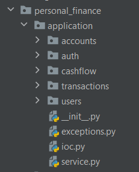

# Слой приложения

## Общая информация
Для реализации бизнес логики был создан слой приложения (Application layer).



На данном слое, как и на всех предыдущих слоях, были реализованные собственные модели данных для инкапсуляции всех 
нижележащих слоев. Данные модели данных описаны в пакете `personal_finance.application.<package>.dto.py`.
В качестве примера приведем модели данных для сущности пользователя.

## Модели данных

```python
from pydantic import BaseModel, Field

from personal_finance.domain.users.user import User, UserName, Login


class ReadUserDto(BaseModel):
    id: int = Field()
    first_name: str = Field()
    last_name: str = Field()
    login: str = Field()
    password_hash: str = Field()

    @classmethod
    def from_entity(cls, user: User) -> "ReadUserDto":
        return ReadUserDto(
            id=user.id,
            first_name=user.first_name.value,
            last_name=user.last_name.value,
            login=user.login.value,
            password_hash=user.password
        )

    def to_entity(self) -> User:
        return User(
            self.id,
            UserName(self.first_name),
            UserName(self.last_name),
            Login(self.login),
            self.password_hash
        )


class WriteUserDto(BaseModel):
    first_name: str = Field()
    last_name: str = Field()
    login: str = Field()
    password: str = Field()

    def to_entity(self) -> User:
        return User(
            None,
            first_name=UserName(self.first_name),
            last_name=UserName(self.last_name),
            login=Login(self.login),
            password=self.password
        )
```
## Сервисы приложения
Также была реализована абстракция в виде сервисов приложения (Application Services). Именно они будут содержать в себе 
бизнес-логику реализуемого приложения при помощи использования нижележащего слоя infrastructure. 

Был выделен параметризованный интерфейс сервиса, содержащий в себе базовые CRUD-операции.
```python
from abc import abstractmethod, ABCMeta
from typing import TypeVar, Generic, Collection, Optional

from pydantic import BaseModel

R = TypeVar('R', bound=BaseModel)
W = TypeVar('W', bound=BaseModel)
ID = TypeVar('ID')


class CrudService(Generic[ID, R, W], metaclass=ABCMeta):

    @abstractmethod
    def find_by_id(self, identifier: ID) -> Optional[R]:
        raise NotImplementedError

    @abstractmethod
    def find_all(self) -> Collection[R]:
        raise NotImplementedError

    @abstractmethod
    def save(self, obj: W) -> R:
        raise NotImplementedError

    @abstractmethod
    def update(self, id: ID, obj: W) -> R:
        raise NotImplementedError

    @abstractmethod
    def delete_by_id(self, identifier: ID) -> None:
        raise NotImplementedError

    def __getitem__(self, index: ID) -> Optional[R]:
        return self.find_by_id(index)
```

В качестве примера реализации сервиса приведем UserService

```python
from typing import Collection, Optional

from .dto import ReadUserDto, WriteUserDto
from ..auth.crypt import get_password_hash
from ..exceptions import NotFoundException, ConflictException
from ..service import CrudService, ID
from ...domain.users.user import User
from ...infrastructure.persistance.postgres.users.repository import UserRepository


class UserService(CrudService[int, ReadUserDto, WriteUserDto]):
    __repository: UserRepository

    def __init__(self, repository: UserRepository) -> None:
        self.__repository = repository

    def find_by_id(self, identifier: ID) -> Optional[ReadUserDto]:
        user: User | None = self.__repository.find_by_id(identifier)
        if user is None:
            raise NotFoundException("User not found")

        return ReadUserDto.from_entity(user)

    def find_all(self) -> Collection[ReadUserDto]:
        collection: Collection[User] = self.__repository.find_all()
        return list(map(ReadUserDto.from_entity, collection))

    def save(self, obj: WriteUserDto) -> ReadUserDto:
        user: User = obj.to_entity()
        user.password = get_password_hash(user.password)
        if self.__repository.find_by_login(user.login.value) is not None:
            raise ConflictException("Login already exists")

        user = self.__repository.save(user)
        return ReadUserDto.from_entity(user)

    def update(self, id: ID, obj: WriteUserDto) -> ReadUserDto:
        if self.__repository.find_by_id(id) is None:
            raise NotFoundException("User not found")
        user: User = obj.to_entity()
        user.id = id
        user.password = get_password_hash(user.password)
        existing_user: User = self.__repository.find_by_login(user.login.value)
        if existing_user is None:
            user = self.__repository.save(user)
            return ReadUserDto.from_entity(user)

        if existing_user != user:
            raise ConflictException("Login already exists")

        user = self.__repository.save(user)
        return ReadUserDto.from_entity(user)

    def delete_by_id(self, identifier: ID) -> None:
        if self.__repository.find_by_id(identifier) is None:
            raise NotFoundException("User not found")

        self.__repository.delete_by_id(identifier)

    def find_by_login(self, login: str) -> ReadUserDto:
        user = self.__repository.find_by_login(login)
        if user is None:
            raise NotFoundException("")

        return ReadUserDto.from_entity(user)
```