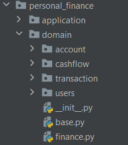

# Доменная модель

## Вариант
Необходимо создать простой сервис для управления личными финансами. Сервис должен позволять пользователям вводить доходы и расходы, устанавливать бюджеты на различные категории, а также просматривать отчеты о своих финансах. Дополнительные функции могут включать в себя возможность получения уведомлений о превышении бюджета, анализа трат и установки целей на будущее.

## Доменная модель
Была проведена декомпозиция предметной области и составлена UML-диаграмма классов


## Доменный слой приложения
Спроектированные сущности были реализованы в коде в пакете
`personal_finance.domain`. Классы были сгруппированы по пакетам с учетом их связности. Данное решение было принято во 
избежание случайного зацепления ([Coincidental cohesion](https://en.wikipedia.org/wiki/Cohesion_(computer_science)#:~:text=Coincidental%20cohesion%20(worst)))



В файле `base.py` были выделены основные метаклассы для всех классов системы - Entity, ValueObject, AggregateRoot.

```python
from typing import List, Any


class Entity:
    id: int

    def __init__(self, id: int) -> None:
        self.id = id

    def __eq__(self, __value) -> bool:
        if not isinstance(__value, self.__class__):
            return False

        return self.id == __value.id


class AggregateRoot(Entity):
    def __init__(self, id: int) -> None:
        super().__init__(id)


class ValueObject:

    @property
    def _equality_attributes(self) -> List[Any]:
        raise NotImplementedError("Value object must implement equality attributes.")

    def __eq__(self, __value) -> bool:
        if not isinstance(__value, ValueObject):
            return False

        return self._equality_attributes == __value._equality_attributes
```

В файле `finance.py` были выделены классы, используемые большинством классов доменной модели:

```python
from enum import Enum
from typing import List, Any

from personal_finance.domain.base import ValueObject


class Currency(Enum):
    RUB = "RUB",
    USD = "USD",
    EUR = "EUR"


class Money(ValueObject):
    __amount: int
    __currency: Currency

    def __init__(self, amount: int, currency: Currency) -> None:
        self.__amount = amount
        self.__currency = currency

    @property
    def _equality_attributes(self) -> List[Any]:
        return [self.__amount, self.__currency]

    @property
    def amount(self) -> int:
        return self.__amount

    @property
    def currency(self) -> Currency:
        return self.__currency
```

В качестве примера приведем содержимое файла `domain.account.account.py`

```python
from typing import List, Any

from personal_finance.domain.account.exceptions import InvalidAccountException
from personal_finance.domain.base import ValueObject, Entity
from personal_finance.domain.finance import Currency, Money
from personal_finance.domain.users.user import User


class AccountBalance(ValueObject):
    __amount: int
    __currency: Currency

    def __init__(self, amount: int, currency: Currency):
        self.__amount = amount
        self.__currency = currency

    @property
    def amount(self) -> int:
        return self.__amount

    @property
    def currency(self) -> Currency:
        return self.__currency

    def refill(self, money: Money) -> "AccountBalance":
        return AccountBalance(self.__amount + money.amount, self.__currency)

    def withdraw(self, money: Money) -> "AccountBalance":
        return AccountBalance(self.__amount - money.amount, self.__currency)

    @property
    def _equality_attributes(self) -> List[Any]:
        return [self.amount, self.currency]


class AccountName(ValueObject):
    __name: str

    def __init__(self, name: str) -> None:
        if len(name) < 2 or len(name) > 50:
            raise InvalidAccountException("Account name must be between 2 and 50 characters")
        self.__name = name

    @property
    def name(self) -> str:
        return self.__name

    @property
    def _equality_attributes(self) -> List[Any]:
        return [self.__name]


class Tag(Entity):
    name: str

    def __init__(self, id: int, name: str) -> None:
        super().__init__(id)
        self.name = name


class AccountTag(Entity):
    tag: Tag
    order: int

    def __init__(self, id: int, tag: Tag, order: int) -> None:
        super().__init__(id)
        self.tag = tag
        self.order = order


class UserAccount(Entity):
    name: AccountName
    balance: AccountBalance
    user: User
    tags: List[AccountTag]

    def __init__(self, id: int, name: AccountName, balance: AccountBalance, user: User, tags=None) -> None:
        super().__init__(id)
        self.tags = [] if tags is None else tags
        self.name = name
        self.balance = balance
        self.user = user

    def withdraw(self, money: Money) -> None:
        self.balance = self.balance.withdraw(money)

    def refill(self, money: Money) -> None:
        self.balance = self.balance.refill(money)


```
