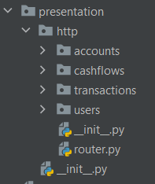

# Слой представления

## Общая информация
Слой представления (Presentation layer) служит для предоставления внешнего интерфейса для работы с реализованной 
системой. Примером такого интерфейса может служить REST API, основанный на протоколе HTTP.

Стоит отметить, что все нижележащие слои не завязываются на конкретных реализациях представлений 
(например, HTTP кодах ответа). Это позволит реализовать несколько слоев представления без изменения остальных слоев 
приложения.

## HTTP
В лабораторной работе был реализован слой представления HTTP (`personal_finance.presentation.http`), 
основанный на использовании фреймворка FastApi. 



## Модели данных
Как и на всех слоях, в слое представления были реализованы собственные модели данных. Это позволяет ограничить перечень
данных, которые система принимает и отдает наружу. Приведем пример модели данных для пользователя
```python
from pydantic import BaseModel, Field

from personal_finance.application.users.dto import ReadUserDto


class UserReadDto(BaseModel):
    id: int = Field(example="1")
    first_name: str = Field(example="Vasya")
    last_name: str = Field(example="Ivanov")
    login: str = Field(example="vasyaivanov228")

    @staticmethod
    def from_app_dto(dto: ReadUserDto) -> "UserReadDto":
        return UserReadDto(
            **dto.model_dump()
        )


class UserCreateDto(BaseModel):
    first_name: str = Field(example="Vasya")
    last_name: str = Field(example="Ivanov")
    login: str = Field(example="vasyaivanov228")
    password: str = Field(example="<PASSWORD>")


class UserUpdateDto(BaseModel):
    first_name: str = Field(example="Vasya")
    last_name: str = Field(example="Ivanov")
    login: str = Field(example="vasyaivanov228")
    password: str = Field(example="<PASSWORD>")


class LoginDto(BaseModel):
    login: str = Field(example="vasyaivanov228")
    password: str = Field(example="<PASSWORD>")


class JwtDto(BaseModel):
    token: str = Field(example="<JWT TOKEN>")
```

## Роутеры
Роутеры содержат в себе логику делегирования запросов к системе на уровень приложения. 
Приведем пример роутера для пользователей

```python
from typing import Collection, List, Optional

from fastapi import APIRouter, HTTPException
from fastapi import Depends
from starlette import status

from personal_finance.application.auth.crypt import verify_password
from personal_finance.application.auth.service import get_current_user, encode_token
from personal_finance.application.exceptions import NotFoundException, ConflictException
from personal_finance.application.ioc import IocContainer
from personal_finance.application.users.dto import ReadUserDto, WriteUserDto
from personal_finance.application.users.service import UserService
from .dto import UserReadDto, UserCreateDto, UserUpdateDto, JwtDto, LoginDto

user_router = APIRouter()


@user_router.get("/", status_code=status.HTTP_200_OK)
def get_users(user_service: UserService = Depends(IocContainer.service['UserService'])) -> List[UserReadDto]:
    collection: Collection[ReadUserDto] = user_service.find_all()

    return list(map(UserReadDto.from_app_dto, collection))


@user_router.get("/{user_id}", status_code=status.HTTP_200_OK, responses={
    status.HTTP_404_NOT_FOUND: {

    }
})
def get_user(user_id: int,
             user_service: UserService = Depends(IocContainer.service['UserService'])) -> Optional[UserReadDto]:
    try:
        user: ReadUserDto = user_service.find_by_id(user_id)
        return UserReadDto.from_app_dto(user)
    except NotFoundException as e:
        raise HTTPException(status_code=status.HTTP_404_NOT_FOUND, detail={"message": e.message})


@user_router.post('/register', status_code=status.HTTP_201_CREATED, responses={
    status.HTTP_409_CONFLICT: {}
})
def register(user: UserCreateDto,
             user_service: UserService = Depends(IocContainer.service['UserService'])) -> JwtDto:
    user = UserCreateDto.model_validate(user)
    user_dto: WriteUserDto = WriteUserDto(**user.model_dump())
    try:
        created_user: ReadUserDto = user_service.save(user_dto)
        return JwtDto(token=encode_token(created_user.id))
    except ConflictException as e:
        raise HTTPException(status_code=status.HTTP_409_CONFLICT, detail={"message": e.message})


@user_router.put("/{user_id}", status_code=status.HTTP_200_OK, responses={
    status.HTTP_403_FORBIDDEN: {},
    status.HTTP_404_NOT_FOUND: {},
    status.HTTP_409_CONFLICT: {}
})
def update_account_info(user_id: int,
                        user: UserUpdateDto,
                        user_service: UserService = Depends(IocContainer.service['UserService']),
                        current_user: ReadUserDto = Depends(get_current_user)) -> UserReadDto:
    user = UserUpdateDto.model_validate(user)
    if current_user.id != user_id:
        raise HTTPException(status_code=status.HTTP_403_FORBIDDEN)

    user_dto: WriteUserDto = WriteUserDto(**user.model_dump())
    try:
        updated_user: ReadUserDto = user_service.update(user_id, user_dto)
        return UserReadDto.from_app_dto(updated_user)
    except ConflictException as e:
        raise HTTPException(status_code=status.HTTP_409_CONFLICT, detail={"message": e.message})
    except NotFoundException as e:
        raise HTTPException(status_code=status.HTTP_404_NOT_FOUND, detail={"message": e.message})


@user_router.post('/login', status_code=status.HTTP_200_OK, responses={
    status.HTTP_401_UNAUTHORIZED: {}
})
def login(login_data: LoginDto,
          user_service: UserService = Depends(IocContainer.service['UserService'])):
    try:
        user: ReadUserDto = user_service.find_by_login(login_data.login)
    except NotFoundException as e:
        raise HTTPException(status_code=status.HTTP_401_UNAUTHORIZED, detail={"message": e.message})

    if not verify_password(login_data.password, user.password_hash):
        raise HTTPException(status_code=status.HTTP_401_UNAUTHORIZED)

    token = encode_token(user.id)
    return JwtDto(token=token)


@user_router.get("/me", status_code=status.HTTP_200_OK, responses={
    status.HTTP_401_UNAUTHORIZED: {}
})
def get_self(current_user: ReadUserDto = Depends(get_current_user)) -> UserReadDto:
    return UserReadDto.from_app_dto(current_user)
```

Далее, роутеры соединяются воедино одним другим роутером, стоящим выше по иерархии
```python
from fastapi import APIRouter

from personal_finance.presentation.http.accounts.router import account_router, tag_router
from personal_finance.presentation.http.cashflows.router import source, category
from personal_finance.presentation.http.transactions.router import transfer
from personal_finance.presentation.http.users.router import user_router

app_router = APIRouter()

app_router.include_router(user_router, prefix='/users', tags=['Users'])
app_router.include_router(account_router, prefix='/accounts', tags=['Accounts'])
app_router.include_router(source, prefix='/income-source', tags=['Income sources'])
app_router.include_router(category, prefix='/expense-category', tags=['Expense categories'])
app_router.include_router(transfer, prefix='/transactions/transfer', tags=['Transfer transactions'])
app_router.include_router(tag_router, prefix='/tags', tags=['Tags'])
```

После, главный роутер включается в класс приложения

```python
from fastapi import FastAPI

from personal_finance.infrastructure.persistance.postgres.database import init_db
from personal_finance.presentation.http.router import app_router


app = FastAPI()

app.include_router(app_router)


@app.on_event('startup')
def startup():
    init_db()
    print("Database initialized")

```

