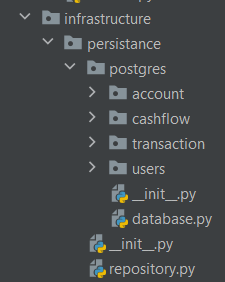

# Persistence
Далее был реализован инфраструктурный слой приложения. В него входит слой persistence для сохранения доменных сущностей в БД.
В данном слое были описаны модели, позволяющие работать с ORM SQLModel. Они были помещены в пакет `personal_finance.infrastructure.persistance.postgres`.
По аналогии с доменными моделями, они были сгруппированы по степени зацепления.


## Общие модули
В файле `personal_finance.infrastructure.persistance.postgres.database.py` описаны основные функции для подключения к БД
```python
from sqlmodel import SQLModel, Session, create_engine
from dotenv import load_dotenv
import os
load_dotenv()
db_url = os.getenv('DATABASE_URL')
engine = create_engine(db_url, echo=True)


def init_db():
    SQLModel.metadata.create_all(engine)


def get_session():
    with Session(engine) as session:
        yield session
```
В файле `personal_finance.infrastructure.persistance.repository.py` была реализована абстракция над инфраструктурным 
слоем, инкапсулирующая в себе всю работу с БД и ORM SQLModel в частности. Репозиторий содержит в себе основные CRUD-операции для работы с сущностями и агрегатами.
```python
from abc import abstractmethod, ABCMeta
from typing import TypeVar, Generic, Collection, Optional

from sqlmodel import SQLModel

from personal_finance.domain.base import Entity

T = TypeVar('T', bound=SQLModel)
ID = TypeVar('ID', bound=Entity)


class Repository(Generic[ID, T], metaclass=ABCMeta):

    @abstractmethod
    def find_by_id(self, identifier: ID) -> Optional[T]:
        raise NotImplementedError

    @abstractmethod
    def find_all(self) -> Collection[T]:
        raise NotImplementedError

    @abstractmethod
    def save(self, obj: T) -> T:
        raise NotImplementedError

    @abstractmethod
    def delete_by_id(self, identifier: ID) -> None:
        raise NotImplementedError

    def __getitem__(self, index: ID) -> Optional[T]:
        return self.find_by_id(index)
```

## Модели SQLModel

Все модели были описаны в файлах `personal_finance.infrastructure.persistance.postgres.<package>.model.py`. 
Для примера приведем `personal_finance.infrastructure.persistance.postgres.users.model.py`

```python
from sqlmodel import SQLModel, Field


class UserModel(SQLModel, table=True):
    id: int = Field(primary_key=True)
    first_name: str
    last_name: str
    login: str
    password: str
```

## Реализация репозитория

В качестве примера реализации репозитория приведем репозиторий для работы с пользователями 
`personal_finance.infrastructure.persistance.postgres.users.repository.py`

```python
from typing import Collection, Optional

from sqlmodel import Session, select

from personal_finance.domain.users.user import User, UserName, Login
from personal_finance.infrastructure.persistance.repository import Repository, ID, T
from .model import UserModel


def to_user(model: UserModel) -> User:
    return User(
        id=model.id,
        first_name=UserName(model.first_name),
        last_name=UserName(model.last_name),
        login=Login(model.login),
        password=model.password
    )


def to_model(user: User) -> UserModel:
    return UserModel(
        id=user.id,
        first_name=user.first_name.value,
        last_name=user.last_name.value,
        login=user.login.value,
        password=user.password
    )


class UserRepository(Repository[int, User]):
    session: Session

    def __init__(self, session: Session) -> None:
        self.session = session

    def find_by_id(self, identifier: ID) -> Optional[User]:
        model: UserModel = self.session.exec(select(UserModel).where(UserModel.id == identifier)).first()
        if model is None:
            return None
        return to_user(model)

    def find_all(self) -> Collection[User]:
        models: Collection[T] = self.session.exec(select(UserModel)).all()
        return list(map(to_user, models))

    def save(self, obj: User) -> User:
        model: UserModel = to_model(obj)
        existing: UserModel = self.session.exec(select(UserModel).where(UserModel.id == model.id)).first()
        if existing is None:
            self.session.add(model)
            self.session.commit()
            self.session.refresh(model)
            return to_user(model)

        existing: UserModel = existing.sqlmodel_update(model.model_dump(exclude_unset=True))
        self.session.add(existing)
        self.session.commit()
        self.session.refresh(existing)
        return to_user(existing)

    def delete_by_id(self, identifier: ID) -> None:
        model: UserModel = self.session.exec(select(UserModel).where(UserModel.id == identifier)).first()
        if model is None:
            return

        self.session.delete(model)
        self.session.commit()

    def find_by_login(self, login: str) -> Optional[User]:
        model: UserModel | None = self.session.exec(select(UserModel).where(UserModel.login == login)).first()
        if model is None:
            return None
        return to_user(model)
```
