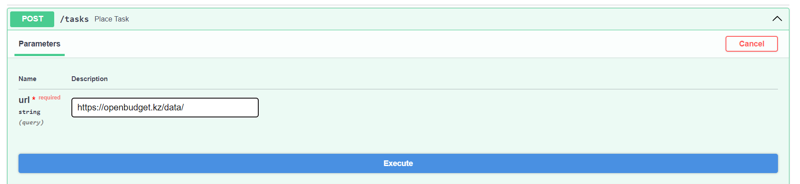
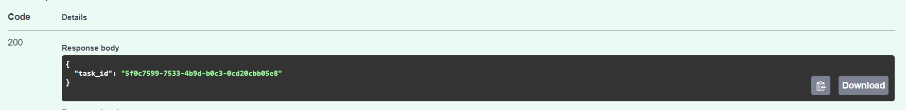
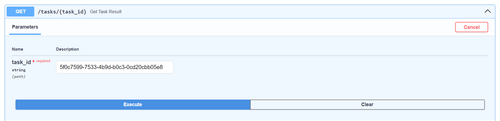
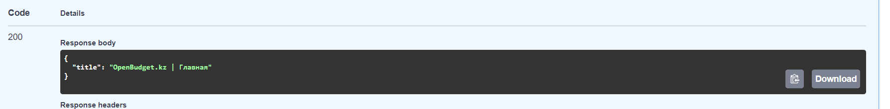
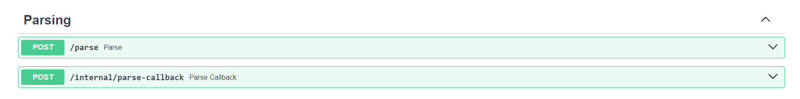

# Очередь
Для парсинга была реализована Celery-задача.
Содержимое файла `celery_backend.tasks.py`
```python
def parse_page(url: str) -> WebPage:
    logger = logging.getLogger()
    logger.info('Requesting url %s', url)
    soup = BeautifulSoup(urlopen(url), features="html.parser")
    title = soup.title.get_text()
    logger.info('Got response with title \'%s\'', title)
    page = WebPage(title=title)
    return page


@app.task
def parse_task(url):
    return parse_page(url)
```

## Интерфейс очереди
Для работы с очередью был предоставлен публичный HTTP-API на базе FastApi.
Он содержит в себе следующие эндпоинты:
- `POST /tasks` - поместить задачу на парсинг в очередь. В результате выполнения будет возвращен уникальный идентификатор операции
- `GET /tasks/{task_id}` - получить результат выполнения задачи по её уникальному идентификатору

## Пример работы
В качестве демонстрации получим информацию о Государственном бюджете Казахстана.
URL `https://openbudget.kz/data/`

### Шаг 1 - поместим задачу в очередь
Для этого отправим HTTP-запрос на эндпоинт /tasks

В ответ получим уникальный идентификатор созданной задачи в формате UUID (`5f0c7599-7533-4b9d-b0c3-0cd20cbb05e8`)

## Шаг 2 - получим результат выполнения задачи
Для этого обратимся ко второму эндпоинту /tasks/{task_id} с полученным нами ранее уникальным идентификатором задачи

В качестве ответа получаем заголовок запрашиваемой нами HTML-страницы.


# Перенаправление запросов
В ЛР 1 был реализованы эндпонты для парсинга и коллбэка по завершению парсинга.

## Шаг 1 Запрос
Посылаем запрос с URL-адресом для парсинга 
`POST /parse?url=...`
Далее этот запрос перенаправляется на сервис парсинга
```python
@app_router.post('/parse', tags=['Parsing'])
def parse(url: str) -> None:
    r = requests.post(PARSER_URL, params={'url': url})
    if r.status_code != 200:
        raise HTTPException(status_code=r.status_code, detail=r.json())

```
## Шаг 2 Постановка celery-задачи
При получении запроса на парсинг, сервис парсинга создает celery-задачу и возвращает её ID
```python
@app.post("/tasks")
async def place_task(url: str) -> TaskDto:
    task = parse_task.delay(url)
    return TaskDto(task_id=task.id)

```
## Шаг 3 Callback при успешном выполнении
Далее был реализован функционал обратного вызова при успешном выполнении celery-задачи
```python

class BaseTask(Task):

    def on_success(self, retval, task_id, args, kwargs):
        super().on_success(retval, task_id, args, kwargs)
        requests.post(CALLBACK_URL, params={'title': retval['title']})


@app.task(base=BaseTask)
def parse_task(url):
    return parse_page(url)
```
Посылается запрос по адресу CALLBACK_URL
## Шаг 4 сохранение результата в БД
```python
@app_router.post('/internal/parse-callback', tags=['Parsing'])
def parse_callback(title: str, db: Session = Depends(get_session)) -> None:
    page = WebPage(title=title)
    db.add(page)
    db.commit()
```