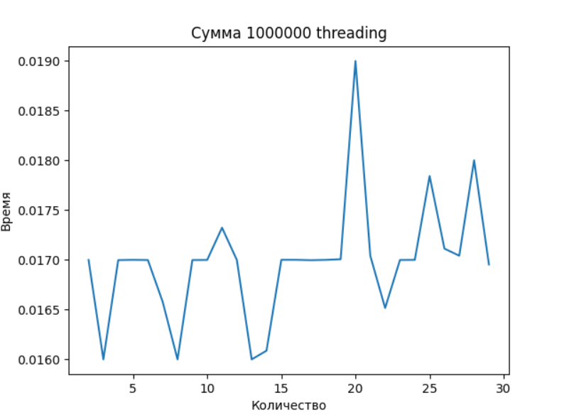
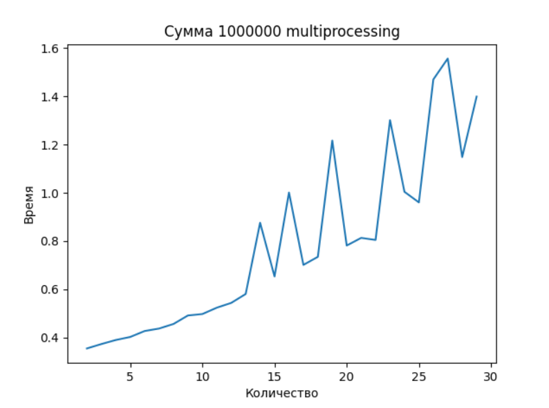
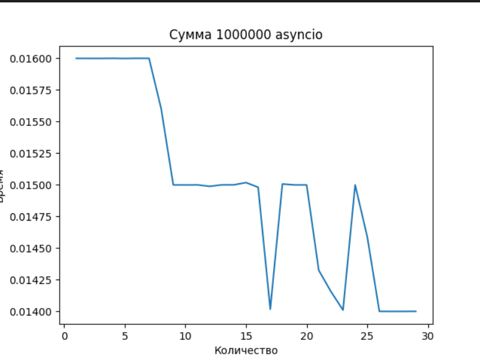
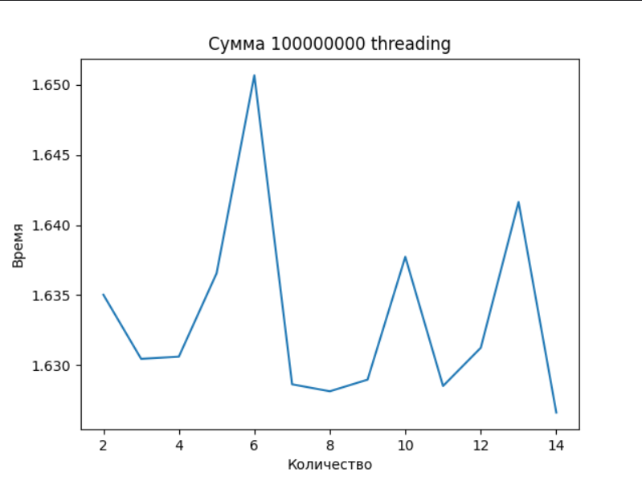
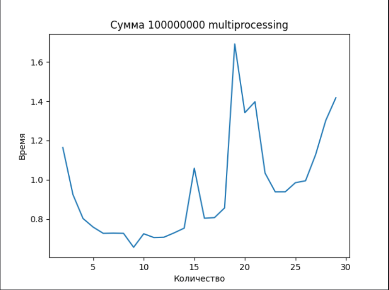
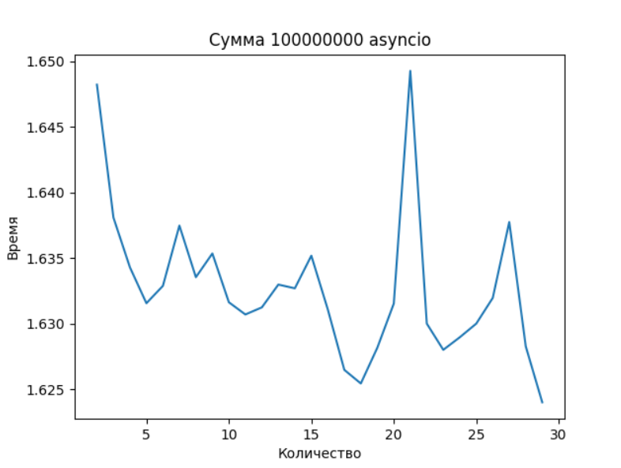

## Задание

Напишите три различных программы на Python, использующие каждый из подходов: threading, multiprocessing и async. Каждая программа должна решать считать сумму всех чисел от 1 до 1000000. Разделите вычисления на несколько параллельных задач для ускорения выполнения.

    import threading
    import time
    
    from plt_builder import paint
    
    x = []
    y = []
    
    def calculate_sum_of_range(start, end, result):
        partial_sum = sum(range(start, end))
        result.append(partial_sum)
    
    
    def calculate_sum(border, threads_cnt):
        start_time = time.time()
    
        results = []
        threads = []
    
        cnt = border // threads_cnt
        for i in range(threads_cnt):
            start = i * cnt + 1
            end = (i + 1) * cnt + 1 if i < threads_cnt - 1 else border + 1
            thread = threading.Thread(target=calculate_sum_of_range, args=(start, end, results))
            threads.append(thread)
            thread.start()
    
        for thread in threads:
            thread.join()
    
        result = sum(results)
    
        end_time = time.time()
    
        x.append(threads_cnt*1.0)
        y.append(end_time - start_time)
    
        print("Выполнено с использованием threading")
    
        print("Сумма: ", result)
        print("Кол-во потоков: ", threads_cnt)
        print("Время:", end_time - start_time, "с")
    
    
    if __name__ == "__main__":
        border = 1000000
        for i in range(2, 30):
            calculate_sum(border, i)
        print(x, y)
        paint(x, y, "Сумма " + str(border) + " threading")

    import multiprocessing
    import time
    
    from plt_builder import paint
    
    x = []
    y = []
    
    def calculate_sum_of_range(start, end, result):
        partial_sum = sum(range(start, end))
        result.put(partial_sum)
    
    
    def calculate_sum(border, processes_cnt):
        start_time = time.time()
    
        results = multiprocessing.Queue()
    
        processes = []
        cnt = border // processes_cnt
        for i in range(processes_cnt):
            start = i * cnt + 1
            end = (i + 1) * cnt + 1 if i < processes_cnt - 1 else border + 1
            process = multiprocessing.Process(target=calculate_sum_of_range, args=(start, end, results))
            processes.append(process)
            process.start()
    
        for process in processes:
            process.join()
    
        result = 0
        while not results.empty():
            result += results.get()
    
        end_time = time.time()
    
        x.append(processes_cnt)
        y.append(end_time - start_time)
    
        print("Выполнено с использованием multiprocessing")
    
        print("Сумма: ", result)
        print("Время:", end_time - start_time, "с")
    
    
    if __name__ == "__main__":
        border = 1000000
        for i in range(2, 30):
            calculate_sum(border, i)
        print(x, y)
        paint(x, y, "Сумма " + str(border) + " multiprocessing")
        

    import asyncio
    import time
    
    from plt_builder import paint
    
    x = []
    y = []
    async def calculate_sum_of_range(start, end):
        partial_sum = sum(range(start, end))
        return partial_sum
    
    
    async def calculate_sum(border, task_cnt):
        start_time = time.time()
    
        cnt = border // task_cnt
    
        tasks = []
        for i in range(task_cnt):
            start = i * cnt + 1
            end = (i + 1) * cnt + 1 if i < task_cnt - 1 else border + 1
            task = asyncio.create_task(calculate_sum_of_range(start, end))
            tasks.append(task)
    
        sums = await asyncio.gather(*tasks)
        result = sum(sums)
    
        end_time = time.time()
    
        x.append(task_cnt)
        y.append(end_time - start_time)
    
        print("Выполнено с использованием asyncio")
    
        print("Сумма: ", result)
        print("Время:", end_time - start_time, "с")
    
    
    if __name__ == "__main__":
        border = 100000000
        for i in range(2, 200):
            asyncio.run(calculate_sum(border, i))
        print(x, y)
        paint(x, y, "Сумма " + str(border) + " asyncio")

## 1e6

## 1e8

