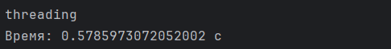
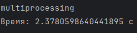
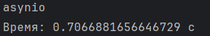
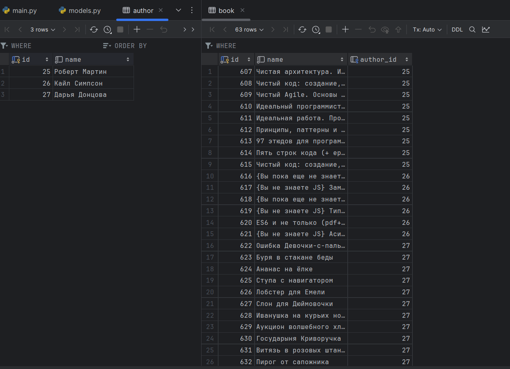

## Задание

Напишите программу на Python для параллельного парсинга нескольких веб-страниц с сохранением данных в базу данных с использованием подходов threading, multiprocessing и async. Каждая программа должна парсить информацию с нескольких веб-сайтов, сохранять их в базу данных.

    import asyncio
    from save_data_async import save_to_db
    from parser_async import parse_data
    import time
    
    urls = [
        "https://www.litres.ru/author/kayl-simpson/",
        "https://www.litres.ru/author/robert-s-martin/"
    ]
    
    
    async def parse_and_save(url):
        author_info = await parse_data(url)
        await save_to_db(author_info)
    
    
    async def start():
        start_time = time.time()
    
        tasks = []
        for url in urls:
            task = asyncio.create_task(parse_and_save(url))
            tasks.append(task)
    
        await asyncio.gather(*tasks)
    
        end_time = time.time()
        print(f"Время: {end_time - start_time} c")
    
    
    asyncio.run(start())

#

    import threading
    from parser import parse_data
    from save_data import save_to_db
    import time
    
    urls = [
        "https://www.litres.ru/author/kayl-simpson/",
        "https://www.litres.ru/author/robert-s-martin/"
    ]
    
    
    def parse_and_save(urls):
        for url in urls:
            author_info = parse_data(url)
            save_to_db(author_info)
    
    
    def start():
        start_time = time.time()
    
        threads_cnt = 3
        size = len(urls) // threads_cnt
        batches = [urls[i:i + size] for i in range(0, len(urls), size)]
    
        threads = []
        for batch in batches:
            thread = threading.Thread(target=parse_and_save, args=(batch,))
            thread.start()
            threads.append(thread)
    
        for thread in threads:
            thread.join()
    
        end_time = time.time()
        execution_time = end_time - start_time
        print(f"Время: {execution_time} с")
    
    
    start()

#
    
    import multiprocessing
    from parser import parse_data
    from save_data import save_to_db
    import time
    
    urls = [
        "https://www.litres.ru/author/kayl-simpson/",
        "https://www.litres.ru/author/robert-s-martin/"
    ]
    
    def parse_and_save(chunk):
        for url in chunk:
            author_info = parse_data(url)
            save_to_db(author_info)
    
    
    def start():
        start_time = time.time()
    
        processes_cnt = len(urls)
        size = len(urls) // processes_cnt
        batches = [urls[i:i + size] for i in range(0, len(urls), size)]
    
        processes = []
        for batch in batches:
            process = multiprocessing.Process(target=parse_and_save, args=(batch,))
            processes.append(process)
            process.start()
    
        for process in processes:
            process.join()
    
        end_time = time.time()
        execution_time = end_time - start_time
        print(f"Время: {execution_time} с")
    
    
    start()

