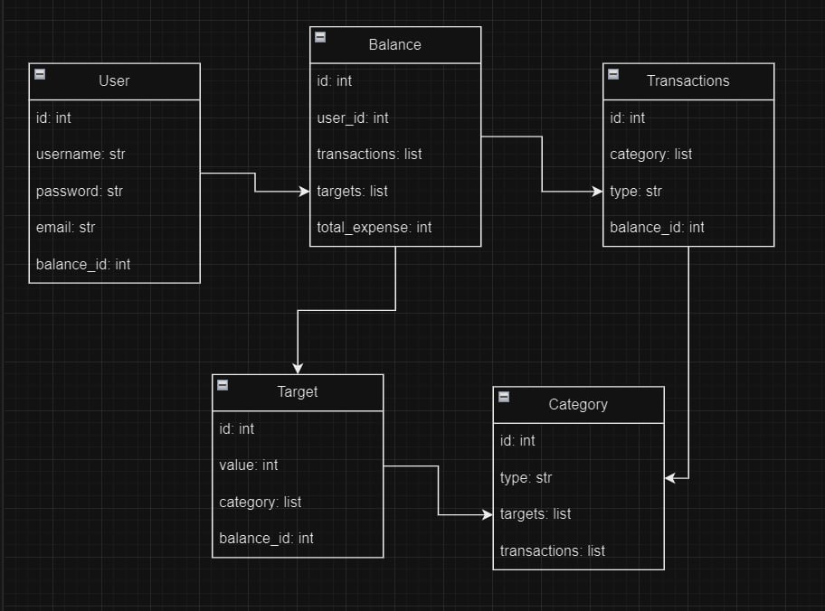

# База данных

Схема базы данных представлена на рисунке:



## Модели

```Python title="user.py"
class User(SQLModel, table=True):
    id: int = Field(default=None, primary_key=True)
    username: str = Field(index=True)
    password: str = Field(min_length=4, max_length=64)
    email: str = Field(...)
    balance: Optional["Balance"] = Relationship(back_populates="user")
    created_at: datetime.datetime = Field(default=datetime.datetime.now())
```

```Python title="main.py"
class CategoryTransactionLink(SQLModel, table=True):
    category_id: int = Field(foreign_key="category.id", primary_key=True)
    transaction_id: int = Field(foreign_key="transactions.id", primary_key=True)


class CategoryTargetLink(SQLModel, table=True):
    category_id: int = Field(foreign_key="category.id", primary_key=True)
    target_id: int = Field(foreign_key="target.id", primary_key=True)


class Category(SQLModel, table=True):
    id: int = Field(default=None, primary_key=True)
    type: CategoryType = Field(sa_column_kwargs={"unique": True, "nullable": False})
    transactions: List["Transactions"] = Relationship(
        back_populates="categories", link_model=CategoryTransactionLink
    )
    targets: List["Target"] = Relationship(
        back_populates="categories", link_model=CategoryTargetLink
    )


class TargetDeafult(SQLModel):
    value: int = 0
    balance_id: int = Field(foreign_key="balance.id")


class Target(TargetDeafult, table=True):
    id: int = Field(default=None, primary_key=True)
    balance: Optional["Balance"] = Relationship(back_populates="targets")
    categories: List[Category] = Relationship(
        back_populates="targets", link_model=CategoryTargetLink
    )


class Transactions(SQLModel, table=True):
    id: int = Field(default=None, primary_key=True)
    value: int = 0
    type: TransactionsType = TransactionsType.INCOME
    balance_id: int = Field(foreign_key="balance.id")
    balance: Optional["Balance"] = Relationship(back_populates="transactions")
    categories: List[Category] = Relationship(
        back_populates="transactions", link_model=CategoryTransactionLink
    )


class BalanceDeafult(SQLModel):
    balance: int = 0
    user_id: Optional[int] = Field(default=None, foreign_key="user.id")


class Balance(BalanceDeafult, table=True):
    id: int = Field(default=None, primary_key=True)
    user: Optional[User] = Relationship(back_populates="balance")
    transactions: List[Transactions] = Relationship(back_populates="balance")
    targets: List[Target] = Relationship(back_populates="balance")
```