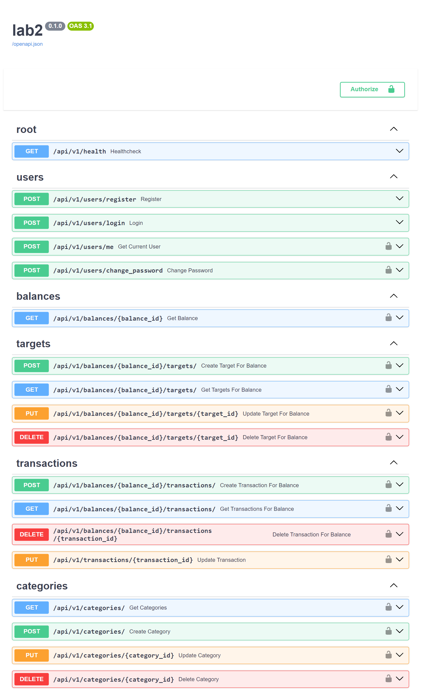

# Результаты

Было реализовано приложение, позволяющее вести учёт финансовых расходов и задавать себе цели на накопление средств. Использован подход с сервисами и контроллерами (роутерами), что позволило облегчить разработку и лучше структурировать код.

FastAPI генерирует Swagger страницу с документацией проекта и песочницей с запросами.

