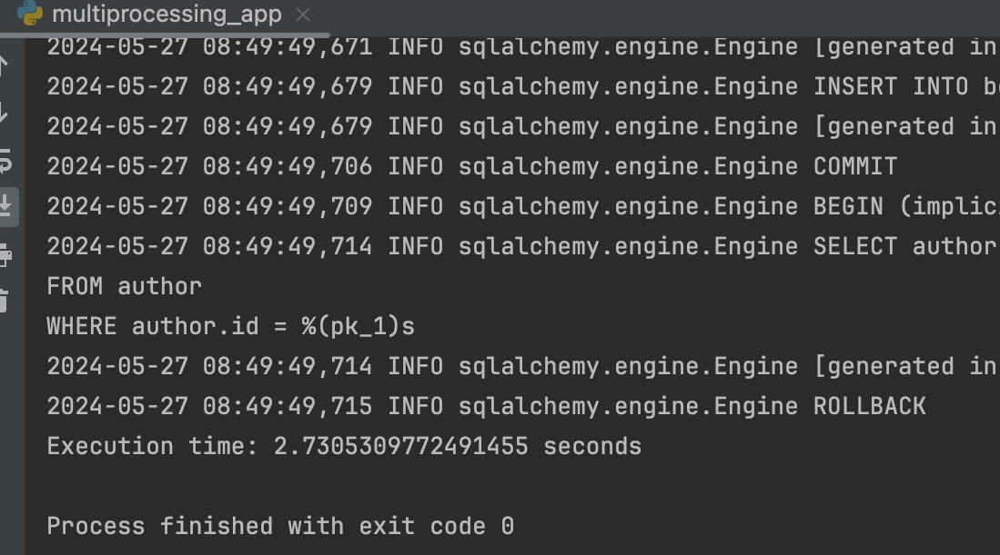
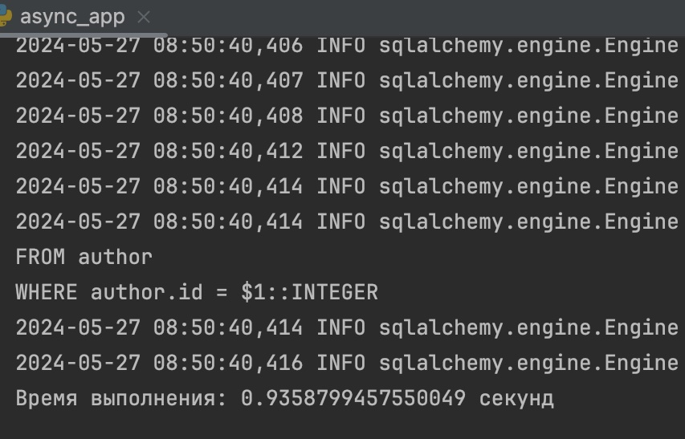

# Task 2

## Описание
Напишите программу на Python для параллельного парсинга нескольких веб-страниц с сохранением данных в базу данных с использованием подходов threading, multiprocessing и async.

### Models
```
import datetime
from typing import Optional, List
from pydantic import validator, EmailStr
from sqlmodel import SQLModel, Field, Relationship, AutoString
from enum import Enum


class ExchangeStatus(Enum):
    agreed = "agreed"
    rejected = "rejected"
    notselected = "not selected"


# book instance
class BookInstanceBase(SQLModel):
    book_id: Optional[int] = Field(default=None, foreign_key="book.id")
    date: datetime.datetime
    publisher: str
    features: str


class BookInstance(BookInstanceBase, table=True):
    id: int = Field(default=None, primary_key=True)
    owner_id: Optional[int] = Field(default=None, foreign_key="user.id")
    requests: Optional[List["BookExchange"]] = Relationship(
        back_populates="book_instance",
        sa_relationship_kwargs=dict(foreign_keys="[BookExchange.book_instance_id]"),
    )
    book: Optional["Book"] = Relationship(back_populates="instances")
    owner: Optional["User"] = Relationship(back_populates="instances")


class BookInstanceRead(BookInstanceBase):
    id: int
    owner_id: int


class BookInstanceWithBook(BookInstanceRead):
    book: "BookRead" = None


class BookInstanceReadFull(BookInstanceWithBook):
    requests: list["BookExchangeRead"] = []
    owner: "UserBase" = None


# author
class AuthorBase(SQLModel):
    name: str
    bio: str


class Author(AuthorBase, table=True):
    id: int = Field(default=None, primary_key=True)
    books: Optional[List["Book"]] = Relationship(back_populates="author")


class AuthorRead(AuthorBase):
    id: int


class AuthorReadFull(AuthorRead):
    books: list["BookRead"] = []


# book
class BookBase(SQLModel):
    title: str
    description: str
    author_id: Optional[int] = Field(default=None, foreign_key="author.id")


class Book(BookBase, table=True):
    id: int = Field(default=None, primary_key=True)
    author: Optional[Author] = Relationship(back_populates="books")
    owners: Optional[List["User"]] = Relationship(back_populates="books", link_model=BookInstance)
    instances: Optional[List["BookInstance"]] = Relationship(back_populates="book")


class BookRead(BookBase):
    id: int


class BookReadFull(BookRead):
    author: AuthorRead = None
    owners: list["UserBase"] = []
    instances: list["BookInstanceRead"] = []


# user
class UserBase(SQLModel):
    id: int = Field(primary_key=True)
    username: str = Field(index=True)
    name: str
    about: str
    email: EmailStr = Field(unique=True, index=True, sa_type=AutoString)


class User(UserBase, table=True):
    password: str = Field(max_length=256, min_length=6)
    created_at: datetime.datetime = datetime.datetime.now()
    books: Optional[List["Book"]] = Relationship(back_populates="owners", link_model=BookInstance)
    sender_requests: Optional[List["BookExchange"]] = Relationship(
        back_populates="sender",
        sa_relationship_kwargs=dict(foreign_keys="[BookExchange.sender_id]"),
    )
    receiver_requests: Optional[List["BookExchange"]] = Relationship(
        back_populates="receiver",
        sa_relationship_kwargs=dict(foreign_keys="[BookExchange.receiver_id]"),
    )
    instances: Optional[List["BookInstance"]] = Relationship(back_populates="owner")


class UserReadFull(UserBase):
    sender_requests:  list["BookExchangeRead"] = []
    receiver_requests:  list["BookExchangeRead"] = []
    instances: list["BookInstanceWithBook"] = []


class UserInput(SQLModel):
    name: str
    about: str
    username: str
    password: str = Field(max_length=256, min_length=6)
    password2: str
    email: EmailStr = Field(unique=True, index=True, sa_type=AutoString)

    @validator('password2')
    def password_match(cls, v, values, **kwargs):
        if 'password' in values and v != values['password']:
            raise ValueError('passwords don\'t match')
        return v


class UserLogin(SQLModel):
    username: str
    password: str


class UserPassword(SQLModel):
    old_password: str
    new_password: str


# book exchange
class BookExchangeBase(SQLModel):
    book_instance_id: Optional[int] = Field(default=None, foreign_key="bookinstance.id")
    status: ExchangeStatus
    date_start: datetime.datetime
    date_end: datetime.datetime


class BookExchange(BookExchangeBase, table=True):
    id: int = Field(default=None, primary_key=True)
    sender_id: Optional[int] = Field(default=None, foreign_key="user.id")
    receiver_id: Optional[int] = Field(default=None, foreign_key="user.id")

    sender: Optional["User"] = Relationship(
        back_populates="sender_requests",
        sa_relationship_kwargs=dict(foreign_keys="[BookExchange.sender_id]"),
    )
    receiver: Optional["User"] = Relationship(
        back_populates="receiver_requests",
        sa_relationship_kwargs=dict(foreign_keys="[BookExchange.receiver_id]"),
    )
    book_instance: Optional["BookInstance"] = Relationship(
        back_populates="requests",
        sa_relationship_kwargs=dict(foreign_keys="[BookExchange.book_instance_id]"),
    )


class BookExchangeChangeStatus(SQLModel):
    status: ExchangeStatus


class BookExchangeRead(BookExchangeBase):
    id: int
    sender_id: int
    receiver_id: int


class BookExchangeReadFull(BookExchangeRead):
    sender: "UserBase" = None
    receiver: "UserBase" = None
    book_instance: "BookInstanceWithBook" = None

```

### Функции для парсинга
```
def parse_author_info(url):
    # Отправляем GET-запрос к веб-странице
    response = requests.get(url)

    # Создаем объект BeautifulSoup для парсинга содержимого страницы
    soup = BeautifulSoup(response.text, 'html.parser')

    # Извлекаем имя автора
    author_name = soup.find('h1', class_='Author_authorName__i4Wxb').text.strip()

    # Извлекаем список книг
    books_elements = soup.find_all('p', class_='ArtInfoTile_title__TCqN1')
    books = [book.text.strip() for book in books_elements]

    # Формируем словарь с данными об авторе и его книгах
    author_data = {
        'author_name': author_name,
        'books': books
    }

    # Преобразуем словарь в JSON
    json_data = json.dumps(author_data, ensure_ascii=False)

    return json_data
    
async def parse_author_info(url):
    async with aiohttp.ClientSession(connector=aiohttp.TCPConnector(ssl=False)) as session:
        html = await fetch(session, url)
        soup = BeautifulSoup(html, 'html.parser')
        author_name = soup.find('h1', class_='Author_authorName__i4Wxb').text.strip()
        books_elements = soup.find_all('p', class_='ArtInfoTile_title__TCqN1')
        books = [book.text.strip() for book in books_elements]
        author_data = {
            'author_name': author_name,
            'books': books
        }

        json_data = json.dumps(author_data, ensure_ascii=False)
        return json_data
```

### Функции для сохранения данных в бд
```
def save_author_and_books_from_json(data: str):
    # Декодирование JSON-данных
    data_dict = json.loads(data)

    # Создание сессии
    session = SessionLocal()

    try:
        # Извлечение данных об авторе из JSON
        author_name = data_dict.get('author_name')

        if not author_name:
            raise ValueError("Недостаточно данных для сохранения.")

        # Создание объекта Author
        author = Author(name=author_name, bio="")

        # Извлечение списка книг из JSON
        book_titles = data_dict.get('books')

        if not book_titles:
            raise ValueError("Не указан список книг для сохранения.")

        # Создание объектов Book и их добавление к автору
        books = [Book(title=title, description="", author=author) for title in book_titles]

        # Добавление объектов в сессию
        session.add(author)
        session.add_all(books)

        # Сохранение изменений
        session.commit()
        session.refresh(author)

        return author, books

    finally:
        # Закрытие сессии
        session.close()

async def save_author_and_books_from_json(data: str):
    # Декодирование JSON-данных
    data_dict = json.loads(data)

    # Создание асинхронной сессии
    async with AsyncSession(engine) as session:
        # Извлечение данных об авторе из JSON
        author_name = data_dict.get('author_name')

        if not author_name:
            raise ValueError("Недостаточно данных для сохранения.")

        # Создание объекта Author
        author = Author(name=author_name, bio="")

        # Извлечение списка книг из JSON
        book_titles = data_dict.get('books')

        if not book_titles:
            raise ValueError("Не указан список книг для сохранения.")

        # Создание объектов Book и их добавление к автору
        books = [Book(title=title, description="", author=author) for title in book_titles]

        # Добавление объектов в сессию
        session.add(author)
        session.add_all(books)

        # Сохранение изменений
        await session.commit()

        # Запрос на получение сохраненного автора
        await session.refresh(author)

        return author, books
```

### Async

```
import asyncio
import aiohttp
import json
from save_data_async import save_author_and_books_from_json
from async_parser import parse_author_info
import time

# Список URL-адресов для парсинга
urls = ["https://www.litres.ru/author/patrik-king/",
        "https://www.litres.ru/author/vladimir-pozner/",
        "https://www.litres.ru/author/allan-dib/"]


async def parse_and_save(url):
    author_info = await parse_author_info(url)
    await save_author_and_books_from_json(author_info)


async def main():
    start_time = time.time()

    tasks = []
    for url in urls:
        task = asyncio.create_task(parse_and_save(url))
        tasks.append(task)

    await asyncio.gather(*tasks)

    end_time = time.time()
    print(f"Время выполнения: {end_time - start_time} секунд")


if __name__ == "__main__":
    asyncio.run(main())

```

### Multiprocessing

```
import multiprocessing
from parser import parse_author_info
from save_data import save_author_and_books_from_json
import time

# Список URL-адресов для парсинга
urls = [
    "https://www.litres.ru/author/patrik-king/",
    "https://www.litres.ru/author/vladimir-pozner/",
    "https://www.litres.ru/author/allan-dib/"
]

# Функция для параллельного парсинга и сохранения данных
def parallel_parse_and_save(chunk):
    for url in chunk:
        author_info = parse_author_info(url)
        save_author_and_books_from_json(author_info)

# Функция для засечения времени исполнения и запуска парсинга
def measure_execution_time():
    start_time = time.time()

    # Разделение списка URL-адресов на равные части (chunks)
    num_processes = len(urls)
    chunk_size = len(urls) // num_processes
    chunks = [urls[i:i+chunk_size] for i in range(0, len(urls), chunk_size)]

    # Создание процессов для параллельного парсинга
    processes = []
    for chunk in chunks:
        process = multiprocessing.Process(target=parallel_parse_and_save, args=(chunk,))
        processes.append(process)
        process.start()

    # Ожидание завершения всех процессов
    for process in processes:
        process.join()

    end_time = time.time()
    execution_time = end_time - start_time
    print(f"Execution time: {execution_time} seconds")

if __name__ == '__main__':
    # Вызов функции для засечения времени исполнения и запуска парсинга
    measure_execution_time()

```

### Threading

```
import threading
from parser import parse_author_info
from save_data import save_author_and_books_from_json
import time

# Список URL-адресов для парсинга
urls = [
    "https://www.litres.ru/author/patrik-king/",
    "https://www.litres.ru/author/vladimir-pozner/",
    "https://www.litres.ru/author/allan-dib/"
]

# Функция для параллельного парсинга и сохранения данных
def parallel_parse_and_save(urls):
    for url in urls:
        author_info = parse_author_info(url)
        save_author_and_books_from_json(author_info)

# Функция для засечения времени исполнения и запуска парсинга
def measure_execution_time():
    start_time = time.time()

    # Разделение списка URL-адресов на равные части
    num_threads = 3
    chunk_size = len(urls) // num_threads
    chunks = [urls[i:i + chunk_size] for i in range(0, len(urls), chunk_size)]

    # Запуск параллельного парсинга для каждой части
    threads = []
    for chunk in chunks:
        thread = threading.Thread(target=parallel_parse_and_save, args=(chunk,))
        thread.start()
        threads.append(thread)

    # Ожидание завершения всех потоков
    for thread in threads:
        thread.join()

    end_time = time.time()
    execution_time = end_time - start_time
    print(f"Execution time: {execution_time} seconds")

# Вызов функции для засечения времени исполнения и запуска парсинга
measure_execution_time()

```

### Результаты

Расход ресурсов на мультипроцессинг не оправдан, поэтому он отрабатывет дольше. Async and threading отрабатывают примерно одинаково.




