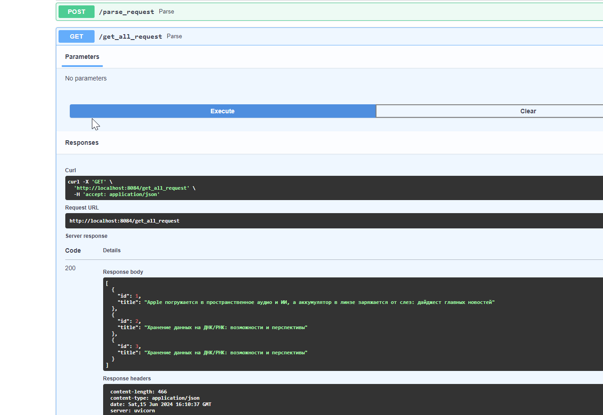
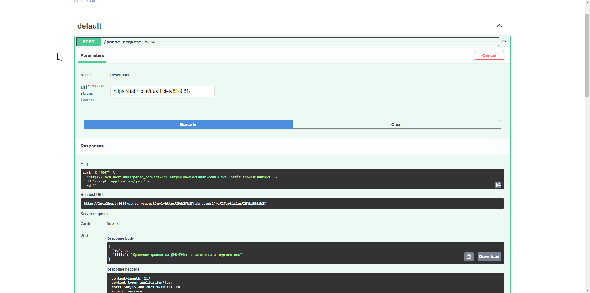

# Задание 2 

???+ question "Задание"

    Вызов парсера из FastAPI

    Эндпоинт в FastAPI для вызова парсера:
    Необходимо добавить в FastAPI приложение ендпоинт, который будет принимать запросы с URL для парсинга от клиента, отправлять запрос парсеру (запущенному в отдельном контейнере) и возвращать ответ с результатом клиенту.
    Зачем: Это позволит интегрировать функциональность парсера в ваше веб-приложение, предоставляя возможность пользователям запускать парсинг через API.
    Полезные ссылки:
    Документация FastAPI

=== "общий docker-compose"

    ```Python title="lab-3/docker-compose.yaml"
    --8<-- "lab-3/docker-compose.yaml"
    ```


=== "pars_app"

    ```Python title="lab-3/parser/pars_app/main.py"
    --8<-- "lab-3/parser/pars_app/main.py"
    ```

=== "request_app"

    ```Python title="lab-3/parser/request_app/main.py"
    --8<-- "lab-3/parser/request_app/main.py"
    ```

=== "демонстрация"


