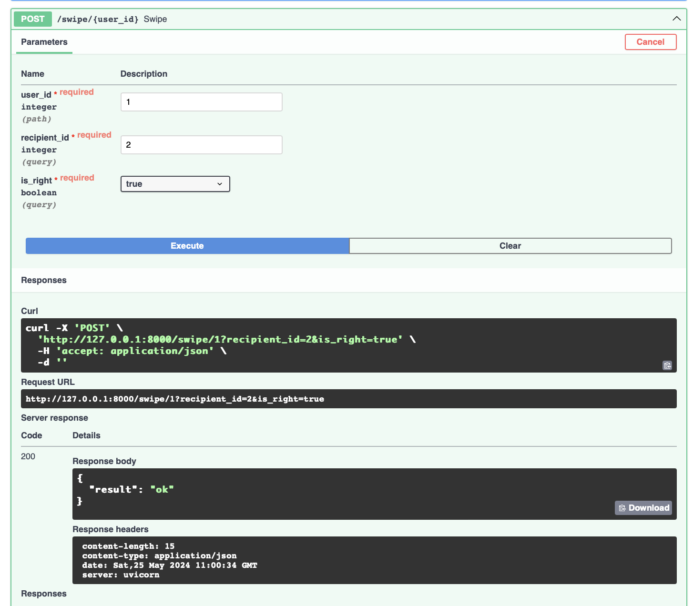

Все доступные опции:

**GET**

/users/ --  вывод всех имеющихся в системе пользователей. Кратко. Исключительно имя, айдишник + статус активности. Без параметров.

/users/{user_id} -- вывод подробной информации по конкретному пользователю. Начиная с имени, заканчивая списком запланированных поездок. Запрашивает id искомого пользователя.

/trips/ --  вывод всех имеющихся в системе поездок. Без параметров.

/matches/{user_id} --  вывод имеющихся у пользователя мэтчей. Запрашивает id искомого пользователя.

/search/{user_id} --  вывод возможно подходящих пользователю путешественников по введенным параметрам. Возможная фильтрация: регион, место, даты поездки (выезд от-до, прибытие от-до). Обязательное поле -- id запрашивающего пользователя.
Без каких-либо параметров:

С указанием некоторых параметров:

При отсутствии совпадений:

**POST**

/users/ -- создание нового пользователя
Успешное создание пользователя:

Не очень успешное:

/users/{user_id}/trip/ -- создание поездки для пользователя. Обязательны: регион, описание поездки

/swipe/{user_id} -- "свайпнуть" пользователя "вправо" (одобрить) или "влево" (заблокировать). Запрашивается айди свапабщего и свапаемого.
Успешный свайп:

Не очень успешный:

/trip/{user_id}/request_join/ -- запрос на присоединение к поездке. Возможен, только если вы "подружились" (свайпнули друг друга вправо). Требует id запрашивающего и id поездки
Успешный:

Если повторный:

Если пользователь каким-то чудом подается в поездку к тому, с кем еще не свайпнулся:

/trip/{user_id}/request_join/ -- одобрение/отклонение на присоединение к поездке. Запрашивает id принимающего решение и id запроса.
Успешный:

Повторный:

Если пользователь пытается одобрить не свой запрос (каким-то образом):

**POST**

/users/{user_id} -- обновление информации по пользователю

