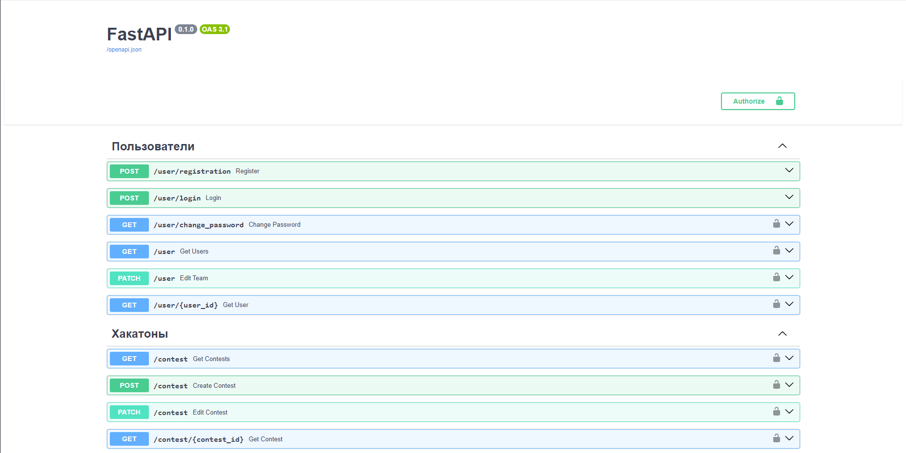
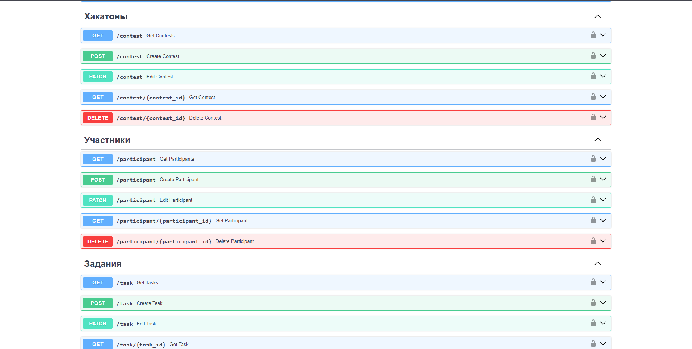
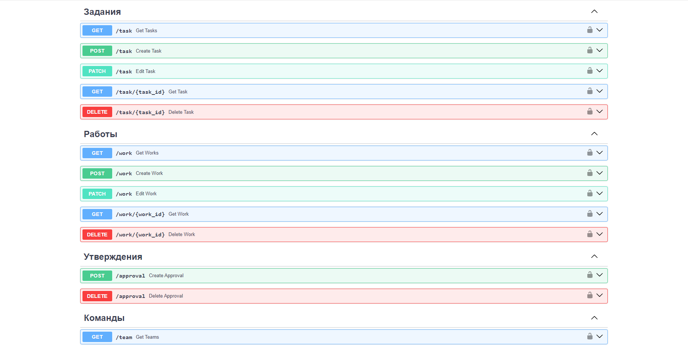
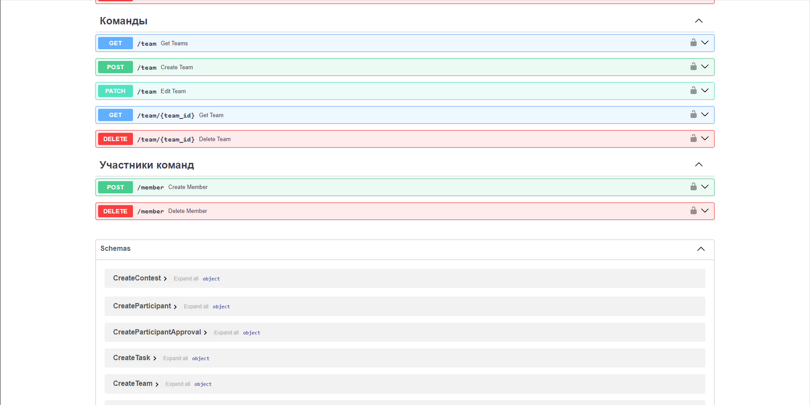

# Лабораторная работа №1

Научится реализовывать полноценное серверное приложение с помощью фреймворка FastAPI с применением дополнительных средств и библиотек.

Pадача состоит в разработке программной системы, которая будет использоваться для организации и проведения хакатонов. Хакатон - это соревнование, на котором участники, как правило, программисты, дизайнеры и бизнес-специалисты, работают над проектами в течение определенного времени, решая поставленные задачи или разрабатывая новые идеи. Система должна предоставлять следующий функционал:

Регистрация участников: Участники должны иметь возможность зарегистрироваться на хакатон, указав свои данные (имя, адрес электронной почты, контактный номер и т. д.). После регистрации участники должны получить подтверждение от организаторов.

Формирование команд: Участники должны иметь возможность создавать команды или присоединяться к уже существующим. Команды могут состоять из участников с различными навыками (программирование, дизайн, маркетинг и т. д.).

Публикация задач: Организаторы хакатона должны иметь возможность публиковать задачи или проекты, над которыми будут работать участники. Каждая задача должна содержать описание, требования и критерии оценки.

Оценка работ: Участники должны иметь возможность загружать свои работы и прототипы для оценки.

## Ход выполнения работы

### main.py:

    from sqlmodel import select
    from typing_extensions import TypedDict
    from fastapi import FastAPI, Depends, HTTPException
    from models import *
    from connection import init_db, get_session
    from api.user.router import router as user_router
    from api.contest.router import router as contest_router
    from api.participant.router import router as participant_router
    from api.task.router import router as task_router
    from api.work.router import router as work_router
    from api.approval.router import router as approval_router
    from api.team.router import router as team_router
    from api.members.router import router as members_router
    
    app = FastAPI()
    
    app.include_router(user_router)
    app.include_router(contest_router)
    app.include_router(participant_router)
    app.include_router(task_router)
    app.include_router(work_router)
    app.include_router(approval_router)
    app.include_router(team_router)
    app.include_router(members_router)
    
    
    @app.on_event("startup")
    def on_startup():
        init_db()

### auth.py:

    from datetime import datetime, timedelta
    from connection import Session, engine
    from sqlmodel import select
    from models import *
    from fastapi import Security, HTTPException
    from fastapi.security import HTTPBearer, HTTPAuthorizationCredentials
    from passlib.context import CryptContext
    import jwt
    from starlette import status
    from dotenv import load_dotenv
    
    secret_key = 'secretapikey'
    
    
    class AuthHandler:
        security = HTTPBearer()
        pwd_context = CryptContext(schemes=['bcrypt'])
        secret = secret_key
    
        def get_password_hash(self, password):
            return self.pwd_context.hash(password)
    
        def verify_password(self, pwd, hashed_pwd):
            return self.pwd_context.verify(pwd, hashed_pwd)
    
        def encode_token(self, user_id):
            payload = {
                'exp': datetime.utcnow() + timedelta(hours=8),
                'iat': datetime.utcnow(),
                'sub': user_id
            }
            return jwt.encode(payload, self.secret, algorithm='HS256')
    
        def decode_token(self, token):
            try:
                payload = jwt.decode(token, self.secret, algorithms=['HS256'])
                return payload['sub']
            except jwt.ExpiredSignatureError:
                raise HTTPException(status_code=401, detail='Expired signature')
            except jwt.InvalidTokenError:
                raise HTTPException(status_code=401, detail='Invalid token')
    
        def auth_wrapper(self, auth: HTTPAuthorizationCredentials = Security(security)):
            return self.decode_token(auth.credentials)
    
        def get_current_user(self, auth: HTTPAuthorizationCredentials = Security(security)):
            credentials_exception = HTTPException(
                status_code=status.HTTP_401_UNAUTHORIZED,
                detail='Could not validate credentials'
            )
            username = self.decode_token(auth.credentials)
            if username is None:
                raise credentials_exception
            user = self. find_user(username)
            if username is None:
                raise credentials_exception
            return user
    
        def find_user(self, name):
            with Session(engine) as session:
                statement = select(User).where(User.username == name)
                return session.exec(statement).first()
    
        def select_all_users(self):
            with Session(engine) as session:
                statement = select(User)
                res = session.exec(statement).all()
                return res

### models.py:
    from datetime import datetime
    from typing import Optional, List
    
    from pydantic import BaseModel
    from sqlmodel import SQLModel, Field, Relationship
    
    
    class User(SQLModel, table=True):
        id: int = Field(default=None, primary_key=True)
        username: str
        password: str
        name: str
    
    
    class Contest(SQLModel, table=True):
        id: int = Field(default=None, primary_key=True)
        user_id: int = Field(default=None, foreign_key="user.id")
        name: str
        description: str
        start_time: datetime
        end_time: datetime
    
    
    class Participant(SQLModel, table=True):
        id: int = Field(default=None, primary_key=True)
        user_id: int = Field(default=None, foreign_key="user.id")
        contest_id: int = Field(default=None, foreign_key="contest.id")
        name: str
        email: str
        phone: str
    
    
    class GetParticipant(SQLModel):
        id: int
        user_id: int
        contest_id: int
        name: str
        email: str
        phone: str
        is_approval: bool = False
    
    
    class ParticipantApprovals(SQLModel, table=True):
        id: int = Field(default=None, primary_key=True)
        user_id: int = Field(default=None, foreign_key="user.id")
        participant_id: int = Field(default=None, foreign_key="participant.id")
    
    
    class Task(SQLModel, table=True):
        id: int = Field(default=None, primary_key=True)
        contest_id: int = Field(default=None, foreign_key="contest.id")
        user_id: int = Field(default=None, foreign_key="user.id")
        name: str
        description: str
        requirements: str
        criteria: str
    
    
    class Work(SQLModel, table=True):
        id: int = Field(default=None, primary_key=True)
        task_id: int = Field(default=None, foreign_key="task.id")
        user_id: int = Field(default=None, foreign_key="user.id")
        description: str
    
    
    class Team(SQLModel, table=True):
        id: int = Field(default=None, primary_key=True)
        user_id: int = Field(default=None, foreign_key="user.id")
        name: str
    
    
    class TeamMember(SQLModel, table=True):
        id: int = Field(default=None, primary_key=True)
        user_id: int = Field(default=None, foreign_key="user.id")
        team_id: int = Field(default=None, foreign_key="team.id")
    
    
    class UserRegistration(SQLModel):
        username: str
        password: str
        name: str
        email: str
    
    
    class UserLogin(SQLModel):
        username: str
        password: str
    
    
    class CreateContest(SQLModel):
        name: str
        description: str
        start_time: datetime
        end_time: datetime
    
    
    class EditContest(SQLModel):
        id: int
        name: str
        description: str
        start_time: datetime
        end_time: datetime
    
    
    class CreateParticipant(SQLModel):
        contest_id: int = Field(default=None, foreign_key="contest.id")
        name: str
        email: str
        phone: str
    
    
    class EditParticipant(SQLModel):
        id: int
        name: str
        email: str
        phone: str
    
    
    class CreateTask(SQLModel):
        contest_id: int = Field(default=None, foreign_key="contest.id")
        name: str
        description: str
        requirements: str
        criteria: str
    
    
    class EditTask(SQLModel):
        id: int
        name: str
        description: str
        requirements: str
        criteria: str
    
    
    class CreateWork(SQLModel):
        task_id: int = Field(default=None, foreign_key="task.id")
        description: str
    
    
    class EditWork(SQLModel):
        id: int
        description: str
    
    
    class CreateParticipantApproval(SQLModel):
        participant_id: int = Field(default=None, foreign_key="participant.id")
    
    
    class DeleteParticipantApproval(SQLModel):
        participant_id: int = Field(default=None, foreign_key="participant.id")
    
    
    class CreateTeam(SQLModel):
        name: str
    
    
    class EditTeam(SQLModel):
        id: int
        name: str
    
    
    class CreateTeamMember(SQLModel):
        team_id: int = Field(default=None, foreign_key="team.id")
    
    
    class DeleteTeamMember(SQLModel):
        team_id: int = Field(default=None, foreign_key="team.id")
    
    
    class EditUser(SQLModel):
        name: str
    
    
    class GetUser(BaseModel):
        id: int
        username: str
        name: str
        teams: List[Team] = []
        members: List[TeamMember] = []
        participants: List[GetParticipant] = []

## Результат

