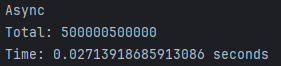
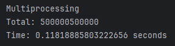
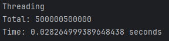
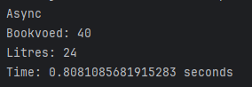
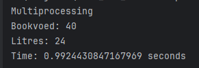
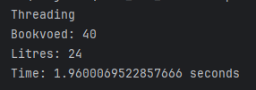

# Лабораторная работа №2

Цель работы: понять отличия перечисленных понятий.

## Задача №1

Задача: Напишите три различных программы на Python, использующие каждый из подходов: threading, multiprocessing и async. Каждая программа должна решать считать сумму всех чисел от 1 до 1000000. Разделите вычисления на несколько параллельных задач для ускорения выполнения.

Подробности задания:

Напишите программу на Python для каждого подхода: threading, multiprocessing и async.
Каждая программа должна содержать функцию calculate_sum(), которая будет выполнять вычисления.
Для threading используйте модуль threading, для multiprocessing - модуль multiprocessing, а для async - ключевые слова async/await и модуль asyncio.
Каждая программа должна разбить задачу на несколько подзадач и выполнять их параллельно.
Замерьте время выполнения каждой программы и сравните результаты.

## Ход выполнения работы

### async.py:

    import asyncio
    import time
    
    
    async def calculate_sum(start, end):
        return sum(range(start, end))
    
    
    async def main():
        tasks_quantity = 4
        numbers = 1000000
        step = numbers // tasks_quantity
        tasks = []
        for i in range(tasks_quantity):
            start = i * step + 1
            end = (i + 1) * step + 1
            task = asyncio.create_task(calculate_sum(start, end))
            tasks.append(task)
    
        results = await asyncio.gather(*tasks)
        total = sum(results)
        print(f"Total: {total}")
    
    
    if __name__ == "__main__":
        print("Async")
        start_time = time.time()
        asyncio.run(main())
        end_time = time.time()
        print(f"Time: {end_time - start_time} seconds")

### multi.py:

    import multiprocessing
    import time
    
    
    def calculate_sum(start, end):
        return sum(range(start, end))
    
    
    def worker(start, end, queue):
        queue.put(calculate_sum(start, end))
    
    
    def main():
        tasks_quantity = 4
        numbers = 1000000
        step = numbers // tasks_quantity
        tasks = []
        queue = multiprocessing.Queue()
    
        for i in range(tasks_quantity):
            start = i * step + 1
            end = (i + 1) * step + 1
            task = multiprocessing.Process(target=worker, args=(start, end, queue))
            tasks.append(task)
            task.start()
    
        for task in tasks:
            task.join()
    
        results = [queue.get() for i in range(tasks_quantity)]
        total = sum(results)
        print(f"Total: {total}")
    
    
    if __name__ == "__main__":
        print("Multiprocessing")
        start_time = time.time()
        main()
        end_time = time.time()
        print(f"Time: {end_time - start_time} seconds")

### threads.py:
    import threading
    import time
    
    
    def calculate_sum(start, end):
        return sum(range(start, end))
    
    
    def worker(start, end, result, index):
        result[index] = calculate_sum(start, end)
    
    
    def main():
        tasks_quantity = 4
        numbers = 1000000
        step = numbers // tasks_quantity
        threads = []
        results = [0] * tasks_quantity
    
        for i in range(tasks_quantity):
            start = i * step + 1
            end = (i + 1) * step + 1
            thread = threading.Thread(target=worker, args=(start, end, results, i))
            threads.append(thread)
            thread.start()
    
        for thread in threads:
            thread.join()
    
        total = sum(results)
        print(f"Total: {total}")
    
    
    if __name__ == "__main__":
        print("Threading")
        start_time = time.time()
        main()
        end_time = time.time()
        print(f"Time: {end_time - start_time} seconds")

   

## Результат

## Задача №2

Напишите программу на Python для параллельного парсинга нескольких веб-страниц с сохранением данных в базу данных с использованием подходов threading, multiprocessing и async. Каждая программа должна парсить информацию с нескольких веб-сайтов, сохранять их в базу данных.

Подробности задания:

Напишите три различных программы на Python, использующие каждый из подходов: threading, multiprocessing и async.
Каждая программа должна содержать функцию parse_and_save(url), которая будет загружать HTML-страницу по указанному URL, парсить ее, сохранять заголовок страницы в базу данных и выводить результат на экран.
Используйте PostgreSQL или другую базу данных на ваш выбор для сохранения данных.
Для threading используйте модуль threading, для multiprocessing - модуль multiprocessing, а для async - ключевые слова async/await и модуль aiohttp для асинхронных запросов.
Создайте список нескольких URL-адресов веб-страниц для парсинга и разделите его на равные части для параллельного парсинга.
Запустите параллельный парсинг для каждой программы и сохраните данные в базу данных.
Замерьте время выполнения каждой программы и сравните результаты.

## Ход выполнения работы

### async.py:
    import re
    
    import aiohttp
    import asyncio
    import sqlite3
    from bs4 import BeautifulSoup
    import time
    
    
    async def parse_litres(cursor, conn, session, category, params):
        async with session.get(f"https://www.litres.ru/{category}", params=params) as response:
            text = await response.text()
            soup = BeautifulSoup(text, 'html.parser')
            books = soup.find_all('div', class_="ArtsGrid_artWrapper__LXa0O")
            count = 0
            for book in books:
                try:
                    title = book.find('p', class_='ArtInfo_title__h_5Ay').get_text()
                    author = book.find('a', class_='ArtInfo_author__0W3GJ').get_text()
                    add_book(cursor, title, author)
                    count += 1
                except Exception as e:
                    pass
            print(f"Litres: {count}")
        commit(conn)
    
    
    async def parse_bookvoed(cursor, conn, session, category, params):
        async with session.get(f"https://www.bookvoed.ru/{category}", params=params) as response:
            text = await response.text()
            soup = BeautifulSoup(text, 'html.parser')
            books = soup.find_all('div', class_="product-card")
            count = 0
            for book in books:
                try:
                    title = book.find('a', class_='product-description__link').get_text()
                    author = book.find('a', class_='ui-comma-separated-links__author').get_text()
                    add_book(cursor, title, author)
                    count += 1
                except Exception as e:
                    pass
            print(f"Bookvoed: {count}")
        commit(conn)
    
    
    def get_db():
        conn = sqlite3.connect('books.db')
        cursor = conn.cursor()
    
        cursor.execute('''
                    CREATE TABLE IF NOT EXISTS books (
                        id INTEGER PRIMARY KEY AUTOINCREMENT,
                        name TEXT,
                        author TEXT
                    )
                ''')
        conn.commit()
        return conn, cursor
    
    
    def add_book(cursor, title, author):
        cursor.execute('INSERT INTO books (name, author) VALUES (?, ?)', (title, author))
    
    
    def commit(conn):
        conn.commit()
    
    
    async def main():
        conn, cursor = get_db()
        tasks = []
        async with aiohttp.ClientSession() as session:
            task = asyncio.create_task(parse_litres(cursor, conn, session, 'genre/biznes-5003', {'art_types': 'text_book'}))
            tasks.append(task)
            task = asyncio.create_task(parse_bookvoed(cursor, conn, session, 'catalog/business-1671', {}))
            tasks.append(task)
            await asyncio.gather(*tasks)
    
    
    if __name__ == "__main__":
        print("Async")
        start_time = time.time()
        asyncio.run(main())
        end_time = time.time()
        print(f"Time: {end_time - start_time} seconds")

### multi.py
    import multiprocessing
    import re
    
    import requests
    import sqlite3
    from bs4 import BeautifulSoup
    import time
    
    
    def parse_litres(queue, category, params):
        r = requests.get(f"https://www.litres.ru/{category}", params=params)
        soup = BeautifulSoup(r.text, 'html.parser')
        books = soup.find_all('div', class_="ArtsGrid_artWrapper__LXa0O")
        count = 0
        for book in books:
            try:
                title = book.find('p', class_='ArtInfo_title__h_5Ay').get_text()
                author = book.find('a', class_='ArtInfo_author__0W3GJ').get_text()
                queue.put((title, author))
                count += 1
            except Exception as e:
                pass
        print(f"Litres: {count}")
        queue.put(None)
    
    
    def parse_bookvoed(queue, category, params):
        r = requests.get(f"https://www.bookvoed.ru/{category}", params=params)
        soup = BeautifulSoup(r.text, 'html.parser')
        books = soup.find_all('div', class_="product-card")
        count = 0
        for book in books:
            try:
                title = book.find('a', class_='product-description__link').get_text()
                author = book.find('a', class_='ui-comma-separated-links__author').get_text()
                queue.put((title, author))
                count += 1
            except Exception as e:
                pass
        print(f"Bookvoed: {count}")
        queue.put(None)
    
    
    def get_db():
        conn = sqlite3.connect('books.db')
        cursor = conn.cursor()
    
        cursor.execute('''
                    CREATE TABLE IF NOT EXISTS books (
                        id INTEGER PRIMARY KEY AUTOINCREMENT,
                        name TEXT,
                        author TEXT
                    )
                ''')
        conn.commit()
        return conn, cursor
    
    
    def add_book(cursor, title, author):
        cursor.execute('INSERT INTO books (name, author) VALUES (?, ?)', (title, author))
    
    
    def commit(conn):
        conn.commit()
    
    
    def main():
        conn, cursor = get_db()
        queue = multiprocessing.Queue()
        processes = []
    
        first_process = multiprocessing.Process(target=parse_litres, args=(queue, 'genre/biznes-5003', {'art_types': 'text_book'}))
        processes.append(first_process)
        first_process.start()
    
        second_process = multiprocessing.Process(target=parse_bookvoed, args=(queue, 'catalog/business-1671', {}))
        processes.append(second_process)
        second_process.start()
    
        finished_processes = 0
        while finished_processes < 2:
            data = queue.get()
            if data is None:
                finished_processes += 1
            else:
                name, title = queue.get()
                add_book(cursor, name, title)
    
        commit(conn)
    
    
    if __name__ == "__main__":
        print("Multiprocessing")
        start_time = time.time()
        main()
        end_time = time.time()
        print(f"Time: {end_time - start_time} seconds")

### threads.py
    import threading
    import requests
    import sqlite3
    from bs4 import BeautifulSoup
    import re
    import time
    
    
    def parse_litres(category, params):
        conn, cursor = get_db()
        r = requests.get(f"https://www.litres.ru/{category}", params=params)
        soup = BeautifulSoup(r.text, 'html.parser')
        books = soup.find_all('div', class_="ArtsGrid_artWrapper__LXa0O")
        count = 0
        for book in books:
            try:
                title = book.find('p', class_='ArtInfo_title__h_5Ay').get_text()
                author = book.find('a', class_='ArtInfo_author__0W3GJ').get_text()
                add_book(cursor, title, author)
                count += 1
            except Exception as e:
                pass
        print(f"Litres: {count}")
        commit(conn)
    
    
    def parse_bookvoed(category, params):
        conn, cursor = get_db()
        r = requests.get(f"https://www.bookvoed.ru/{category}", params=params)
        soup = BeautifulSoup(r.text, 'html.parser')
        books = soup.find_all('div', class_="product-card")
        count = 0
        for book in books:
            try:
                title = book.find('a', class_='product-description__link').get_text()
                author = book.find('a', class_='ui-comma-separated-links__author').get_text()
                add_book(cursor, title, author)
                count += 1
            except Exception as e:
                pass
        print(f"Bookvoed: {count}")
        commit(conn)
    
    
    def get_db():
        conn = sqlite3.connect('books.db')
        cursor = conn.cursor()
    
        cursor.execute('''
                    CREATE TABLE IF NOT EXISTS books (
                        id INTEGER PRIMARY KEY AUTOINCREMENT,
                        name TEXT,
                        author TEXT
                    )
                ''')
        conn.commit()
        return conn, cursor
    
    
    def add_book(cursor, title, author):
        cursor.execute('INSERT INTO books (name, author) VALUES (?, ?)', (title, author))
    
    
    def commit(conn):
        conn.commit()
    
    
    def main():
        threads = []
    
        first_thread = threading.Thread(target=parse_litres, args=('genre/biznes-5003', {'art_types': 'text_book'},))
        threads.append(first_thread)
        first_thread.start()
    
        second_thread = threading.Thread(target=parse_bookvoed, args=('catalog/business-1671', {},))
        threads.append(second_thread)
        second_thread.start()
    
        for thread in threads:
            thread.join()
    
    
    if __name__ == "__main__":
        print("Threading")
        start_time = time.time()
        main()
        end_time = time.time()
        print(f"Time: {end_time - start_time} seconds")

## Результат

