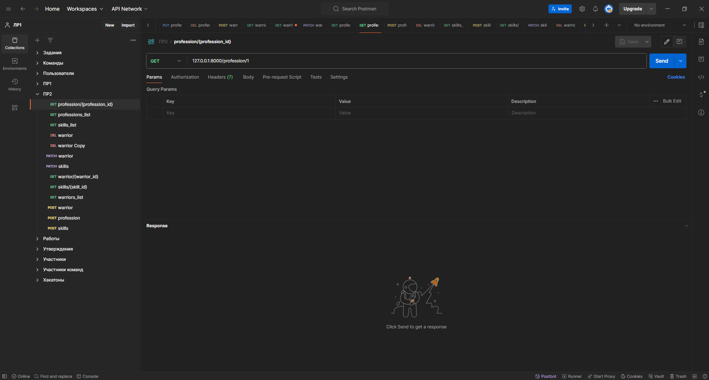

# Практическое задание 1.2

Пошагово реализовать проект и методы, описанные в практике
Создать API и модели для умений воинов и их ассоциативной сущности, вложено отображать умения при запросе воина

## Ход выполнения работы

### main.py:
    from sqlmodel import select
    from typing_extensions import TypedDict
    from fastapi import FastAPI, Depends, HTTPException
    from models import *
    from connection import init_db, get_session
    
    app = FastAPI()
    
    
    @app.on_event("startup")
    def on_startup():
        init_db()
    
    
    @app.post("/warrior")
    def warriors_create(warrior: WarriorDefault, session=Depends(get_session)) -> \
            TypedDict(
                'Response', {
                    "status": int,
                    "data": Warrior}
            ):
        warrior = Warrior.model_validate(warrior)
        session.add(warrior)
        session.commit()
        session.refresh(warrior)
        return {"status": 200, "data": warrior}
    
    
    @app.get("/warriors_list")
    def warriors_list(session=Depends(get_session)) -> List[Warrior]:
        return session.exec(select(Warrior)).all()
    
    
    @app.get("/warrior/{warrior_id}", response_model=WarriorProfessions)
    def warriors_get(warrior_id: int, session=Depends(get_session)) -> Warrior:
        warrior = session.get(Warrior, warrior_id)
        return warrior
    
    
    @app.patch("/warrior{warrior_id}")
    def warrior_update(warrior_id: int, warrior: WarriorDefault, session=Depends(get_session)) -> WarriorDefault:
        db_warrior = session.get(Warrior, warrior_id)
        if not db_warrior:
            raise HTTPException(status_code=404, detail="Warrior not found")
        warrior_data = warrior.model_dump(exclude_unset=True)
        for key, value in warrior_data.items():
            setattr(db_warrior, key, value)
        session.add(db_warrior)
        session.commit()
        session.refresh(db_warrior)
        return db_warrior
    
    
    @app.get("/professions_list")
    def professions_list(session=Depends(get_session)) -> List[Profession]:
        return session.exec(select(Profession)).all()
    
    
    @app.get("/profession/{profession_id}")
    def profession_get(profession_id: int, session=Depends(get_session)) -> Profession:
        return session.get(Profession, profession_id)
    
    
    @app.post("/profession")
    def profession_create(prof: ProfessionDefault, session=Depends(get_session)) -> TypedDict('Response', {"status": int,
                                                                                                           "data": Profession}):
        prof = Profession.model_validate(prof)
        session.add(prof)
        session.commit()
        session.refresh(prof)
        return {"status": 200, "data": prof}
    
    
    @app.delete("/warrior/delete{warrior_id}")
    def warrior_delete(warrior_id: int, session=Depends(get_session)):
        warrior = session.get(Warrior, warrior_id)
        if not warrior:
            raise HTTPException(status_code=404, detail="Warrior not found")
        session.delete(warrior)
        session.commit()
        return {"ok": True}
    
    
    @app.get("/skills_list")
    def skills_list(session=Depends(get_session)) -> List[Skill]:
        return session.exec(select(Skill)).all()
    
    
    @app.post("/skills/")
    def create_skill(skill: SkillDefault, session=Depends(get_session)):
        skill = Skill.model_validate(skill)
        session.add(skill)
        session.commit()
        session.refresh(skill)
        return {"status": 200, "data": skill}
    
    
    @app.get("/skills/{skill_id}")
    def get_skill(skill_id: int, session=Depends(get_session)):
        skill = session.get(Skill, skill_id)
        if skill is None:
            raise HTTPException(status_code=404, detail="Skill not found")
        return skill
    
    
    @app.patch("/skills/{skill_id}")
    def update_skill(skill_id: int, skill: SkillDefault, session=Depends(get_session)):
        db_skill = session.get(Skill, skill_id)
        if db_skill is None:
            raise HTTPException(status_code=404, detail="Skill not found")
        skill_data = skill.model_dump(exclude_unset=True)
        for key, value in skill_data.items():
            setattr(db_skill, key, value)
        session.add(db_skill)
        session.commit()
        session.refresh(db_skill)
        return db_skill
    
    
    @app.delete("/skills/{skill_id}")
    def skill_delete(skill_id: int, session=Depends(get_session)):
        skill = session.get(Skill, skill_id)
        if not skill:
            raise HTTPException(status_code=404, detail="Skill not found")
        session.delete(skill)
        session.commit()
        return {"ok": True}

### models.py:
    from enum import Enum
    from typing import Optional, List
    
    # from pydantic import BaseModel
    from sqlmodel import SQLModel, Field, Relationship
    
    
    class RaceType(Enum):
        director = "director"
        worker = "worker"
        junior = "junior"
    
    
    class SkillWarriorLink(SQLModel, table=True):
        skill_id: Optional[int] = Field(
            default=None, foreign_key="skill.id", primary_key=True
        )
        warrior_id: Optional[int] = Field(
            default=None, foreign_key="warrior.id", primary_key=True
        )
        level: int | None
    
    
    class Skill(SQLModel, table=True):
        id: int = Field(default=None, primary_key=True)
        name: str
        description: Optional[str] = ""
        warriors: Optional[List["Warrior"]] = Relationship(back_populates="skills", link_model=SkillWarriorLink)
    
    
    class ProfessionDefault(SQLModel):
        title: str
        description: str
    
    
    class Profession(ProfessionDefault, table=True):
        id: int = Field(default=None, primary_key=True)
        warriors_prof: List["Warrior"] = Relationship(back_populates="profession")
    
    
    class WarriorDefault(SQLModel):
        race: RaceType
        name: str
        level: int
        profession_id: Optional[int] = Field(default=None, foreign_key="profession.id")
    
    
    class Warrior(WarriorDefault, table=True):
        id: int = Field(default=None, primary_key=True)
        profession: Optional[Profession] = Relationship(back_populates="warriors_prof")
        skills: Optional[List[Skill]] = Relationship(back_populates="warriors", link_model=SkillWarriorLink)
    
    
    class WarriorProfessions(WarriorDefault):
        profession: Optional[Profession] = None
        skill: Optional[Skill] = None
    
    
    class SkillDefault(SQLModel):
        name: str
        description: Optional[str] = ""

## Результат

