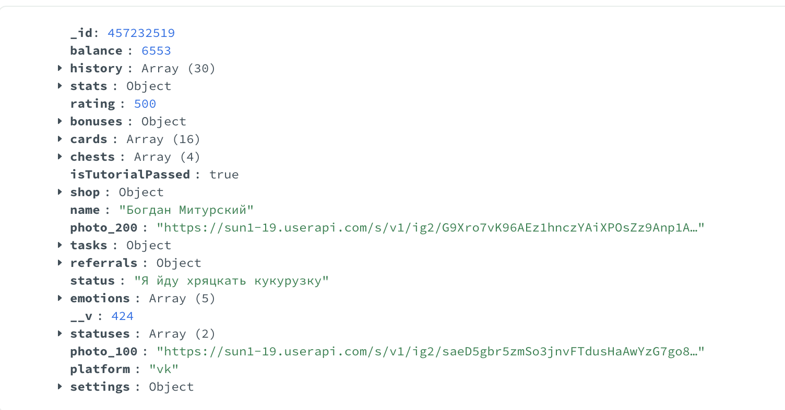

<figure markdown>
  
  <figcaption>Пользователь в коллекции Users (MongoDB Compass)</figcaption>
</figure>

<figure markdown>
  
  <figcaption>Коллекция Quests (MongoDB Compass)</figcaption>
</figure>

<figure markdown>
  
  <figcaption>Коллекция Statuses (MongoDB Compass)</figcaption>
</figure>

<figure markdown>
  
  <figcaption>Результат работы user/get (DevTools)</figcaption>
</figure>

<figure markdown>
  
  <figcaption>Результат работы user/statuses/get (DevTools)</figcaption>
</figure>

<figure markdown>
  
  <figcaption>Результат работы user/statuses/set (DevTools)</figcaption>
</figure>
