<figure markdown>
  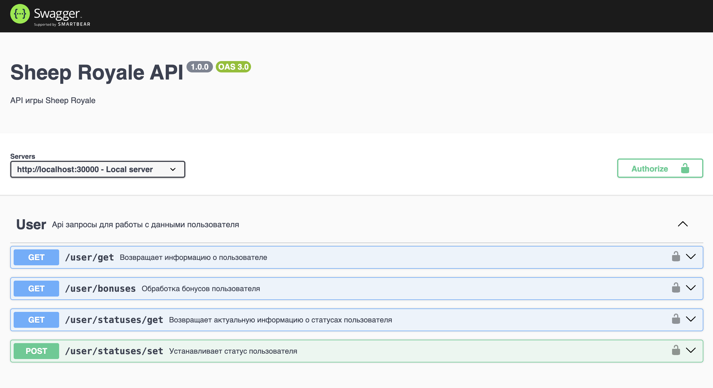
</figure>

<figure markdown>
  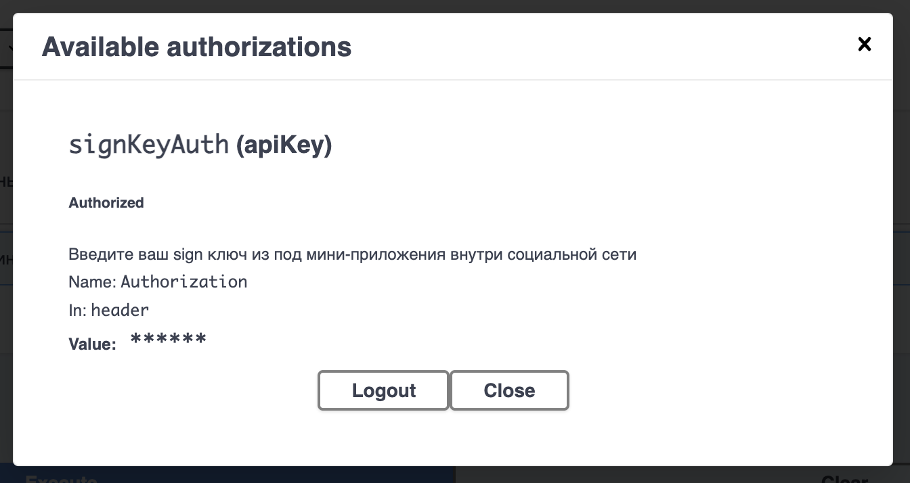
</figure>

<figure markdown>
  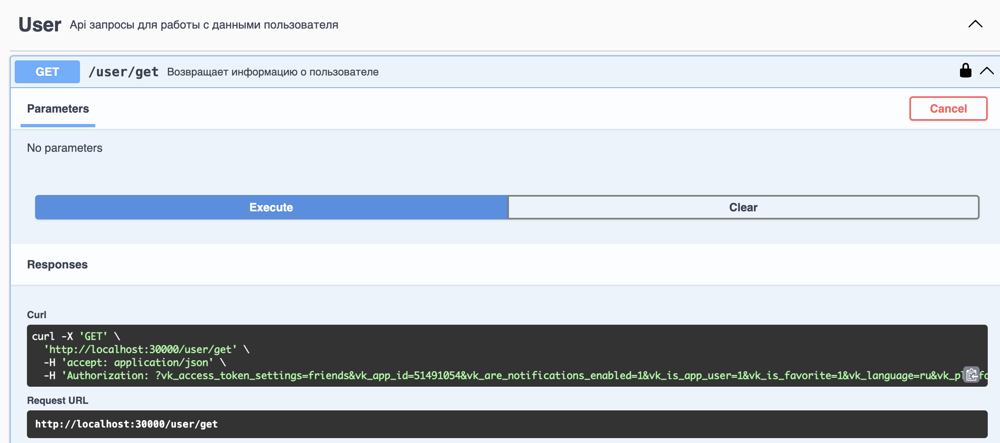
</figure>

<figure markdown>
  
</figure>

<figure markdown>
  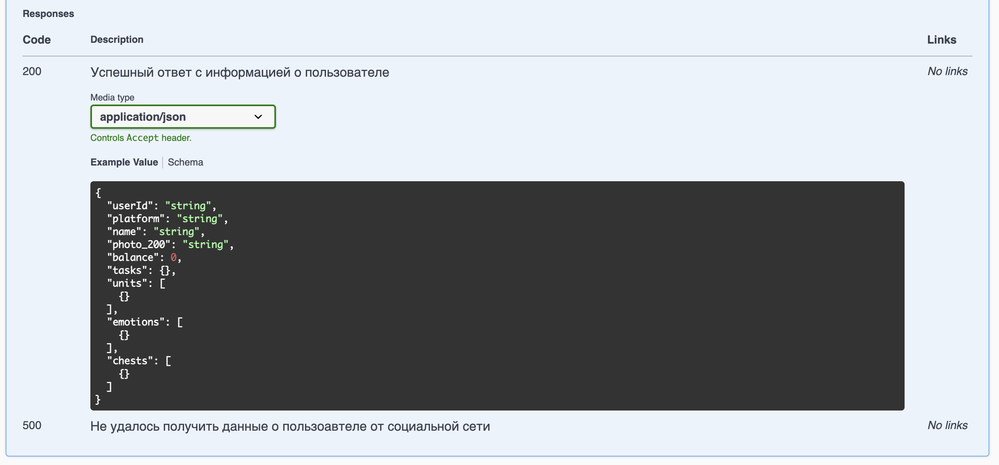
</figure>

<figure markdown>
  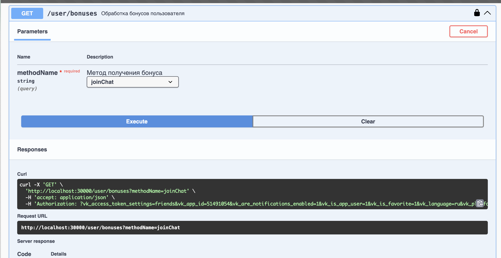
</figure>

<figure markdown>
  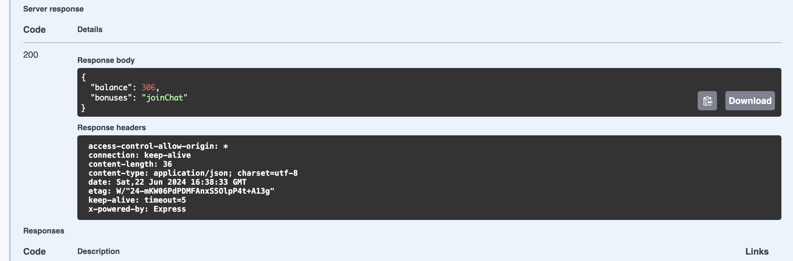
</figure>

<figure markdown>
  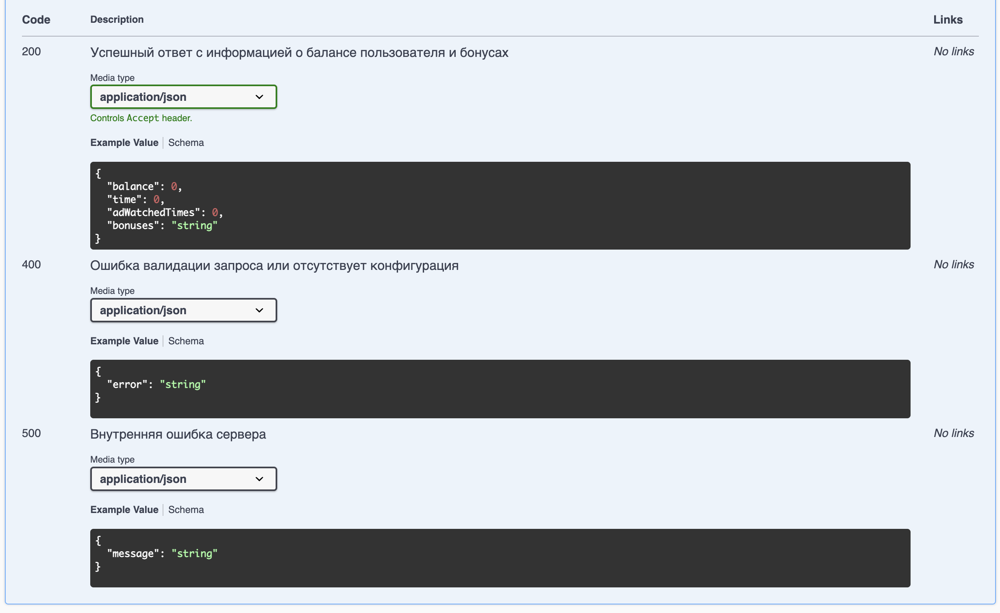
</figure>

<figure markdown>
  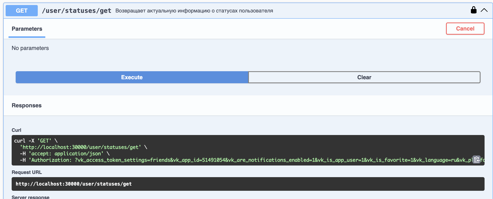
</figure>

<figure markdown>
  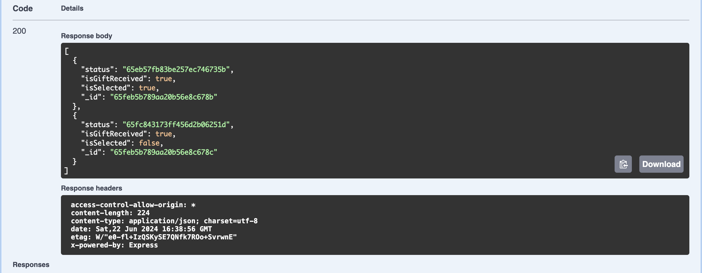
</figure>

<figure markdown>
  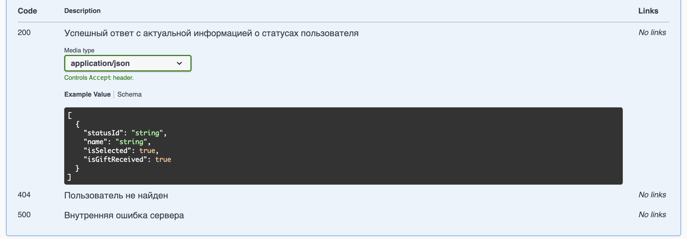
</figure>

<figure markdown>
  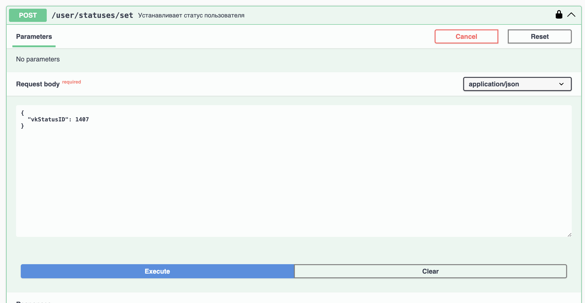
</figure>

<figure markdown>
  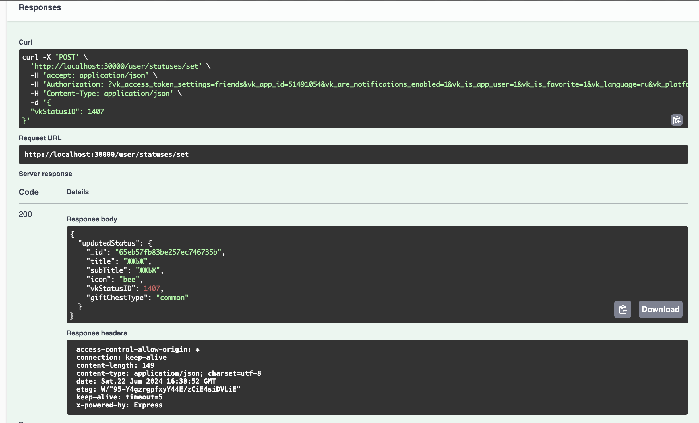
</figure>

<figure markdown>
  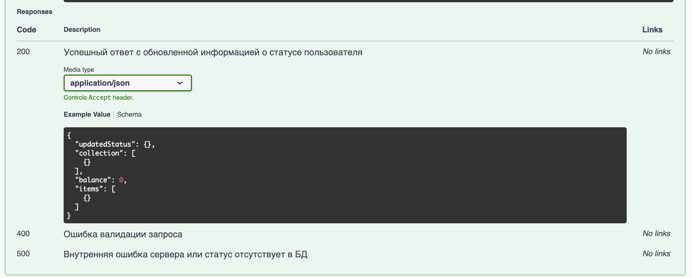
</figure>
