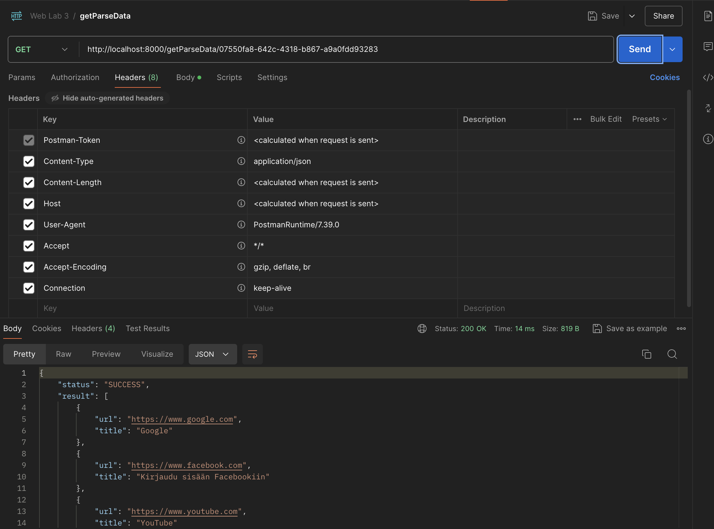

# Тестирование в Postman

<figure markdown>
  
  <figcaption>Запрос syncParse</figcaption>
</figure>

<figure markdown>
  
  <figcaption>Запрос asyncParse</figcaption>
</figure>

<figure markdown>
  
  <figcaption>Запрос getParseData</figcaption>
</figure>

# Вывод

В рамках выполнения работы я научился упаковывать FastAPI приложение в Docker, интегрировать парсер данных с базой данных и вызывать парсер через API и очередь.
