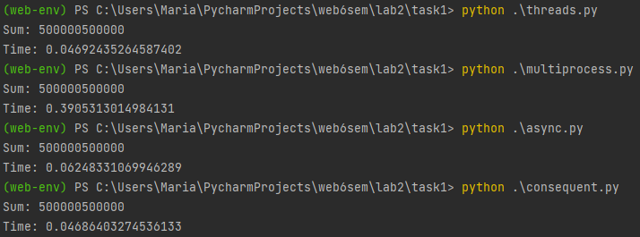

# Задача 1


Задача: Напишите три различных программы на Python, использующие каждый из подходов: threading, multiprocessing и async. Каждая программа должна решать считать сумму всех чисел от 1 до 1000000. Разделите вычисления на несколько параллельных задач для ускорения выполнения.

##Программа использующая многопоточность
```python
import threading
import time


def calculate_sum(start_num, end_num, result):
    res = sum(range(start_num, end_num))
    result.append(res)


def main():
    n = 5
    total = 1000000
    chunk_size = total // n
    threads = list()
    result = list()

    for i in range(n):
        start_num = i * chunk_size + 1
        end_num = (i + 1) * chunk_size + 1
        thread = threading.Thread(target=calculate_sum, args=(start_num, end_num, result))
        threads.append(thread)
        thread.start()

    for thread in threads:
        thread.join()

    return sum(result)


if __name__ == "__main__":
    start_time = time.time()
    total_sum = main()
    result_time = time.time() - start_time
    print(f'Sum: {total_sum} \nTime: {result_time}')

```

##Программа, использующая многопроцессность
```python
import multiprocessing
import time


def calculate_sum(start_num, end_num, queue):
    res = sum(range(start_num, end_num))
    queue.put(res)


def main():
    n = 5
    total = 1000000
    chunk_size = total // n
    processes = list()
    queue = multiprocessing.Queue()

    for i in range(n):
        start_num = i * chunk_size + 1
        end_num = (i + 1) * chunk_size + 1
        process = multiprocessing.Process(target=calculate_sum, args=(start_num, end_num, queue))
        processes.append(process)
        process.start()

    for process in processes:
        process.join()

    res = 0
    while not queue.empty():
        res += queue.get()

    return res


if __name__ == "__main__":
    start_time = time.time()
    total_sum = main()
    result_time = time.time() - start_time
    print(f'Sum: {total_sum} \nTime: {result_time}')

```

##Программа, использующая асинхронность
```python
import asyncio
import time


async def calculate_sum(start_num, end_num):
    return sum(range(start_num, end_num))


async def main():
    n = 5
    total = 1000000
    chunk_size = total // n
    tasks = list()

    for i in range(n):
        start_num = i * chunk_size + 1
        end_num = (i + 1) * chunk_size + 1
        task = asyncio.create_task(calculate_sum(start_num, end_num))
        tasks.append(task)

    result = await asyncio.gather(*tasks)

    return sum(result)


if __name__ == "__main__":
    start_time = time.time()
    total_sum = asyncio.run(main())
    result_time = time.time() - start_time
    print(f'Sum: {total_sum} \nTime: {result_time}')
```

##Программа, работающая последовательно
```python
import threading
import time


def calculate_sum(start_num, end_num, result):
    res = sum(range(start_num, end_num))
    result.append(res)


def main():
    n = 5
    total = 1000000
    chunk_size = total // n
    result = list()

    for i in range(n):
        start_num = i * chunk_size + 1
        end_num = (i + 1) * chunk_size + 1
        calculate_sum(start_num, end_num, result)

    return sum(result)


if __name__ == "__main__":
    start_time = time.time()
    total_sum = main()
    result_time = time.time() - start_time
    print(f'Sum: {total_sum} \nTime: {result_time}')

```

## Сравнение результатов 


## Выводы
Поскольку вычисления были не слишком большие, использование многопоточности, асинхронности и, в особенности, многопроцессности не дало выигрыша во времени.
Все параллельные программы работали дольше последовательной, так как лишь забирали ресурсы на внутренние операции.