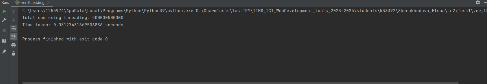

#Различия между threading, multiprocessing и async в Python

Задача: Напишите три различных программы на Python, 
использующие каждый из подходов: threading, multiprocessing и async. 
Каждая программа должна решать считать сумму всех чисел от 1 до 1000000. 
Разделите вычисления на несколько параллельных задач для ускорения выполнения.

###Подход threading:

    import threading
    import time
    
    
    def calculate_sum(start, end, result):
        partial_sum = sum(range(start, end))
        result.append(partial_sum)
    
    
    def main():
        result = []
        start_time = time.time()
        thread1 = threading.Thread(target=calculate_sum, args=(1, 500001, result))
        thread2 = threading.Thread(target=calculate_sum, args=(500001, 1000001, result))
    
        thread1.start()
        thread2.start()
    
        thread1.join()
        thread2.join()
    
        total_sum = sum(result)
        end_time = time.time()
        print("Total sum using threading:", total_sum)
        print("Time taken:", end_time - start_time, "seconds")
    
    
    if __name__ == "__main__":
        main()

В программе с использованием threading 
создаются два потока (thread1 и thread2), 
каждый из которых выполняет вычисление 
суммы частичного диапазона чисел.

thread1 = threading.Thread(target=calculate_sum, args=(1, 500001, result)): 
Здесь создается первый поток thread1, который будет вычислять сумму чисел 
от 1 до 500000. Мы передаем функцию calculate_sum в качестве цели 
для выполнения потока и передаем ей аргументы (1, 500001, result).

thread1.start(): Этот метод запускает выполнение первого потока.

thread1.join(): Этот метод блокирует основной поток, пока thread1 
не завершится.
Аналогичные шаги повторяются для thread2, 
который вычисляет сумму чисел от 500001 до 1000000.

Эти потоки запускаются параллельно с помощью 
метода start() и затем ждут завершения друг друга с помощью метода join(). 
Таким образом, вычисления выполняются параллельно.

###Подход multiprocessing:

    import multiprocessing
    import time
    
    
    def calculate_sum(start, end, result):
        partial_sum = sum(range(start, end))
        result.put(partial_sum)
    
    
    def main():
        result = multiprocessing.Queue()
        start_time = time.time()
        process1 = multiprocessing.Process(target=calculate_sum, args=(1, 500001, result))
        process2 = multiprocessing.Process(target=calculate_sum, args=(500001, 1000001, result))
    
        process1.start()
        process2.start()
    
        process1.join()
        process2.join()
    
        total_sum = 0
        while not result.empty():
            total_sum += result.get()
    
        end_time = time.time()
        print("Total sum using multiprocessing:", total_sum)
        print("Time taken:", end_time - start_time, "seconds")
    
    
    if __name__ == "__main__":
        main()

В коде с использованием 
multiprocessing создаются два процесса 
(process1 и process2), 
каждый из которых (как и предыдущем подходе) выполняет вычисление суммы частичного диапазона чисел.

process1 = multiprocessing.Process(target=calculate_sum, args=(1, 500001, result)): Здесь создается первый процесс process1, который будет вычислять сумму чисел от 1 до 500000. Мы передаем функцию calculate_sum в качестве цели для выполнения процесса и передаем ей аргументы (1, 500001, result).

process1.start(): Этот метод запускает выполнение первого процесса.

process1.join(): Этот метод блокирует основной процесс, пока process1 не 
завершится.
Аналогичные шаги повторяются для process2, который вычисляет 
сумму чисел от 500001 до 1000000.

Эти процессы запускаются параллельно с помощью метода start() 
затем ждут завершения друг друга с помощью метода join(). 
Таким образом, вычисления выполняются параллельно.

###Подход async:

    import asyncio
    import time
    
    
    async def calculate_sum(start, end):
        return sum(range(start, end))
    
    
    async def main():
        start_time = time.time()
        task1 = asyncio.create_task(calculate_sum(1, 500001))
        task2 = asyncio.create_task(calculate_sum(500001, 1000001))
    
        result1, result2 = await asyncio.gather(task1, task2)
    
        total_sum = result1 + result2
        end_time = time.time()
        print("Total sum using asyncio:", total_sum)
        print("Time taken:", end_time - start_time, "seconds")
    
    
    if __name__ == "__main__":
        asyncio.run(main())

В программе с использованием asyncio создаются две 
задачи (task1 и task2), каждая из которых выполняет вычисление 
суммы частичного диапазона чисел. 

task1 = asyncio.create_task(calculate_sum(1, 500001)): 
Здесь создается первая асинхронная задача task1, 
которая вычисляет сумму чисел от 1 до 500000.

task2 = asyncio.create_task(calculate_sum(500001, 1000001)): 
Здесь создается вторая асинхронная задача task2, 
которая вычисляет сумму чисел от 500001 до 1000000.

result1, result2 = await asyncio.gather(task1, task2): 
Здесь мы используем функцию asyncio.gather(), ч
тобы параллельно выполнить обе задачи и дождаться их завершения. 
Мы ожидаем результаты выполнения задач task1 и task2 и 
присваиваем их переменным result1 и result2.

###Сравнение времени выполнения

Использование threading позволило достичь общей суммы за самое короткое время
multiprocessing потребовал немного больше времени, чем потоки, но также показал хороший результат
Использование asyncio также позволило вычислить общую сумму за небольшое время, 
хотя время выполнения немного превышает время с потоками