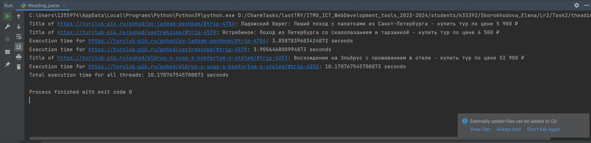

#Threading подход к парсингу

Определяется функция parse_and_save(url), которая принимает URL в 
качестве входного параметра, 
получает HTML-контент, 
разбирает его для извлечения 
соответствующей информации о поездке, 
такой как название, место отправления и т.д. а затем сохраняет эту информацию в базу данных.

Далее определяется список URL-адресов, указывающих на различные страницы поездок на веб-сайте.

Создаются отдельные потоки для каждого URL в списке, и они запускаются параллельно. Каждый поток выполняет функцию parse_and_save с соответствующим URL.

После запуска всех потоков основная программа ожидает завершения каждого потока с помощью thread.join().

    import threading
    import requests
    from bs4 import BeautifulSoup
    from sqlalchemy import create_engine, Column, Integer, String, DateTime
    from sqlalchemy.orm import sessionmaker
    from db import Trip, SessionLocal
    import time
    from datetime import datetime
    
    
    def parse_and_save(url):
        start_time = time.time()
    
        response = requests.get(url)
        soup = BeautifulSoup(response.content, "html.parser")
        title = soup.title.string
    
        departure_location_element = soup.find("div", class_="tags").find("a", class_="tag has-icon-location")
        if departure_location_element:
            departure_location = departure_location_element.text.strip()
        else:
            departure_location = "Unknown"
    
        date_option = soup.select_one("option[selected='selected']")
        if date_option:
            date_text = date_option.text.strip()
            if " — " in date_text and " " in date_text:
                start_day, end_month_year = date_text.split(" — ", maxsplit=1)
                end_day, month_year = end_month_year.split(" ", maxsplit=1)
                month_name, year = month_year.rsplit(maxsplit=1)
                months = {
                    "января": 1, "февраля": 2, "марта": 3, "апреля": 4, "мая": 5, "июня": 6,
                    "июля": 7, "августа": 8, "сентября": 9, "октября": 10, "ноября": 11, "декабря": 12
                }
                month = months[month_name]
                start_date_str = f"{start_day} — {month} {year}"
                end_date_str = f"{end_day} {month} {year}"
                start_date = datetime.strptime(start_date_str, "%d — %m %Y")
                end_date = datetime.strptime(end_date_str, "%d %m %Y")
            else:
                print("Date format not as expected.")
        else:
            start_date = "Unknown"
            end_date = "Unknown"
    
        duration_element = soup.select_one("p.heading:-soup-contains('Длительность') + p.title i.icon-duration")
        if duration_element:
            duration_text = duration_element.find_next_sibling(text=True).strip()
            duration = int(duration_text)
        else:
            duration = "Unknown"
    
        details_block = soup.find("div", class_="block mt-6")
        if details_block:
            description_element = details_block.find("p", class_="title", text="Давайте с нами!")
            if description_element:
                details = description_element.find_next_sibling("div").text.strip()
            else:
                details = None
        else:
            details = None
    
        print(f"Title of {url}: {title}")
    
        db = SessionLocal()
        db.add(Trip(title=title, departure_location=departure_location,
                    start_date=start_date, end_date=end_date,
                    duration=duration, details=details))
        db.commit()
        db.close()
    
        end_time = time.time()
        execution_time = end_time - start_time
        print(f"Execution time for {url}: {execution_time} seconds")
    
    
    urls = ["https://turclub-pik.ru/pohod/elbrus-s-yuga-s-komfortom-s-otelem/#trip-4253",
            "https://turclub-pik.ru/pohod/po-ladoge-peshkom/#trip-4784",
            "https://turclub-pik.ru/pohod/yastrebinoe/#trip-4579"]
    
    start_time = time.time()
    
    threads = []
    
    for url in urls:
        thread = threading.Thread(target=parse_and_save, args=(url,))
        threads.append(thread)
        thread.start()
    
    for thread in threads:
        thread.join()
    
    end_time = time.time()
    total_execution_time = end_time - start_time
    print(f"Total execution time for all threads: {total_execution_time} seconds")

