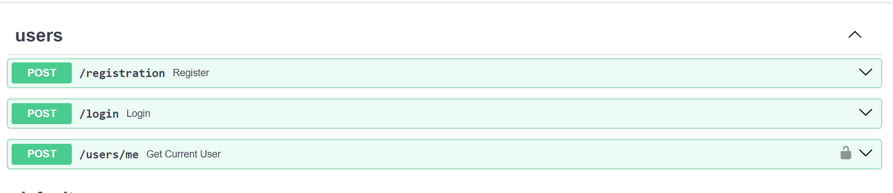
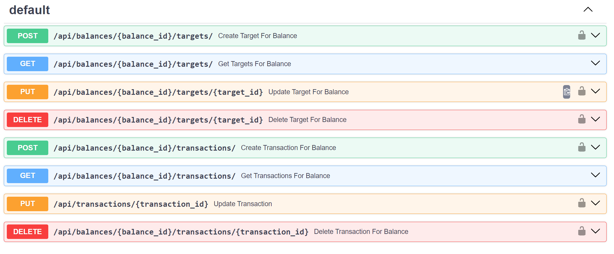
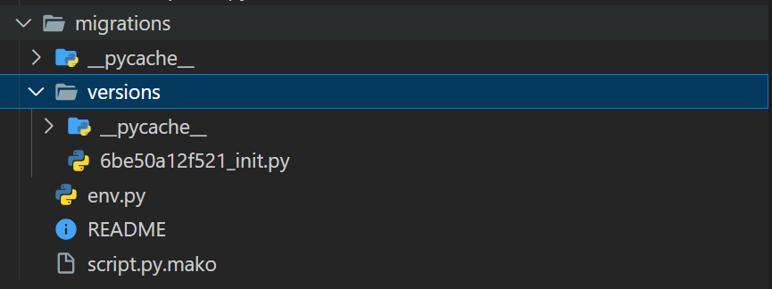

# Отчет по лабораторной работе №1

#### Цель работы:

Научится реализовывать полноценное серверное приложение с помощью фреймворка FastAPI с применением дополнительных средств и библиотек.

## Задание

#### Текст задания:

1. Выполнить практики 2.1-2.3 Их можно реализовать на примере, приведенном в текстах практик или используя выбранную тему. Практики можно предоставить в любом из ниже приведенных вариантов:
   a. Каждая практика - отдельная папка в репозитории.
   b. Каждая практика - отдельная ветка в репозитории.
   c. Каждая практика - отдельный коммит в репозитории.
2. Задание на 9 Баллов: Реализовать на основании выбранной модели с помощью инструкций из практик серверное приложение на FastAPI. Оно должно включать в себя:
   a. Таблицы, реализованные с помощью ORM SQLAlchemy или SQLModel с использованием БД PostgreSQL.
   b. API, содержащее CRUD-ы. Там где это необходимо, реализовать GET-запросы возвращающие модели с вложенными объектами (связи many-to-many и one-to-many).
   c. Настроенную систему миграций с помощью библиотеки Alembic.
   d. Аннотацию типов в передаваемых и возвращаемых значениях в API-методах.
   e. Оформленную файловую структуру проекта с разделением кода, отвечающего за разную бизнес-логику и предметную область, на отдельные файлы и папки.
   f. (опционально) Комментарии к сложным частям кода.
3. Задание на 15 Баллов (можно реализовывать сразу): Необходимо реализовать функционал пользователя в разрабатываемом приложении. Функционал включает в себя:
   a. Авторизацию и регистрацию
   b. Генерацию JWT-токенов
   c. Аутентификацию по JWT-токену
   d. Хэширование паролей
   e. Дополнительные АПИ-методы для получения информации о пользователе, списка пользователей и смене пароля

#### Ссылка на практики

https://github.com/SashaZharov/ITMO_ICT_WebDevelopment_tools_2023-2024/tree/main/students/k33402/Alexandr_Zharov/practical_works/practical_work_1

#### Ход Выполнения:

Для работы будет использоваться следующий стек:
fastapi
sqlmodel
uvicorn
alembic

На первом шаге инициализируем приложение и подключаем базу данных:

```
app = FastAPI()

app.include_router(user_router)
app.include_router(main_router, prefix="/api")


def create_db():
    SQLModel.metadata.create_all(engine)


@app.on_event("startup")
def on_startup():
    create_db()


if __name__ == '__main__':
    uvicorn.run(app, host='localhost', port=8000, reload=True)
```

```
eng = r'A:\Studies\Веб\ITMO_ICT_WebDevelopment_tools_2023-2024\students\k33402\Alexandr_Zharov\laboratory_work_1\database.db'
sqlite_url = f'sqlite:///{eng}'
engine = create_engine(sqlite_url, echo=True)
session = Session(bind=engine)
```

Создаем модели данных для бд, в них будет входить: пользователь, баланс, транзакции и цели, также будет создан enum для категорий

```
class Category(str, Enum):
    FOOD = "Food"
    TRANSPORTATION = "Transportation"
    ENTERTAINMENT = "Entertainment"
    SHOPPING = "Shopping"
    BILLS = "Bills"
    SALARY = "Salary"
    SAVINGS = "Savings"
    OTHER = "Other"


class TransactionsType(str, Enum):
    INCOME = "income"
    EXPENSES = "expenses"


class Target(SQLModel, table=True):
    id: int = Field(primary_key=True)
    category: Category = Category.OTHER
    value: int = 0
    balance_id: int = Field(foreign_key="balance.id")
    balance: Optional["Balance"] = Relationship(back_populates="targets")


class Transactions(SQLModel, table=True):
    id: int = Field(primary_key=True)
    category: Category = Category.OTHER
    value: int = 0
    type: TransactionsType = TransactionsType.INCOME
    balance_id: int = Field(foreign_key="balance.id")
    balance: Optional["Balance"] = Relationship(back_populates="transactions")


class Balance(SQLModel, table=True):
    id: int = Field(primary_key=True)
    balance: int = 0
    user_id: Optional[int] = Field(foreign_key="user.id")
    user: Optional[User] = Relationship(back_populates="balance")
    transactions: List[Transactions] = Relationship(back_populates="balance")
    targets: List[Target] = Relationship(back_populates="balance")
```

Также создаем модель пользователя:

```
class User(SQLModel, table=True):
    id: int = Field(primary_key=True)
    username: str = Field(index=True)
    password: str
    email: str
    balance: Optional["Balance"] = Relationship(back_populates="user")
    created_at: datetime.datetime = Field(default=datetime.datetime.now())
```

Теперь добавляем эндпоинты для авторизации

```
user_router = APIRouter()
auth_handler = AuthHandler()


@user_router.post('/registration', status_code=201, tags=['users'], description='Register new user')
def register(user: UserInput):
    users = select_all_users()
    if any(x.username == user.username for x in users):
        raise HTTPException(status_code=400, detail='Username is taken')
    hashed_pwd = auth_handler.get_password_hash(user.password)
    balance = Balance(balance=0)
    u = User(username=user.username, password=hashed_pwd, email=user.email, balance=balance)
    session.add_all([u, balance])
    session.commit()

    return JSONResponse(status_code=201, content={"message": "User registered successfully"})


@user_router.post('/login', tags=['users'])
def login(user: UserLogin):
    user_found = find_user(user.username)

    if not user_found:
        raise HTTPException(status_code=401, detail='Invalid username and/or password')
    verified = auth_handler.verify_password(user.password, user_found.password)

    if not verified:
        raise HTTPException(status_code=401, detail='Invalid username and/or password')

    token = auth_handler.encode_token(user_found.username)
    return {'token': token}


@user_router.post('/users/me', tags=['users'])
def get_current_user(user: User = Depends(auth_handler.get_current_user)):
    return user.username
```



Добавляем CRUD операции для целей и транзакций, а также эндпоинты для получения данных о транзакции и цели по балансу


Также подключаем систему миграций используя библиотеку alembic


## Вывод

В ходе работы было написано API с авторизацией и CRUD-операциями на фреймворке FastAPI
