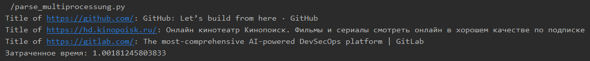
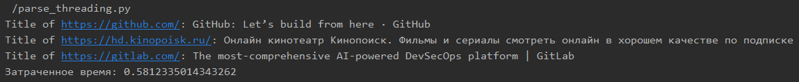

# Отчет по лабораторной работе №2

#### Цель работы:

Понять отличия потоками и процессами и понять, что такое ассинхронность в Python.

## Задание 1

#### Текст задания:

Напишите три различных программы на Python, использующие каждый из подходов: threading, multiprocessing и async. Каждая программа должна решать считать сумму всех чисел от 1 до 1000000. Разделите вычисления на несколько параллельных задач для ускорения выполнения.

Подробности задания:

1. Напишите программу на Python для каждого подхода: threading, multiprocessing и async.
2. Каждая программа должна содержать функцию calculate_sum(), которая будет выполнять вычисления.
3. Для threading используйте модуль threading, для multiprocessing - модуль multiprocessing, а для async - ключевые слова async/await и модуль asyncio.
4. Каждая программа должна разбить задачу на несколько подзадач и выполнять их параллельно.
5. Замерьте время выполнения каждой программы и сравните результаты.

#### Ход Выполнения:

Для тестирования была написана функция для подсчета суммы чисел в отрезке и созданы функции вызывающие эту функцию для отрезков с указанным шагом. Таким образом мы добились того, что подсчет суммы будет разделен на несколько задачь, которые можно будет выполнять с применением различных подходов асинхронного программирования на python.

Результат выполнения с помощью asyncio

Результат выполнения с помощью multiprocessing

Результат выполнения с помощью threding

## Задание 2

#### Текст задания:

Напишите программу на Python для параллельного парсинга нескольких веб-страниц с сохранением данных в базу данных с использованием подходов threading, multiprocessing и async. Каждая программа должна парсить информацию с нескольких веб-сайтов, сохранять их в базу данных.

Подробности задания:

1. Напишите три различных программы на Python, использующие каждый из подходов: threading, multiprocessing и async.
2. Каждая программа должна содержать функцию parse_and_save(url), которая будет загружать HTML-страницу по указанному URL, парсить ее, сохранять заголовок страницы в базу данных и выводить результат на экран.
3. Используйте базу данных из лабораторной работы номер 1 для заполенния ее данными. Если Вы не понимаете, какие таблицы и откуда Вы могли бы заполнить с помощью парсинга, напишите преподавателю в общем чате потока.
4. Для threading используйте модуль threading, для multiprocessing - модуль multiprocessing, а для async - ключевые слова async/await и модуль aiohttp для асинхронных запросов.
5. Создайте список нескольких URL-адресов веб-страниц для парсинга и разделите его на равные части для параллельного парсинга.
6. Запустите параллельный парсинг для каждой программы и сохраните данные в базу данных.
7. Замерьте время выполнения каждой программы и сравните результаты.

#### Ход Выполнения:

Для этого задания было реализованно создание базы данных, а также парсинг страниц по указанному url. Каждая страница парсилась и в базу данных заносился title.
Парсинг производился асинхронно с применением asyncio, multiprocessing и threading

Результаты парсинга с помощью asyncio

Результаты парсинга с помощью multiprocessing

Результаты парсинга с помощью threading

## Вывод

В ходе выполнения работы были изучены различные подходы к асинхронному програмированию в python при помощи библиотек threading, multiprocessing и async.
