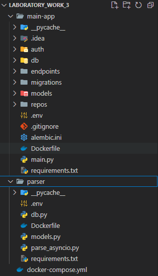
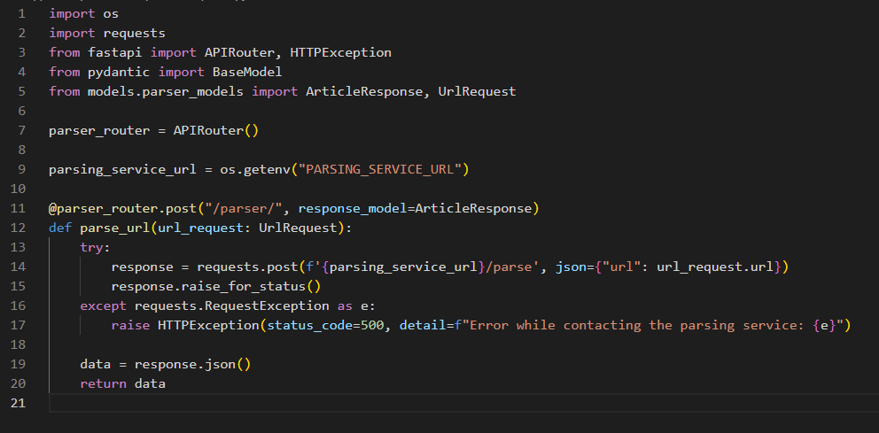
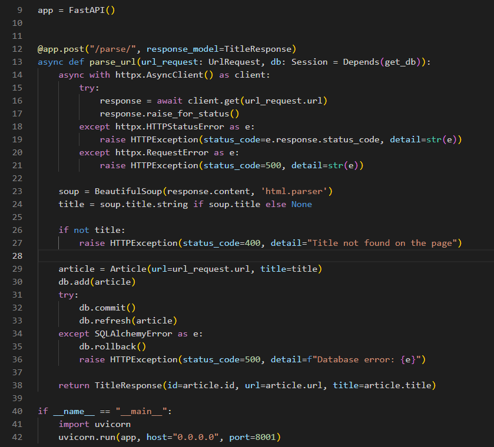
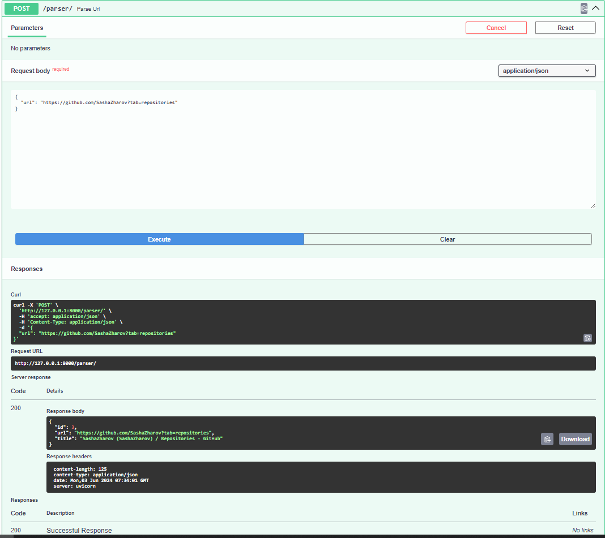
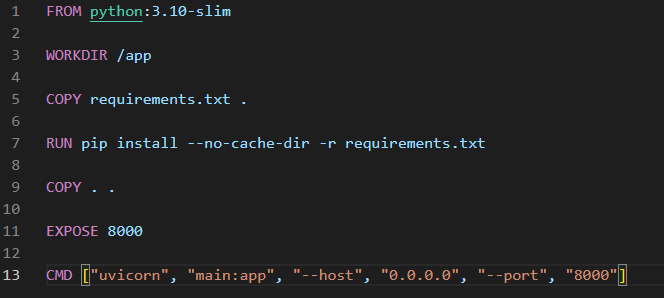
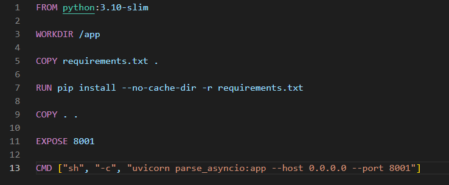
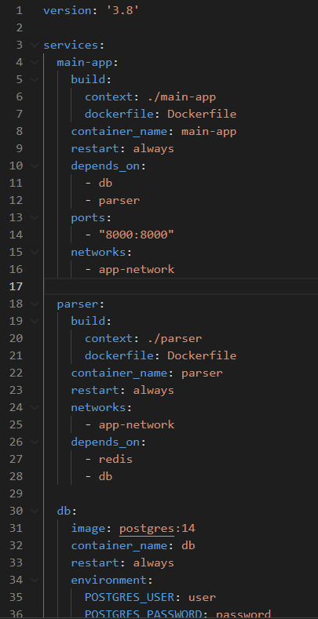

# Отчет по лабораторной работе №3

#### Цель работы:

Научиться упаковывать FastAPI приложение в Docker, интегрировать парсер данных с базой данных и вызывать парсер через API и очередь.

## Задание 1

#### Текст задания:

1. Создание FastAPI приложения: Создано в рамках лабораторной работы номер 1
2. Создание базы данных: Создано в рамках лабораторной работы номер 1
3. Создание парсера данных: Создано в рамках лабораторной работы номер 2
4. Реулизуйте возможность вызова парсера по http Для этого можно сделать отдельное приложение FastAPI для парсера или воспользоваться библиотекой socket или подобными.
5. Разработка Dockerfile
6. Создание Docker Compose файла

#### Ход Выполнения:

Сачала переносим 1 и 2 лабораторную работу в новый проект.
1 работа будет основой для главного сервиса, а 2 будет использоваться как микросервис для асинхронного парсинга страниц

В основном приложении добавляем новый роут по которому будем обращаться к микросервису и передавать url

В микросервисе добавляем функцию для обработки запроса

Проверяем работу

Теперь в каждый сервис добавляем Dockerfile

И в корне проекта добавляем docer-compose файл для запуска всех необходимых образов

## Вывод

В ходе работы я научился связывать разные сервисы между собой, а также запускать приложения в докер-контейнере вместе с базой данных.
