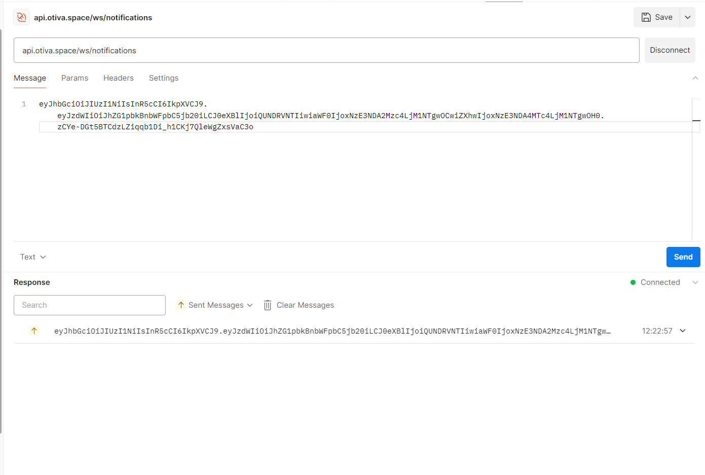
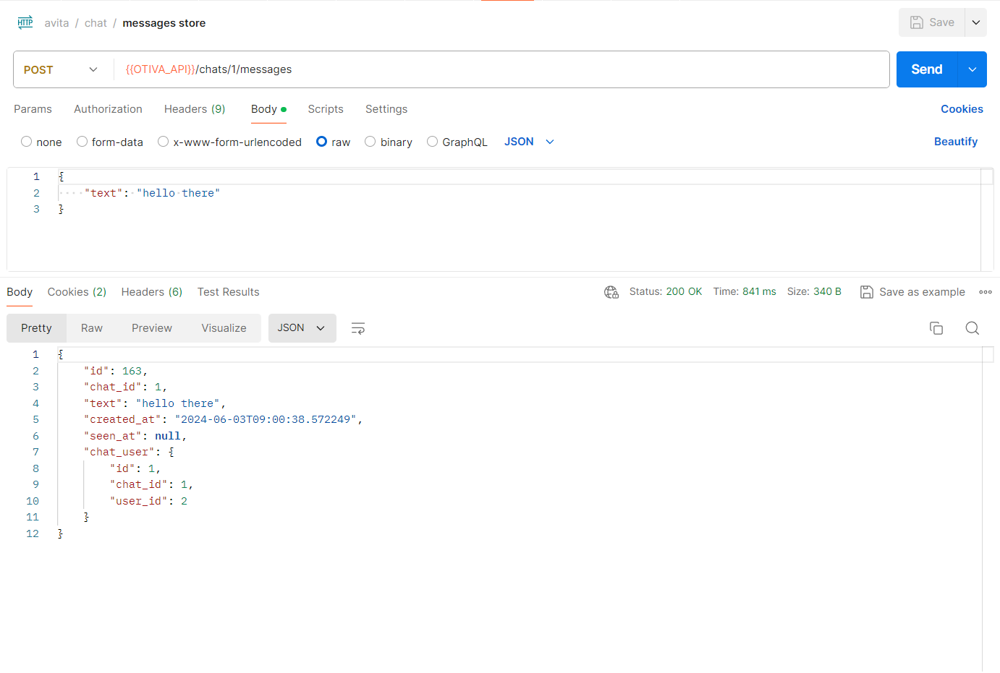
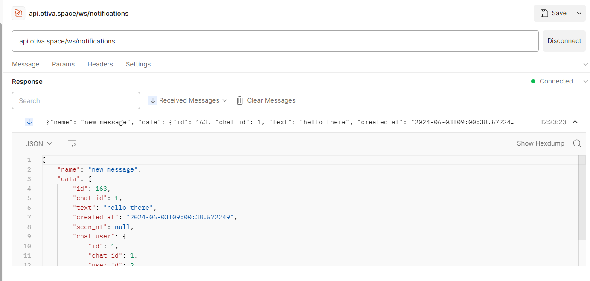

# Отчёт

## Задача лабораторной работы

Научиться упаковывать FastAPI приложение в Docker, интегрировать парсер данных с базой данных и вызывать парсер через API и очередь.

## Стек

- `nginx`
- `certbot`
- `fastapi`
- `postgresql`
- `uvicorn`
- `gunicorn`
- `alembic`
- `sqlalchemy`
- `jose` - генерация JWT токенов
- `redis` - для обмена сообщениями через publisher/subscriber

## Структура папок

```bash
├── fastapi
    └── src
      └── api
          ├── dependecies
          ├── routers
          ├── transformers
          └── api
      ├── config
      └── database
          ├── migrations
          └── seeders
      ├── utils
      └── env.example
      └── Dockerfile
    └── env.example
├── nginx
    └── conf.d
        └── app.conf
├── pgsql
    └── env.example
└── redis
    └── redis.conf
├── docker-compose.yml
└── README.md
```

## Запуск

Запуск проекта осуществляется командой `docker compose up`.
Миграции применяются через `alembic upgrade head`

# Результаты

Получилось упаковать приложение на fastapi вместе с redis и postgres в Docker, интегрировать с БД, развернуть его в облаке и обеспечить доступ по https.

# Ход работы

# Docker

Рассмотрим конфигурации приложения:

Dockerfile fastapi: устанавловаем все необходимые зависимости, открываем порт и запускаем воркеры uvicorn с помощью gunicorn

```Dockerfile
FROM python:3.9-alpine
WORKDIR /app

COPY ./requirements.txt requirements.txt
RUN apk update && \
    apk add build-base && \
    pip install -r requirements.txt

EXPOSE 8000
CMD ["gunicorn", "src.main:app", "--workers", "4", "--worker-class", "uvicorn.workers.UvicornWorker", "--bind", "0.0.0.0:8000"]
```

В композ-файле объявлены пять сервисов:

- Прокси сервер (nginx)
- сертбот для получения ssl-сертификатов (certbot)
- База данных (postgres)
- Redis (redis)
- Приложение API (fastapi)

```YML title="docker-compose.yml"
version: '3'
services:

  nginx:
    image: nginx:alpine
    container_name: otiva_nginx
    restart: unless-stopped
    ports:
      - "80:80"
      - "443:443"
    volumes:
      - ./certbot/www:/var/www/certbot/
      - ./certbot/conf:/etc/letsencrypt/
      - ./nginx/conf.d/:/etc/nginx/conf.d/
    networks:
      - otiva

  fastapi:
    container_name: otiva_fastapi
    restart: unless-stopped
    build:
      context: ./fastapi
      dockerfile: Dockerfile
    ports:
      - "5000:5000"
    volumes:
      - ./fastapi:/app
    networks:
      - otiva

  postgres:
    container_name: otiva_postgres
    restart: unless-stopped
    image: postgres:14
    ports:
      - "5432:5432"
    env_file:
      - ./pgsql/.env
    volumes:
      - otiva-pgsql-volume:/var/lib/postgresql/data
    networks:
      - otiva

  redis:
    image: redis:alpine
    container_name: otiva_redis
    restart: unless-stopped
    volumes:
      - otiva-redis-volume:/data
      - ./redis/redis.conf:/usr/local/etc/redis/redis.conf
    expose:
      - 6379
    command: redis-server /usr/local/etc/redis/redis.conf
    networks:
      - otiva

  certbot:
    image: certbot/certbot
    container_name: otiva_certbot
    volumes:
      - ./certbot/conf:/etc/letsencrypt
      - ./certbot/www:/var/www/certbot
    command: certonly --webroot -w /var/www/certbot/ --email test.space@gmail.com --agree-tos

networks:
  otiva:
    driver: bridge

volumes:
  otiva-pgsql-volume:
    driver: local
  otiva-redis-volume:
    driver: local

```

Конфигурация nginx
```bash title=app.conf
server {
server {
  listen 80;
  server_name api.otiva.space;

  location /.well-known/acme-challenge/ {
    root /var/www/certbot;
  }
 
  location / {
    return 301 https://$host$request_uri;
  }
}

server {
  listen 443 ssl;
  server_name api.otiva.space;

  ssl_certificate /etc/letsencrypt/live/otiva/fullchain.pem; # managed by Certbot
  ssl_certificate_key /etc/letsencrypt/live/otiva/privkey.pem; # managed by Certbot

  charset utf-8;

  set $cors_origin "";
  set $cors_cred   "";
  set $cors_header "";
  set $cors_method "";


  if ($http_origin = "https://otiva.space") {
      set $cors_origin $http_origin;
      set $cors_cred   true;
      set $cors_header $http_access_control_request_headers;
      set $cors_method $http_access_control_request_method;
  }

  add_header Access-Control-Allow-Origin      $http_origin always;
  add_header Access-Control-Allow-Credentials $cors_cred always;
  add_header Access-Control-Allow-Headers     $cors_header always;
  add_header Access-Control-Allow-Methods     $cors_method always;

  if ($request_method = 'OPTIONS') {
      return 204;
  }

  location /ws {
      proxy_pass http://otiva_fastapi:8000;
      proxy_http_version 1.1;
      proxy_set_header Upgrade $http_upgrade;
      proxy_set_header Connection "Upgrade";
      proxy_set_header Host $host;
  }

  location / {
      proxy_pass http://otiva_fastapi:8000;
      proxy_set_header Host $host;
      proxy_set_header X-Real-IP $remote_addr;
      proxy_set_header X-Forwarded-For $proxy_add_x_forwarded_for;
      proxy_set_header X-Forwarded-Proto $scheme;
      proxy_redirect off;
  }
}
```

# FastAPI

Был написан небольшой клиент для работы с redis pub/sub
```python title=pubsub.py
from src.utils.redis import redis
import json
import asyncio
from typing import Union


class PubSubEvents:
    NEW_MESSAGE: str = 'new_message'


class PubSubMessage:
    def __init__(self, data, pattern, channel, type):
        self.data = data
        self.pattern = pattern
        self.channel = channel
        self.type = type


class PubSubEvent:
    def __init__(self, name, data: Union[list, dict]):
        self.name = name
        self.data = data

    def serialize(self) -> str:
        data = {
            'name': self.name,
            'data': self.data,
        }
        return json.dumps(data)


class PubSub:
    @staticmethod
    async def publish(payload: dict[str, PubSubEvent]):
        """Accepts dict {channel_name: data} and publishes data to respective channel names"""
        if not payload:
            return
        pub = redis.get_connection()

        for channel in payload:
            event: PubSubEvent = payload[channel]
            await pub.publish(channel, event.serialize())

        await pub.close()

    @staticmethod
    async def subscribe(channel: str):
        sub = redis.get_connection().pubsub()
        async with sub as conn:
            await conn.subscribe(channel)

            while True:
                try:
                    message = await conn.get_message(ignore_subscribe_messages=True)
                    if message is not None:
                        dto = PubSubMessage(
                            data=message['data'].decode('utf-8'),
                            pattern=message['pattern'].decode('utf-8') if message['pattern'] else None,
                            channel=message['channel'].decode('utf-8') if message['channel'] else None,
                            type=message['type'] if message['type'] else None,
                        )
                        yield dto
                    await asyncio.sleep(1)
                except Exception:
                    break

            await conn.unsubscribe(channel)
        await sub.close()
```

Pub/sub redis используется в приложении для отправки уведомлений пользователю черезз Websockets

```python title=notifications.py
from fastapi import WebSocket, APIRouter, Depends
from src.api.dependencies.auth import Auth
from src.utils.pubsub import PubSub


router = APIRouter()


@router.websocket("/ws/notifications")
async def websocket_endpoint(websocket: WebSocket, auth: Auth = Depends()):
    await websocket.accept()
    try:
        user = await auth.check_access_token_websocket(websocket)
    except Exception as e:
        await websocket.send_text('Unauthenticated')
        await websocket.close()
        return

    channel_name = f'notifications:{user.id}'

    async for message in PubSub.subscribe(channel_name):
        await websocket.send_text(message.data)

    await websocket.close()
```

Пример отправки сообщения о новом сообщении в чате:

```python title=chat.py
@router.post('/{chat_id}/messages')
async def store_message(chat_id: int, request: Request, auth: Auth = Depends()):
    await auth.check_access_token(request)

    validator = Validator(await request.json() | {'chat_id': chat_id}, {
        'text': ['required', 'string'],
    }, {}, BasePayload())
    payload = validator.validated()

    # chat must have current user as ChatUser
    async with db_manager.get_session() as session:
        q = select(Chat) \
            .options(joinedload(Chat.chat_users)) \
            .where(Chat.id == chat_id)
        res = await session.execute(q)
        chat: Chat = res.scalar()

    if not chat:
        return ApiResponse.error('Chat does not exists.')

    current_chat_user: ChatUser = next(filter(lambda cu: cu.user_id == request.state.user.id, chat.chat_users), None)

    if not current_chat_user:
        return ApiResponse.error('User does not belongs to this chat.')

    message: ChatMessage = await SqlAlchemyRepository(db_manager.get_session, ChatMessage).create({
        'chat_user_id': current_chat_user.id,
        'chat_id': chat_id,
        'text': payload.text,
        'seen_at': None,
    })

    transformed_message = transform(message, ChatMessageTransformer())

    notifications = {}
    for chat_user in chat.chat_users:
        # do not notify sender
        if chat_user.user_id == request.state.user.id:
            continue
        notifications[f'notifications:{chat_user.user_id}'] = PubSubEvent(PubSubEvents.NEW_MESSAGE, transformed_message)

    await PubSub.publish(notifications)  # todo to queue

    return ApiResponse.payload(transformed_message)
```

# Пример работы:

## Подключаемся к вебсокету

## Отправляем сообщение

## Уведомление пришло
