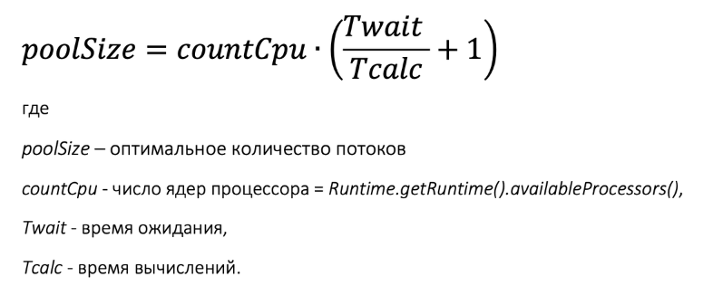
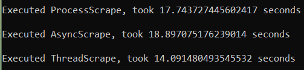

# Запуск парсера/скрапера
Напишем валидатор данных для скрипта:
```Python
def validate_input(cmd, url: str, start: str, end: str):
    if start.isdigit() and end.isdigit():
        start = int(start)
        end = int(end)
    else:
        raise TypeError("Can not convert str to int")
    if start > end and (start < 0 or end < 0):
        raise ValueError("Invalid page range")
    if url[-1] == "/":
        url = url[:-2]
        print("Trimmed the trailing '/' in the url")
    return url, start, end
```
Входная точка для запуска скрипта:
```Python
if __name__ == "__main__":
    print(sys.argv)
    if len(sys.argv) == 4 and (refined_args := validate_input(*sys.argv)):
        # refined_args = ("https://joyreactor.cc/tag/%D0%BA%D0%BE%D1%82%D1%8D", 298, 300)
        a = ProcessScrape(*refined_args)
        b = AsyncScrape(*refined_args)
        c = ThreadScrape(*refined_args)
        a.run()
        b.run()
        c.run()
        for i in BaseScraper._results:
            print(i)
    else:
        print("Not enough parameters")
```
Полезно также знать, что рассчитывать количество оптимальных потоков для ЦПУ можно по следующей формуле:

Воспольземся cpu_count(), чтобы получить количество ядер процессора. Для своего кода я решил разделить пул потоков поровну между операциями получения страницы и сохранения изображений. Учитывая искуственность задержок для избежания DDoS-а, формула будет не совсем корректной, но в любом случае ограничить количество потоков сверху будет полезно.
```Python
CPU_COUNT = cpu_count()
NUMBER_OF_WORKERS = CPU_COUNT if CPU_COUNT < 4 else CPU_COUNT // 2
```
Результаты работы скрипта на двух страницах:
