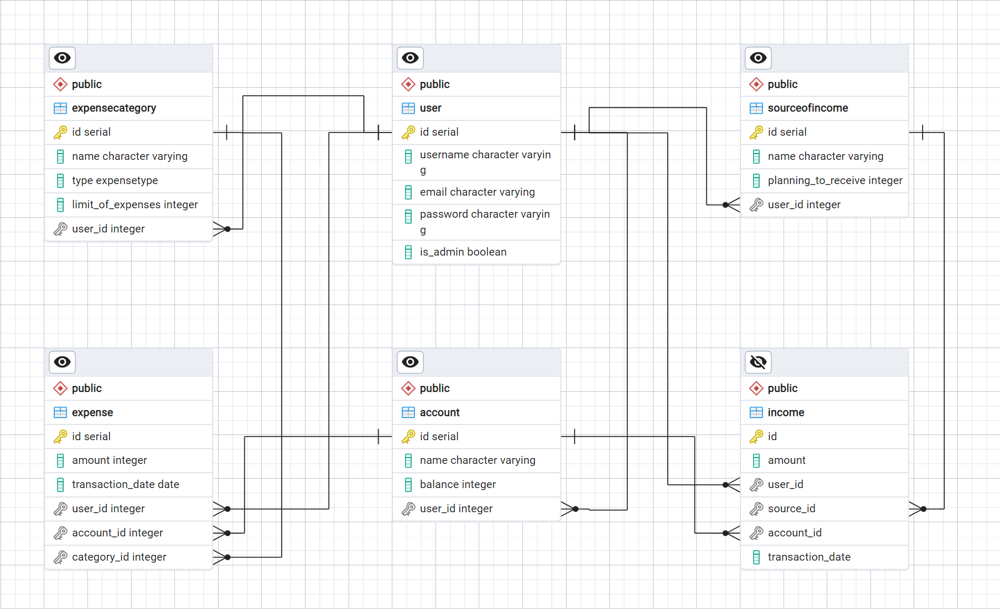

# Модели

Предметная область: __Разработка сервиса для управления личными финансами__

Создадим модели с помощью `SQLModel`:


=== "Траты"

    ```Python
    from sqlmodel import SQLModel, Field, Relationship
    from datetime import date
    from typing import ForwardRef
    
    User = ForwardRef("User")

    --8<-- "laboratory_work_1\finance\models.py:53:65"
    ```

=== "Поступления"

    ```Python
    from sqlmodel import SQLModel, Field, Relationship
    from datetime import date

    --8<-- "laboratory_work_1\finance\models.py:66:78"
    ```

=== "Категории трат"

    ```Python
    from enum import Enum
    from sqlmodel import SQLModel, Field, Relationship

    --8<-- "laboratory_work_1/finance/models.py:6:31"
    ```

=== "Платежный аккаунт"

    ```Python
    from sqlmodel import SQLModel, Field, Relationship

    --8<-- "laboratory_work_1/finance/models.py:42:52"
    ```

=== "Источник поступлений"

    ```Python
    from sqlmodel import SQLModel, Field, Relationship

    --8<-- "laboratory_work_1/finance/models.py:32:41"
    ```


<details>
<summary><b>Лог созданных таблиц</b></summary>

~~~~sql
CREATE TABLE "user" (
        id SERIAL NOT NULL,
        username VARCHAR NOT NULL,
        email VARCHAR NOT NULL,
        password VARCHAR NOT NULL,
        is_admin BOOLEAN NOT NULL,
        PRIMARY KEY (id)
)

CREATE TABLE expensecategory (
        id SERIAL NOT NULL,
        name VARCHAR NOT NULL,
        type expensetype NOT NULL,
        limit_of_expenses INTEGER,
        user_id INTEGER NOT NULL,
        PRIMARY KEY (id),
        FOREIGN KEY(user_id) REFERENCES "user" (id)
)

CREATE TABLE sourceofincome (
        id SERIAL NOT NULL,
        name VARCHAR NOT NULL,
        planning_to_receive INTEGER,
        user_id INTEGER NOT NULL,
        PRIMARY KEY (id),
        FOREIGN KEY(user_id) REFERENCES "user" (id)
)

CREATE TABLE account (
        id SERIAL NOT NULL,
        name VARCHAR NOT NULL,
        balance INTEGER,
        user_id INTEGER,
        PRIMARY KEY (id),
        FOREIGN KEY(user_id) REFERENCES "user" (id)
)

CREATE TABLE expense (
        id SERIAL NOT NULL,
        amount INTEGER NOT NULL,
        transaction_date DATE NOT NULL,
        user_id INTEGER NOT NULL,
        account_id INTEGER,
        category_id INTEGER,
        PRIMARY KEY (id),
        FOREIGN KEY(user_id) REFERENCES "user" (id),
        FOREIGN KEY(account_id) REFERENCES account (id),
        FOREIGN KEY(category_id) REFERENCES expensecategory (id)
)

CREATE TABLE income (
        id SERIAL NOT NULL,
        amount INTEGER NOT NULL,
        transaction_date DATE NOT NULL,
        user_id INTEGER NOT NULL,
        source_id INTEGER,
        account_id INTEGER,
        PRIMARY KEY (id),
        FOREIGN KEY(user_id) REFERENCES "user" (id),
        FOREIGN KEY(source_id) REFERENCES sourceofincome (id),
        FOREIGN KEY(account_id) REFERENCES account (id)
)
~~~~

</details>

Получившаяся схема базы данных:


