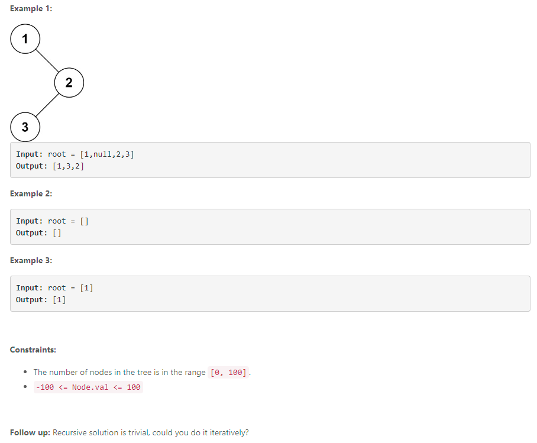
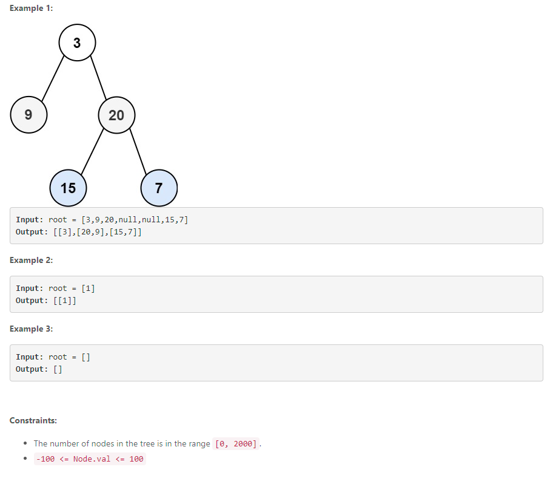
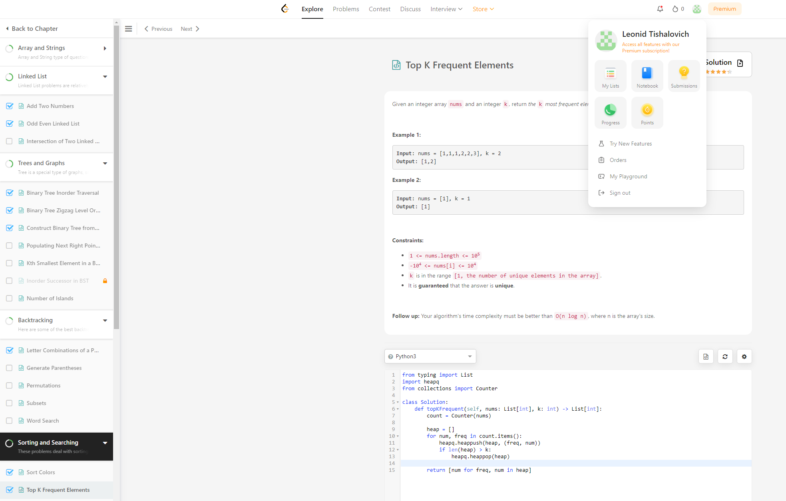

# Отработка

## Отработка ЛР1

## 3Sum

Given an integer array nums, return all the triplets [nums[i], nums[j], nums[k]] such that i != j, i != k, and j != k, and nums[i] + nums[j] + nums[k] == 0.

Notice that the solution set must not contain duplicate triplets.

### Решение

```
class Solution:
    def threeSum(self, nums: List[int]) -> List[List[int]]:
        nums.sort()
        result = []
        n = len(nums)
        
        for i in range(n):
            if i > 0 and nums[i] == nums[i - 1]:
                continue
                
            left, right = i + 1, n - 1
            while left < right:
                total = nums[i] + nums[left] + nums[right]
                
                if total == 0:
                    result.append([nums[i], nums[left], nums[right]])
                    
                    while left < right and nums[left] == nums[left + 1]:
                        left += 1
                    while left < right and nums[right] == nums[right - 1]:
                        right -= 1
                        
                    left += 1
                    right -= 1
                elif total < 0:
                    left += 1
                else:
                    right -= 1
        
        return result
```

## Add Two Numbers
You are given two non-empty linked lists representing two non-negative integers. The digits are stored in reverse order, and each of their nodes contains a single digit. Add the two numbers and return the sum as a linked list.

You may assume the two numbers do not contain any leading zero, except the number 0 itself.


### Решение
```
# Definition for singly-linked list.
# class ListNode:
#     def __init__(self, val=0, next=None):
#         self.val = val
#         self.next = next
class Solution:
    def addTwoNumbers(self, l1: ListNode, l2: ListNode) -> ListNode:
        dummy_head = ListNode(0)
        current = dummy_head
        carry = 0
        
        while l1 or l2 or carry:
            val1 = l1.val if l1 else 0
            val2 = l2.val if l2 else 0
            
            total_sum = val1 + val2 + carry
            carry = total_sum // 10 
            new_digit = total_sum % 10
            
            current.next = ListNode(new_digit)
            current = current.next
            
            if l1:
                l1 = l1.next
            if l2:
                l2 = l2.next
        
        return dummy_head.next
```
## Binary Tree Inorder Traversal
Given the root of a binary tree, return the inorder traversal of its nodes' values.


### Решение
```
# Definition for a binary tree node.
# class TreeNode:
#     def __init__(self, val=0, left=None, right=None):
#         self.val = val
#         self.left = left
#         self.right = right

from typing import Optional, List

class Solution:
    def inorderTraversal(self, root: Optional[TreeNode]) -> List[int]:
        result = []
        self._inorder_helper(root, result)
        return result
    
    def _inorder_helper(self, node: Optional[TreeNode], result: List[int]):
        if node:
            self._inorder_helper(node.left, result)
            result.append(node.val) 
            self._inorder_helper(node.right, result) 
```

## Binary Tree Zigzag Level Order Traversal
Given the root of a binary tree, return the zigzag level order traversal of its nodes' values. (i.e., from left to right, then right to left for the next level and alternate between).

### Решение
```
# Definition for a binary tree node.
# class TreeNode:
#     def __init__(self, val=0, left=None, right=None):
#         self.val = val
#         self.left = left
#         self.right = right

from typing import Optional, List
from collections import deque

class Solution:
    def zigzagLevelOrder(self, root: Optional[TreeNode]) -> List[List[int]]:
        if not root:
            return []
        
        results = []
        queue = deque([root])
        left_to_right = True
        
        while queue:
            level_size = len(queue)
            level = deque()
            
            for _ in range(level_size):
                node = queue.popleft()
                
                if left_to_right:
                    level.append(node.val)
                else:
                    level.appendleft(node.val)
                
                if node.left:
                    queue.append(node.left)
                if node.right:
                    queue.append(node.right)
            
            results.append(list(level))
            left_to_right = not left_to_right
        
        return results
```

# Выполненные задания

